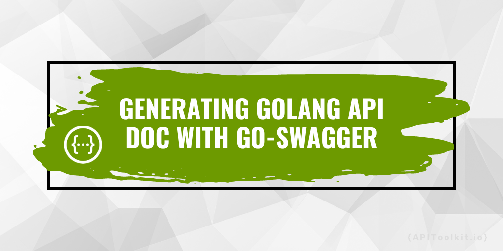

---
title: "Generating Golang API Doc with Swagger"
date: 2023-09-01T08:00:00+00:00
description: In the context of Golang, Swagger simplifies the process of generating API documentation, enhancing the developer experience.
author: jessica
categories:
  - APIs
--- 



Imagine you're a skilled developer who's just put the final touches on an API – a tool that lets different software talk to each other. This is a big deal because it opens up new possibilities for how programs can work together. But here's the thing: you can't just stop here. You now have to help other developers understand how to use your API to build their own software. This is where documentation comes in – it's like a guidebook that explains how everything works. As you dive deep down, you start thinking about different ways to make this documentation process smoother. There are tools like [APIToolkit](https://apitoolkit.io), Go-Swagger, Docusaurus, and Postman that promise to make things easier by organizing and explaining all the technical details.

However, you also remember the challenges you've faced in the past when dealing with API documentation. You wonder if there's a way to speed things up without losing the important details. After all, even the most amazing software is useless if nobody can figure out how to use it. This leads you to realize that no matter how complex or amazing your [API](https://apitoolkit.io) is, it's only truly valuable when people can actually understand and use it.

The truth is no matter how impressive your API is, its true potential remains untapped without clear [documentation](https://apitoolkit.io/blog/api-documentation-vs-api-specification/). This is where your journey takes an interesting turn. As a developer, you understand the importance of documenting and organizing APIs, even if not all developers share the same enthusiasm for this task. This is where specialized tools come into play, making API documentation simpler and more approachable. In the world of software development, [API documentation](https://apitoolkit.io/blog/api-documentation-vs-api-specification) is both crucial and often underestimated. It's the bridge that connects the intricacies of your API with its practical application. This guide delves into this vital aspect and spotlights Swagger as a game-changing tool to simplify the documentation process.

Whether you're someone who loves writing documentation or someone who finds it a bit of a challenge, this guide is for you. It's filled with tips and tricks that go beyond personal preferences, helping you find faster and smarter ways to create [documentation](https://apitoolkit.io/blog/api-documentation-vs-api-specification). So, embrace this phase of your journey as a developer. Remember, your software might be super cool, but it only truly shines when others can understand and use it.

## What is Swagger?

Swagger, now known as OpenAPI, is an open-source toolkit designed to simplify the process of creating [REST-based APIs](https://apitoolkit.io/blog/anomalies-in-restful-apis/). It offers a standardized way to describe API endpoints, request parameters, response formats, authentication methods, and more. This description is machine-readable and can be used to generate interactive documentation, client SDKs, and server stubs in various programming languages. In the context of Golang, Swagger simplifies the process of generating API documentation, enhancing the developer experience. With its suite of tools and standardized approach, it accelerates the development of scalable APIs. Beyond just development, it offers a seamless method to produce, manage, and present API documentation.

### Key Features of Swagger

- Ease of Use: Provides tools for quick and efficient creation, maintenance, and publication of [API documentation](https://apitoolkit.io/blog/api-documentation-vs-api-specification/).
- Interactive Documentation: Offers visually appealing documentation with built-in capabilities to test API endpoints directly from a browser.
- Universal Understanding: Designed to be easily comprehensible for both developers and non-developers.
- Client Library Generation: Allows direct generation of API client libraries for a variety of languages and frameworks from an OpenAPI specification.
With Swagger, not only do you get a tool for documentation but also a comprehensive suite that aids in the entire lifecycle of API development.

### Here are some of the advantages of using Swagger in your next project

- Allowing you to rapidly and easily write, maintain, and publish [API documentation](https://apitoolkit.io/blog/api-documentation-vs-api-specification/)
- Creating visually appealing interactive documentation that allows you to validate and test API endpoints directly from your browser without the use of third-party applications.
- Developers and non-developers alike will find it simple to understand.
- The ability to directly produce API client libraries (SDKs) for numerous languages and frameworks from an OpenAPI specification.

In this tutorial you will learn how to use annotation and Swag to produce Swagger documentation for Go web APIs directly from the source code.

## How to generate Golang API documentation with Swagger

Step 1: Make a Project Directory: Configuring your development environment
Create a new Go project in your text editor or IDE then go ahead and load your go.mod file. You may choose any name for your package. If you don’t know how to do that, you can use the text below

```go
mkdir goswagger 
cd goswagger 
go mod init goswagger 
```

Step 2: Installing Swagger
```go
download_url=$(curl -s https://api.github.com/repos/go-swagger/go-swagger/releases/latest | \
  jq -r '.assets[] | select(.name | contains("'"$(uname | tr '[:upper:]' '[:lower:]')"'_amd64")) | .browser_download_url')
curl -o /usr/local/bin/swagger -L'#' "$download_url"
chmod +x /usr/local/bin/swagger 
```

Step 3: Download Dependencies
Next, we will download the required dependencies

For this tutorial purpose, we will make use of  

Mux: Handling http requests and routing

Command:
 ```go
go get github.com/gorilla/mux 
```

Swagger: Handling swagger doc

Command: 
```go
go get github.com/go-openapi/runtime/middleware 
MySQL: Handling MySQL queries
```

Commands: 
Shape Copy Text 
```go
github.com/go-sql-driver/mysql 
go get github.com/jmoiron/sqlx 
```

Step 4: Import Database company.sql from the Root Directory 
Create main.go in the root directory. Establish database connection, routing for APIs, and Swagger documentation. 

Shape Copy Text 
 ```go
  r := mux.NewRouter() 
   dbsqlx := config.ConnectDBSqlx() 
   hsqlx := controllers.NewBaseHandlerSqlx(dbsqlx) 
   company := r.PathPrefix("/admin/company").Subrouter() 
   company.HandleFunc("/", hsqlx.PostCompanySqlx).Methods("POST") 
   company.HandleFunc("/", hsqlx.GetCompaniesSqlx).Methods("GET") 
   company.HandleFunc("/{id}", hsqlx.EditCompany).Methods("PUT") 
   company.HandleFunc("/{id}", hsqlx.DeleteCompany).Methods("DELETE") 
```

Step 5: Write Documentation using Go Swagger
Now, let’s see how to document using Swagger. It will consist of basic configurations, models, and API routes.

Basic Configuration

```go
//  Comapany Api: 
//   version: 0.0.1 
//   title: Comapany Api 
//  Schemes: http, https 
//  Host: localhost:5000 
//  BasePath: / 
//  Produces: 
//    - application/json 
// 
// securityDefinitions: 
//  apiKey: 
//    type: apiKey 
//    in: header 
//    name: authorization 
// swagger:meta 
package controllers 
```

We can define security using the API key, which can be checked for each API.

Step5: Create a Model
You can create models for our APIs' requests and answers. Below are some structural examples with swagger comments. Every field can have a name, type, schema, required, and description.

```go
type ReqAddCompany struct { 
   // Name of the company 
   // in: string 
   Name string `json:"name"validate:"required,min=2,max=100,alpha_space"` 
   // Status of the company 
   // in: int64 
   Status int64 `json:"status" validate:"required"` 
} 

// swagger:parameters admin addCompany 
type ReqCompanyBody struct { 
   // - name: body 
   //  in: body 
   //  description: name and status 
   //  schema: 
   //  type: object 
   //     "$ref": "#/definitions/ReqAddCompany" 
   //  required: true 
   Body ReqAddCompany `json:"body"` 
} 

// swagger:model Company 
type Company struct { 
   // Id of the company 
   // in: int64 
   Id int64 `json:"id"` 
   // Name of the company 
   // in: string 
   Name string `json:"name"` 
   // Status of the company 
   // in: int64 
   Status int64 `json:"status"` 
} 

// swagger:model CommonError 
type CommonError struct { 
   // Status of the error 
   // in: int64 
   Status int64 `json:"status"` 
   // Message of the error 
   // in: string 
   Message string `json:"message"` 
} 
```

Step 6: Set Up your API Routes 
Every route can have swagger comments. You  can specify the request and response models, the route name, the request method, the description, and, if necessary with the API key.

```go
[Text Wrapping Break] HYPERLINK "javascript:void(0);" 
```

```go
// swagger:route GET /admin/company/ admin listCompany 
// Get companies list 
// 
// security: 
// - apiKey: [] 
// responses: 
//  401: CommonError 
//  200: GetCompanies 

func (h *BaseHandlerSqlx) GetCompaniesSqlx(w http.ResponseWriter, r *http.Request) { 
   response := GetCompanies{} 
   companies := models.GetCompaniesSqlx(h.db) 
   response.Status = 1 
   response.Message = lang.Get("success") 
   response.Data = companies 
   w.Header().Set("content-type", "application/json") 
   json.NewEncoder(w).Encode(response) 
} 

// swagger:route POST /admin/company/ admin addCompany 
// Create a new company 
// 
// security: 
// - apiKey: [] 
// responses: 
//  401: CommonError 
//  200: GetCompany 
func (h *BaseHandlerSqlx) PostCompanySqlx(w http.ResponseWriter, r *http.Request) { 
   w.Header().Set("content-type", "application/json") 
   response := GetCompany{} 
   decoder := json.NewDecoder(r.Body) 
   var reqcompany *models.ReqCompany 
   err := decoder.Decode(&reqcompany) 
   fmt.Println(err) 
   if err != nil { 

       json.NewEncoder(w).Encode(ErrHandler(lang.Get("invalid_requuest"))) 
       return 
   } 
   company, errmessage := models.PostCompanySqlx(h.db, reqcompany) 
   if errmessage != "" { 
       json.NewEncoder(w).Encode(ErrHandler(errmessage)) 
       return 
   } 

   response.Status = 1 
   response.Message = lang.Get("insert_success") 
   response.Data = company 
   json.NewEncoder(w).Encode(response) 
} 

// swagger:route  PUT /admin/company/{id} admin editCompany 
// Edit a company 
// 
// consumes: 
//         - application/x-www-form-urlencoded 
// security: 
// - apiKey: [] 
// responses: 
//  401: CommonError 
//  200: GetCompany 
func (h *BaseHandlerSqlx) EditCompany(w http.ResponseWriter, r *http.Request) { 
   r.ParseForm() 

   w.Header().Set("content-type", "application/json") 
   vars := mux.Vars(r) 
   response := GetCompany{} 
   id, err := strconv.ParseInt(vars["id"], 10, 64) 
   if err != nil { 
       json.NewEncoder(w).Encode(ErrHandler(lang.Get("invalid_requuest"))) 
       return 
   } 

   var reqcompany models.ReqCompany 
   reqcompany.Status, err = strconv.ParseInt(r.FormValue("status"), 10, 64) 
   reqcompany.Name = r.FormValue("name") 
   if err != nil { 
       json.NewEncoder(w).Encode(ErrHandler(lang.Get("invalid_requuest"))) 
       return 
   } 

   company, errmessage := models.EditCompany(h.db, &reqcompany, id) 
   if errmessage != "" { 
       json.NewEncoder(w).Encode(ErrHandler(errmessage)) 
       return 
   } 

   response.Status = 1 
   response.Message = lang.Get("update_success") 
   response.Data = company 
   json.NewEncoder(w).Encode(response) 
} 

```
```go
// swagger:route DELETE /admin/company/{id} admin deleteCompany 
// Delete company 
// 
// security: 
// - apiKey: [] 
// responses: 
//  401: CommonError 
//  200: CommonSuccess 
// Create handles Delete get company 
func (h *BaseHandlerSqlx) DeleteCompany(w http.ResponseWriter, r *http.Request) { 
   vars := mux.Vars(r) 
   errmessage := models.DeleteCompany(h.db, vars["id"]) 
   if errmessage != "" { 
       json.NewEncoder(w).Encode(ErrHandler(errmessage)) 
       return 
   } 
   successresponse := CommonSuccess{} 
   successresponse.Status = 1 
   successresponse.Message = lang.Get("delete_success") 
   w.Header().Set("content-type", "application/json") 
   json.NewEncoder(w).Encode(successresponse) 
}
```

   ```go
// documentation for developers 
   opts := middleware.SwaggerUIOpts{SpecURL: "/swagger.yaml"} 
   sh := middleware.SwaggerUI(opts, nil) 
   r.Handle("/docs", sh) 
   // documentation for share 
   // opts1 := middleware.RedocOpts{SpecURL: "/swagger.yaml"} 
   // sh1 := middleware.Redoc(opts1, nil) 
   // r.Handle("/docs", sh1) 
```

After we've finished with the API, we can use the command below in the root directory to generate swagger yaml or JSON files from swagger comments.

```go
./swagger.yaml -scan-models swagger produce spec 
```

It will create a file called swagger.yaml in the root directory. The same method can be used to generate a JSON file.

We may add routes for documentation in the main using this file.

Go ahead and file.

Generate Clients using Swagger Documentation

Swagger, as indicated earlier, isn't just for API documentation; we can also use it to construct clients. Consider the following AngularJS client creation example.

Example: Client Generation for AngularJS.

```go
npm install ng-swagger-gen --save-dev 
sudo node_modules/.bin/ng-swagger-gen -i ../swagger.yaml -o backend/src/app
```

It will generate services files for all of the APIs that will be referenced in the Swagger document. Clients for other frameworks and technologies can also be generated in the same way.

## Conclusion

In [API development](https://apitoolkit.io), comprehensive documentation is a necessity. Swagger emerges as a powerful tool that simplifies the process of generating API documentation. It transforms code into an understandable guide, accelerates the development process, and fosters a community of developers who can effectively utilize your API. So, whether you're a seasoned Golang developer or just embarking on your coding journey, integrating Swagger into your workflow can bring your API documentation to the forefront, making your product more accessible, understandable, and impactful.

- - -

**Keep Reading**

[API observability and testing as a service](https://apitoolkit.io)

[How to Tackle ANomalies in RESTful APIs the Right Way](https://apitoolkit.io/blog/anomalies-in-restful-apis/)

[API Documentation vs Specification: What It Means for You](https://apitoolkit.io/blog/api-documentation-vs-api-specification/)

[A Comprehensive API Management Strategy for Businesses](https://apitoolkit.io/blog/the-ultimate-api-management-strategy/)

[The Rise of API-as-a-Product (2023)](https://apitoolkit.io/blog/api-as-a-product/)
