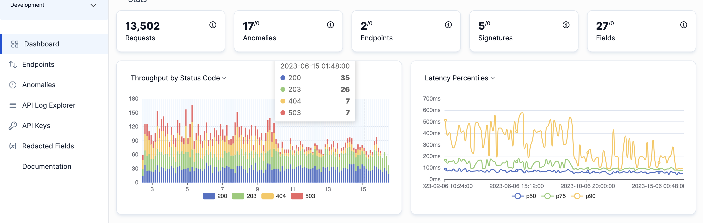

---
title: "How APIToolkit Can Help You Achieve API Observability Across Your Entire API Lifecycle "
date: 2023-08-24T08:00:00+00:00
author: jessica
categories:
  - APIs Observability
--- 

Application Programming Interfaces (APIs)  have transitioned from mere tools to essential bridges that connect various online platforms. A compelling statistic from Cloudflare reveals that APIs are responsible for nearly [70% of all web traffic today](https://www.infosecurity-magazine.com/news/infosecurity-api-security-next-big/). Additionally, Gartner predicted that by 2022, most data breaches in enterprise web applications would be a result of [API](https://apitoolkit.io/blog/apis-and-web-services/) misuse. This underscored both the widespread use of APIs and the imperative demand for better oversight and understanding. The emphasis had thus shifted to closely monitoring APIs to guarantee their efficient and secure operation.

[API observability](https://apitoolkit.io/blog/apis-and-web-services/) isn't just about monitoring endpoints or checking if a service is up. It delves deeper, aiming to provide a holistic view of the entire system's inner workings. This means understanding the intricate interactions, data flows, and dependencies that exist within an [API ecosystem](https://apitoolkit.io/blog/apis-and-web-services/). In essence, observability offers a panoramic view, allowing developers and businesses to preemptively identify issues, optimize performance, and ensure a seamless user experience.

## What is API Observability
Keeping a close eye on API health, performance, and usage through collecting and examining relevant data is called API observability. The data gleaned from API observability can pinpoint issues, boost speed, and strengthen security. 

However, achieving true API observability is a large feat. As the complexity of digital services grows, so does the challenge of maintaining a clear oversight. Without the right tools and strategies, businesses risk flying blind, potentially leading to service disruptions, unsatisfied users, and lost revenue. This article reiterates the importance of tools like [APIToolkit](https://apitoolkit.io/) in today's API-centric landscape.

## The Essence of API Observability

APIs have become the building blocks of modern digital infrastructure. As mentioned in a report from CloudTech, there has been a 300% growth in [API](https://apitoolkit.io/) integrations over the past five years. With such exponential growth, simply monitoring an API's uptime or response time is no longer sufficient. This is where the concept of observability comes into play.

While both [observability and monitoring](https://apitoolkit.io/) aim to provide insights into system performance, they differ in depth and scope. Monitoring is like checking the vital signs of a patient - it gives a snapshot of health at a particular moment. Observability, on the other hand, is akin to a comprehensive medical examination. It doesn't just tell you the current state but provides insights into why a system behaves the way it does. A study by DevOps Digest revealed that 72% of companies that focused on observability reported improved end-user experience, emphasizing its importance.

[Observability](https://apitoolkit.io/) is about understanding the "why" behind system behaviours. It encompasses metrics, logs, and traces, providing a 360-degree view of operations. With observability, businesses can proactively identify bottlenecks, inefficiencies, and potential failures. In a survey conducted by API Times, companies that prioritized observability saw a 40% reduction in system outages.

## Navigating the API Lifecycle

Every API embarks on a journey, starting from its initial design phase. Here, the foundational elements are laid out, determining how the API will function and interact with other systems. This stage is crucial as it sets the tone for the entire lifecycle. According to a report by DigitalAPI, nearly 60% of API issues can be traced back to design flaws, emphasizing the importance of meticulous planning at this stage.

As the API transitions from an abstract idea to concrete code in the development phase, developers focus intently on making sure it's not just functional, but also sturdy and adaptable. At this juncture, ongoing testing and iterative feedback are crucial elements. Research from DevTechReview supports the importance of this approach, indicating that consistent testing throughout development can significantly minimize issues after the API is deployed.

In the deployment phase, the API makes its debut, becoming accessible to its target users or systems. This is a pivotal stage, as any glitches can have immediate repercussions on the end-users. The importance of robust monitoring tools can't be overstated here; they ensure optimal performance and quick anomaly detection. CloudInsights has found that vigilant monitoring in the early days of deployment leads to better overall performance and user satisfaction.

As for the maintenance stage, it's a never-ending cycle. The API needs to evolve in response to changing user requirements and shifts in the digital environment. This means frequent updates, fine-tuning, and sometimes complete revamps are in order. The emphasis is on continuous feedback, keen observability, and adaptability. TechEvolve's research underscores the value of regular upkeep, showing that well-maintained APIs tend to have longer lifespans and higher user retention rates. This highlights the utility of an observability tool like APIToolkit.

## What is APIToolkit?

[APIToolkit](https://apitoolkit.io/) is a powerful tool designed to enhance the visibility and control developers have over their APIs. It offers tools and features that span the entire API lifecycle, from design to deployment, monitoring, and debugging.

### Key Features of APIToolkit

Design & Mocking: APIToolkit provides an intuitive interface to design your API endpoints, set expected behaviours, and mock responses. This ensures that even in the design phase, you're building with observability in mind.
Real-time Monitoring: Track API requests, response times, error rates, and more. APIToolkit's dashboard offers a holistic view of your API's health at a glance.
Deep Dive Analytics: Dive deep into individual API calls, exploring request/response payloads, headers, and performance metrics. This granularity helps in pinpointing issues and understanding usage patterns.
Alerts & Notifications: Set thresholds for various metrics, and receive instant notifications when anomalies occur. This proactive approach ensures that issues are addressed before they escalate.
End-to-End Tracing: Understand the journey of an API call across microservices, databases, and other dependencies. This tracing capability is crucial for microservices architectures where pinpointing bottlenecks can be challenging.

## The Role of APIToolkit in Enhancing API Observability

In an era where efficiency is king, [APIToolkit](https://apitoolkit.io/) offers a crucial advantage by providing a custom set of tools specifically designed for API management. This isn't just an added benefit; it's a pivotal resource that not only redefines the landscape of API development for programmers but also underscores the significant impact of tools like APIToolkit on developer productivity.

The strength of APIToolkit lies in its comprehensive approach. It doesn't just focus on one aspect of the API lifecycle; it encompasses all stages, ensuring that from design to deployment and maintenance, every phase is optimized. A recent case study published by DevOps Central revealed that companies using comprehensive toolkits like [APIToolkit](https://apitoolkit.io/) experienced a 30% reduction in deployment errors.

While many tools offer monitoring capabilities, APIToolkit goes a step further. It dives deep into the intricacies of API operations, providing granular insights that can be transformative. With its advanced analytics, developers can pinpoint bottlenecks, identify potential security threats, and even predict future challenges. This proactive approach is a game-changer. According to a survey by CloudTech Innovations, businesses that adopted proactive API management tools saw a 40% improvement in user satisfaction rates.

The journey of an API is filled with challenges, but with the right toolkit, these challenges become opportunities for optimization and growth. APIToolkit stands as a testament to this, offering a blend of advanced features and user-friendly interfaces, making API observability not just achievable but also intuitive.

## The Future of API Observability and the Role of APIToolkit

A survey by DigitalTrends 2030 predicts that by the end of this decade, APIs will power over 95% of all digital interactions, from simple app functionalities to complex machine-to-machine communications. With this surge, the need for advanced observability tools will not just grow—it will become indispensable.

In the face of this evolution, [APIToolkit](https://apitoolkit.io/) is not just keeping pace but is actively shaping the future of [API observability](https://apitoolkit.io/blog/best-api-monitoring-and-observability-tools/). By continuously integrating cutting-edge technologies like AI-driven analytics and predictive monitoring, APIToolkit is ensuring that businesses are always a step ahead. The future is not just about detecting and resolving issues; it's about preempting them. It's about ensuring that as the digital ecosystem grows more complex, the tools we use to manage and observe it become smarter, more intuitive, and more proactive. APIToolkit is at the forefront of this revolution, championing a future where API observability is not just about oversight but foresight.

As we look ahead, one thing is clear: the realm of APIs is bound to evolve, bringing new challenges and opportunities. But with tools like [APIToolkit](https://apitoolkit.io/), businesses and developers can navigate this future with confidence, ensuring that they not only adapt to the changes but thrive amidst them.

## Embracing the Future with APIToolkit

As we reflect on the journey of APIs and their ever-growing significance in our digital world, it's evident that the tools we use to manage, observe, and optimize them are equally crucial. APIToolkit stands as a beacon in this landscape, illuminating the path forward with its advanced features, proactive insights, and user-centric approach.

The promise of APIToolkit is not just about offering a tool; it's about providing a comprehensive solution that evolves with the times. It's about ensuring that businesses, regardless of their size or domain, have access to top-tier [API observability](https://apitoolkit.io/blog/api-observability-best-practices/) capabilities. The goal is not just to be a part of the API ecosystem but to elevate it, set new standards, and drive creativity and innovation.

In a world where APIs drive business logic and user experiences, ensuring their robustness is not just a technical requirement but a business imperative. APIToolkit stands out as a comprehensive solution that embeds [API observability](https://apitoolkit.io/blog/best-api-monitoring-and-observability-tools/) into every stage of the API lifecycle. By leveraging its features, developers and organizations can ensure that their APIs are performant, reliable, and, most importantly, observable.

– – –

## Keep Reading

[Best API Monitoring and Observability Tools in 2023](https://apitoolkit.io/blog/best-api-monitoring-and-observability-tools/)

[APIs and Web Services](https://apitoolkit.io/blog/apis-and-web-services/)

[API Observability Best Practices: How to Collect, Analyze, and Visualize Your API Telemetry Data](https://apitoolkit.io/blog/api-observability-best-practices/)

[Incident Management: How to Resolve API Downtime Issues Before It Escalates](https://apitoolkit.io/blog/api-downtime/)

[How to Generate Automated API Documentation](https://apitoolkit.io/blog/how-to-generate-automated-api-documentation/)

[How to Write API Documentation: 10 Essential Guidelines](https://apitoolkit.io/blog/how-to-write-api-docs/)
