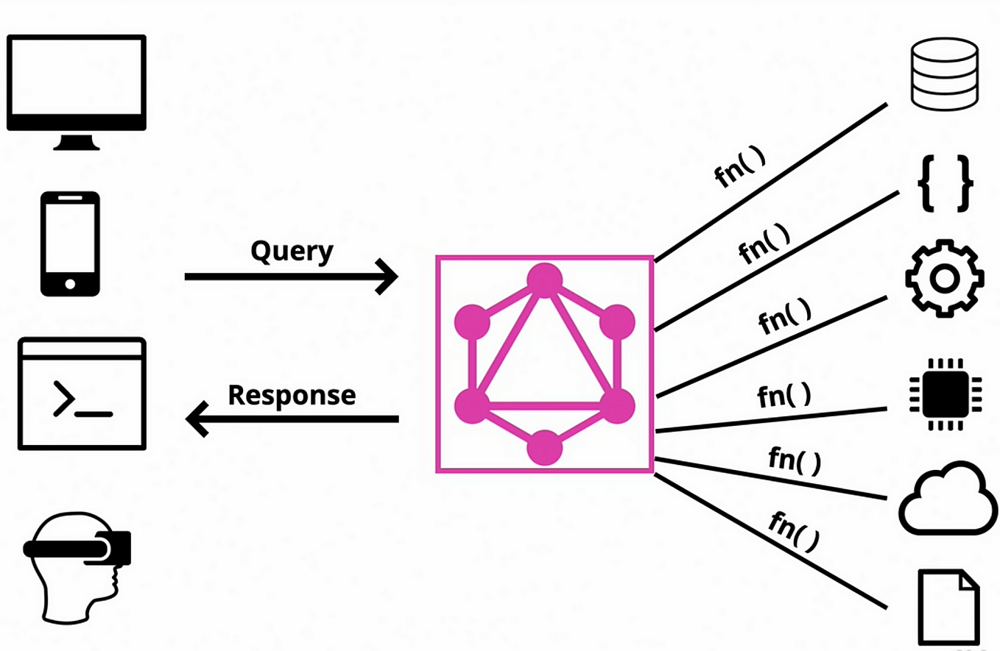
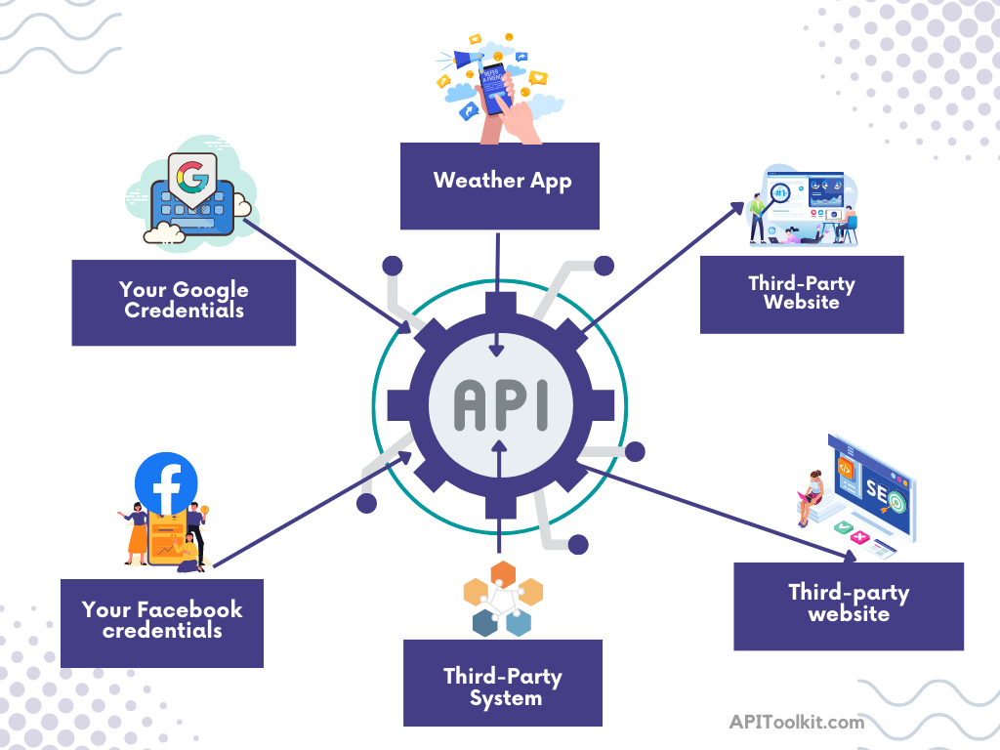

.png)

# How to Generate Swagger Docs from your Live traffic with Apitoolkit

Creating clear, and useful documentation is one of the toughest challenges developers face. We pour endless energy into crafting beautiful code, architecting complex systems, and engineering revolutionary products. Yet all that effort is wasted if no one understands how to properly interact with what we build. As the saying goes, "Confusion is the enemy of utilization".

The problem becomes amplified in the technical domain of APIs. How do we document web services in a way that is readable? How can we describe intricate API capabilities to promote accurate usage? What does excellent API documentation even look like?

## What is Swagger?

Swagger is a collection of open-source tools that helps software developers design, build, document, and consume REST APIs. It's like having a Swiss Army Knife for your API development, allowing you to plan your API with OpenAPI, collaborate with your team, generate code automatically, test your API easily, and create beautiful and interactive documentation.



But wait, let's clarify the difference between Swagger and OpenAPI. OpenAPI is a formal specification used by Swagger, while Swagger is the tool for using the OpenAPI specification.

## Why Automatic API Documentation Generation is needed?

Imagine building an city without any maps or directions. That's what it's like for developers trying to use an API without proper documentation. Automatic API documentation generation solves this problem by automatically creating a clear and concise "map" of your API, in this case known as a Swagger document.

Swagger document details the available API endpoints, their parameters, data types, and responses, essentially acting as a model that explains "how things work" behind the scenes.

- **Reduced development time:** With readily available documentation, developers can spend less time figuring out your API and more time building their applications.
- **Fewer errors and bugs:** Clear documentation helps developers avoid mistakes and write code that interacts seamlessly with your API.
- **Enhanced collaboration:** Automatic documentation ensures everyone is on the same page and facilitates smoother communication between developers.
- **Simplified API testing:** By understanding the API structure, developers can more easily write effective test cases and ensure your API is functioning properly.

## What is APIToolkit and how can it help you??

APIToolkit is a web service development platform that enables developers to design, build, test, and deploy APIs in a simplified and efficient manner. By providing a range of tools and services, APIToolkit aims to make API development more accessible and convenient for businesses and developers alike.

 By analyzing your live API traffic, APIToolkit automatically generates accurate and up-to-date Swagger Docs, so you can spend less time writing and more time building great APIs. APIToolkit also offers advanced features like anomaly detection, mocking and testing, making it the perfect tool for any developer who wants to streamline their API workflow.

 

 Since APIToolkit is a library that allows you to generate swagger documentation for your live APIs directly from the running application without any additional setup or configuration 

## How to generate Swagger Docs from Live Traffic using APItoolkit

Follow this instruction to generate swagger documentation from your live traffic using APItoolkit. In this article I will be using flask for the process
### Prerequisites

1. Create an account with APItoolkit. If you do not have an account use [this link](#) to create or login into your account.
2. Connect your API to APItoolkit. Read more on how to do this [here](#).

### General overview on how to generate swagger docs from live traffic using APItoolki.

1. To create a new project on APItoolkit.io, you can use the following steps: 
 * Go to the APItoolkit.io website. 
 * Click on get started
 * Click on the "Create a Project" button. 
 * Enter a name for your project and desciption
 * Click on the "Create Project" button. 

 2. Configure your project settings in APItoolkit by visiting the project's settings page. Here, you can specify the base URL of your API and provide other necessary information.

 3. Connect your API to APItoolkit by following the provided instructions. This can be done by installing the APItoolkit agent on your server and configuring it to send data to the APItoolkit platform.

 4. Once the APItoolkit agent is connected and properly configured, APItoolkit will begin collecting data from the live traffic of your API.

 5. Monitor the data collection and the generation of the swagger document by visiting the "Dashboard" section in your APItoolkit project.

6. To access the generated swagger document, visit the "Documentation" section in your APItoolkit project.

7. If you want to download the generated swagger document for offline use, click on the "Download" button in the "Documentation" section.


### Configure live traffic monitoring


**Step1:**
1. Log in to your APItoolkit account.
2. Create a new project or open an existing one.

**Step2:**
1. Ensure you have Python installed.

**Step3**
This is a sample flask project to deomonstrate how to generate live traffice using APItoolkit.
``````python
from flask import Flask
from flask_restful import Api
from apitoolkit.flask import swagger

app = Flask(__name__)
api = Api(app)

@app.route("/")
def hello_world():
    return "Hello, world!"

@api.route("/api/v1/users")
class UserList(Resource):
    def get(self):
        return {"users": [{"name": "John Doe"}, {"name": "Jane Doe"}]}

@swagger.doc(
    tags=["users"],
    description="Operations on users",
    responses={
        200: {"description": "A list of users"},
        404: {"description": "The user was not found"},
    },
)
class User(Resource):
    def get(self, user_id):
        return {"user": {"id": user_id, "name": "John Doe"}}

if __name__ == "__main__":
    app.run(debug=True)
``````

This sample application defines two routes: 
 
*  / : This route returns a simple "Hello, world!" message. 
*  /api/v1/users : This route returns a list of users. 
 
The  swagger  decorator is used to generate Swagger Docs for the API. The Swagger Docs will be  available at the following URL:

``````url
http://localhost:5000/api/v1/swagger.json
``````

**OR**

You can access the generated swagger document, visit the "Documentation" section in your APItoolkit project.

Review and edit the generated Swagger Docs. APItoolkit will create a basic OpenAPI/Swagger spec, but you may need to make adjustments to account for specific aspects of your API.

### Benefits of using APIToolkit for Swagger Docs Generation

- **Saves Time and Effort:** Compared to manually writing and maintaining Swagger Docs, APIToolkit automates the process by learning from live traffic and generating the documentation automatically. This frees developers up to focus on other tasks. The tool eliminates the need for manually writing YAML files or using complex command-line tools, further streamlining the process.
- **Ensures Documentation is Always Up-to-Date:** By analyzing API traffic, APIToolkit constantly updates the Swagger Docs to reflect any changes made to the API. This ensures that developers always have access to the latest information, reducing confusion and frustration. Manual documentation becomes outdated quickly and requires constant maintenance, which is a burden that APIToolkit removes.
- **Improves Developer Experience and Adoption:** Accurate and up-to-date Swagger Docs allow developers to understand and use your API more easily. This leads to faster integration and adoption, ultimately benefiting your business. Features like interactive testing and code samples within the documentation further enhance the developer experience.
- **Enables Better API Governance and Management:** APIToolkit provides a central repository for your Swagger Docs, making it easier to manage and share them with your team. The tool also offers version control and audit logging, enabling better tracking of changes and ensuring compliance with API standards.

### Frequently asked questions

**1. What's the big deal about Swagger Docs? Aren't they just glorified README files?**

   *Ans:* While Swagger Docs do serve as comprehensive documentation, they're much more than simple READMEs. They offer a standardized format that's easily understood by both humans, making API interaction smoother and more efficient. Think of them as interactive blueprints, giving developers everything they need to understand and use your API effectively.

**2. Why should I use APIToolkit instead of manually writing Swagger Docs?**

   *Ans:* Manual documentation is like hand-drawing maps in the age of GPS. APIToolkit automatically analyzes your live traffic, creating accurate and complete Swagger Docs in a fraction of the time. It's like having a tireless documentation robot working around the clock to keep your docs up-to-date.

**3. Can APIToolkit really generate accurate docs from my complex API?**

   *Ans:* APIToolkit's AI is trained on massive datasets of real-world APIs, making it adept at handling even the most intricate configurations. It identifies endpoints, parameters, data types, and responses with impressive accuracy, saving you valuable time and effort.

**4. What if my team wants to collaborate on refining the generated docs?**

   *Ans:* APIToolkit fosters collaboration with its real-time editing feature. Your team can work together to refine descriptions, add examples, and customize the UI, ensuring your docs are clear, concise, and informative.

**5. What if I'm curious about using APIToolkit but I'm not sure it's right for me?**

   *Ans:* We get it! That's why we offer a free trial. Explore APIToolkit's capabilities firsthand and see how it can revolutionize your API documentation process. We're confident you'll see the difference.

## Conclusion

Generating Swagger Docs from live traffic with APIToolkit offers a powerful and efficient solution for API users. By automating the documentation process and providing intelligent features, APIToolkit empowers teams to create accurate, up-to-date docs that improve developer experience, accelerate API adoption, and drive innovation.

As the future of API documentation leans towards automation and intelligence, APIToolkit paves the way for a more efficient and collaborative API development ecosystem.
