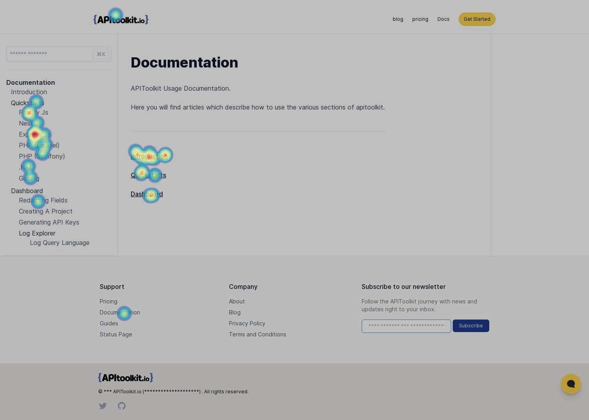
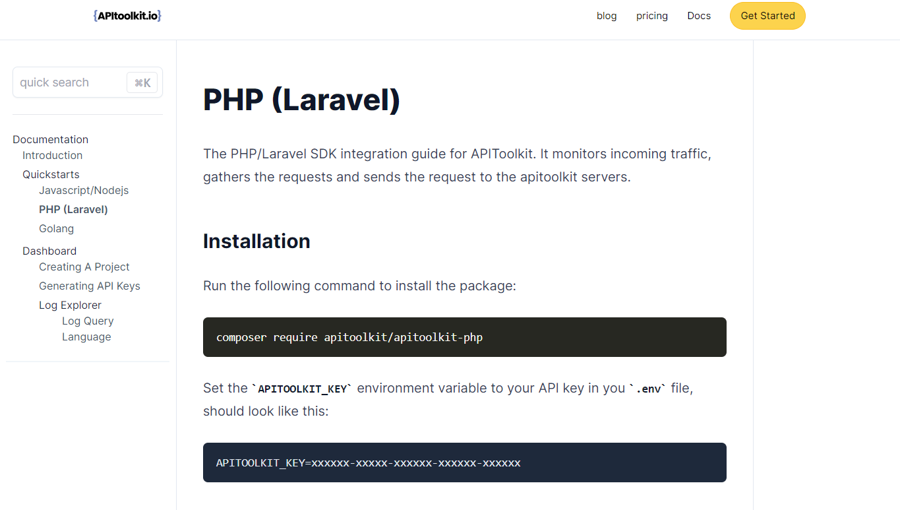
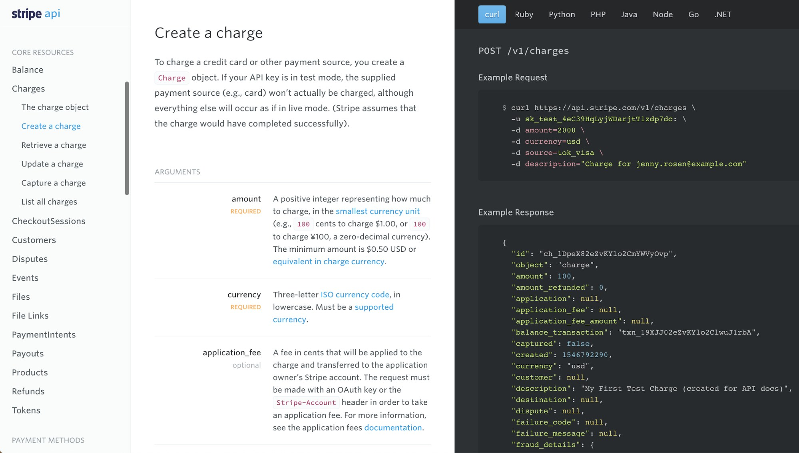

As is the way with most programming concepts, documentation is vital. An API might as well be gibberish if the documentation isn’t laid out properly.

Developing easy-to-understand API documentation can be quite challenging. But for those who know the right approaches, it can be a breeze.

Effective API documentation not only outlines the technical aspects of an API, such as endpoints, parameters, and response formats, but it also provides context, examples, and use cases to help developers quickly grasp the concepts and capabilities of the API. It serves as a reference guide, enabling developers to build applications that leverage the API's functionalities accurately and efficiently.

Creating high-quality API documentation requires a balance between technical accuracy and clear, concise language. It should be accessible to developers of varying skill levels, from beginners to experienced professionals. Well-documented APIs not only improve developer experience but also contribute to the success and adoption of your API.

Now, with only 32% of API providers confident that their API documentation are above average, we thought it crucial to detail the best approaches and give you compelling reasons why you should always provide excellent documentation for your APIs.

## Key Statistics on API Documentation

To start, let's understand some key statistics on API documentation:

* A study by ProgrammableWeb found that 70% of API developers say that documentation is the most important factor in their decision to use an API.

* Another study by Mulesoft found that 45% of API developers say that they have had to abandon an API due to poor documentation.

* A third study by IBM found that the average time it takes to find the information you need in an API documentation is 20 minutes.

* Software engineers who participated [in a study](https://www.researchgate.net/publication/335456576_How_developers_use_API_documentation_an_observation_study) said they spend approximately 40% of their time reading documentation.

Image source: A heatmap showing site visitors to [APIToolkit](https://apitoolkit.io) (an API management toolkit) spent more time reading the documentation.

## Importance of API Documentation

From a developer's perspective, [good documentation](https://apitoolkit.io/blog/how-to-generate-automated-api-documentation/) is a time-saver. Instead of spending hours deciphering and experimenting with an API's functionalities, developers can refer to comprehensive documentation that provides clear instructions, examples, and troubleshooting tips. This saves valuable development time and accelerates the integration process, allowing developers to focus on building innovative applications.

In addition, effective API documentation improves collaboration between API providers and developers. It acts as a common language, facilitating communication and ensuring that both parties are on the same page. Developers can easily understand the expected behavior of the API, the available endpoints, and the required parameters, enabling them to integrate the API seamlessly into their applications.

## Who Benefits From API Documentation?

Your [API documentation](https://apitoolkit.io/blog/api-documentation-and-observability-the-truth-you-must-know/) audience is segmented. As such, it’s important to identify the different groups of people who benefit from your documentation. This will give you insights into serving their needs.

### Developers
Developers are the people who directly use your APIs. In order to use your APIs effectively, they need to understand how it applies to their use case.  Additionally, if they need to run QA tests on the APIs, they require as much information as possible about the APIs. They may need to learn how to access and integrate with dozens, or even hundreds, of the resources you expose.

Studies show that [developers have become more confident in API documentation](https://swagger.io/blog/5-key-trends-fintech-api-development/) over the years. With the numbers rising, it only makes sense if you provide the relevant technical docs to accompany your APIs.

### Administrators and Others
This group of people may never actually use your APIs. They are responsible for identifying resources needed by their teams. Some of them are technical like CTOs, whereas others might be COOs. Ensure your API documentation is written with such an audience in mind.

Lastly, journalists, tech enthusiasts, and other non-specialized people will likely come across your API docs. How do you target them? By writing for the least technical audience.

## Essential Guidelines for API Documentation

### 1. Define the Purpose and Scope of Your API Documentation

Before diving into the technical details, it is essential to define the purpose and scope of your API documentation. Ask yourself, what are the goals of the documentation? What do you want developers to achieve by reading it? Identify the key objectives and outline the topics you need to cover.

Consider the target audience and their needs. Are they developers who require in-depth technical information or business users who seek a high-level overview? Tailor the level of detail and the language used accordingly.

### 2. Document the API Endpoints

The API endpoints are the backbone of your API, defining the available functionalities and actions. Document each endpoint, providing a clear description of its purpose, the HTTP methods it supports (e.g., GET, POST, PUT, DELETE), and the expected response format.

Include examples of API requests and responses to illustrate the expected behavior. Use clear and concise language, avoiding technical jargon whenever possible. Consider using data structures or diagrams to visualize complex payloads or relationships between resources.

### 3. Document the Parameters and Request Payloads

Parameters play a crucial role in API interactions, allowing developers to customize their requests and retrieve specific data. Document each parameter, including its name, data type, required/optional status, and any constraints or validation rules.

Provide clear examples of how to construct API requests, demonstrating the usage of parameters. Consider highlighting common use cases and scenarios where different parameters may be required.

For APIs that accept request payloads, document the structure and format of the payload. Specify the required fields, expected data types, and any constraints or validation rules. Include examples of valid payloads to guide developers in constructing their requests accurately.

### 4. Document the Authentication and Authorization Methods

Security is paramount in API interactions. Document the authentication and authorization methods supported by your API, outlining the steps developers need to take to authenticate their requests and access protected resources.

Explain the different authentication mechanisms, such as API keys, OAuth, or JWT, and provide clear instructions on how to obtain and use the necessary credentials. Include examples of API requests with authentication headers or tokens for better understanding.

Ensure that developers understand the authorization scopes and permissions associated with each authentication method. Document any access control rules or roles that determine the level of access granted to different users.

### 5. Provide Examples, Use Cases, and Code Samples

Developers often learn best through practical examples and use cases. Provide a wide range of examples that demonstrate how to use your API in various scenarios. Include step-by-step instructions with code snippets to guide developers through common tasks or workflows.

Consider providing examples in multiple programming languages to cater to developers with diverse backgrounds. Highlight any language-specific libraries, SDKs, or frameworks that simplify API integration.

For complex or advanced use cases, consider providing complete code samples or reference implementations. These examples serve as a starting point for developers, showcasing best practices and efficient ways of utilizing your API.

### 6. Organize and Structure Your Documentation

Well-organized documentation is essential for easy navigation and information retrieval. Categorize information into logical sections and provide a clear table of contents. Use headings, subheadings, and bullet points to improve readability and scanability.

## 7. Understand your Users' Needs

The most important step when creating API documentation is to have a clear understanding of your users’ needs and what they expect from the documentation. Start by researching the target audience for your API, and consider their level of technical knowledge. This can help you design the documentation so that it meets their needs in the most effective way possible.

### 8. Target the Least Specialized Audience

When writing for a mixed audience, the smartest approach is to address the least technical amongst your readers. Try to answer basic questions, give explanations where necessary, and reduce your use of jargon. Here are a bunch of ways to target non-technical audiences

Tell stories: Utilize case scenarios and make stories around them. This engages every kind of audience and shows your product in action.

Be detailed: It’s important to put in all the important bits of information but you should try to do that in as few words as possible. Have an outline that lets you break concepts down into concise bits.

Be instructional: Let your users know where to begin and where to end. Detail complex pieces of information in clearly outlined steps. Give examples where necessary.

Read: [Top 7 Reasons Why Your Team should Use an API Monitoring and Observability Tool](https://apitoolkit.io/blog/why-you-need-an-api-monitoring-tool/)

### 9. Point to Relevant Supporting Resources

Your readers want all the help they can get. Don’t be stingy with information. Point to any relevant guides and supporting resources that they may need. Don’t leave them guessing. Some examples of supporting documents are:

A Getting Started Guide: This gives a comprehensive approach to using your API. The goal is to ensure your consumers attain success with using your product.

Interactive Console:
A console helps your audience to test your APIs and see results in real time. It’s a simple approach that yields big rewards.

Libraries: Code libraries enable developers to easily call different resources. Access to methods in different languages to work with your API helps developers feel more comfortable working with the API.

Read: [Must-Know API Trends in 2023](https://apitoolkit.io/blog/api-trends/)

### 10. Utilize Industry Standards

Make it easy for your readers to understand your documents; use familiar layouts and designs. If you’re using a document generator then the layout is already decided for you. 

Here are some recommendations:
Use good contrast: The Web Content Accessibility Guidelines 2.1 (WCAG) recommends a contrast ratio of at least 3:1 for graphics and user interface components (such as form input borders). WCAG Level AAA requires a contrast ratio of at least 7:1 for normal text and 4.5:1 for large text.

Use a dynamic layout: These days, layouts must be easy to bookmark. The use of PDFs and single-page documents doesn’t cut it. Ensure your docs are dynamic and scalable.

Navigation bar: Your navigation bar should stick to the screen. Make it easy for users to switch between pages.

Read: [How to Generate Automated API Documentation](https://apitoolkit.io/blog/how-to-generate-automated-api-documentation/)

### 11. Describe Your Request-response Cycles in Detail

Your users should not be surprised by API responses. They should know exactly what to expect from API calls. 

Document all possible calls your API could offer in relation to the parameters and responses. Responses serve as a contextual guide for your users, showing when they’re on the right path.

Responses also provide guidance with error messages. Overall this helps your users to succeed. Be sure to cover multiple formats when describing the full sample response body. 

Lastly, examples are important. Provide examples in each object that your API is meant to return, together with examples of parameters that consumers can add for a successful API call. API observability tools can help with this.

### 12. Explain Error Messages Clearly

Errors are an inevitable part of using any API, and it’s important to explain errors clearly in your documentation. This way, users will understand why something went wrong and know what steps to take to fix the problem. Providing examples of common error messages can also be helpful for users to reference when troubleshooting. Be sure to include good descriptions of each error message and provide explanations for why it occurred.

### 13. Make It Freely Available

Trust me, one thing that really irks developers is gated API docs. Don’t be fooled, gated docs do not increase conversions. Developers and decision-makers want to know what to expect before deciding to use your APIs.

Use as many code samples as necessary. Developers appreciate this a lot. Don’r be all talk and no sample. 

Lastly, optimize it for search engines. Your docs are no good if they can’t be found with a simple Google search. Ensure the page is indexed, titled properly, and well described.

Read: [How to Write API Documentation: 10 Essential Guidelines](https://apitoolkit.io/blog/how-to-write-api-docs/)

### 14. Update Your Docs Regularly

No one likes an outdated document. Stay on top of this. [Update your API docs regularly](https://apitoolkit.io/api-documentation-and-developer-portals/). Here are some recommendations:

Have a standard process/framework for updates: Incorporate your docs into your API update process. This ensures that as you roll out new features, your docs are ready to be published as well.

Review often: Frequent review of your docs will expose outdated areas. Schedule your reviews to keep your processes streamlined.

Use analytics: Good API analytics will show what endpoints are used most frequently. This will inform your API doc review process, helping you focus your updates on the most used portions. [APIToolkit](https://apitoolkit.io) provides detailed analytics and much more. It’s a one-stop solution for API observability and monitoring.

## Common Challenges in API Documentation

While API documentation is essential, it can present its own set of challenges. Let's explore some of the common hurdles that API providers face when creating documentation and how to overcome them:

- **Striking the right balance**: One of the primary challenges is striking the right balance between technical accuracy and user-friendly language. Developers require accurate technical details, but presenting them in a way that is easily understandable can be a challenge. To overcome this, consider using clear and concise language, avoiding jargon whenever possible, and providing relevant examples and explanations.

- **Maintaning up-to-date documentation**: Another challenge is maintaining up-to-date documentation. APIs evolve over time, with new features, endpoints, and parameters being added or modified. It is crucial to keep the documentation in sync with the API itself. Regularly review and update your documentation to ensure accuracy and relevancy. Consider integrating [APIToolkit](https://apitoolkit.io) into your backend services. Our API management tool auto-generates API documentation for you by studying the live traffic to and from your endpoints. You immediately get a notification once changes have been made. Read more about this [here](https://apitoolkit.io/blog/how-to-generate-automated-api-documentation/).

### Final Thoughts 
Documenting your [APIs](https://apitoolkit.io/blog/best-api-monitoring-and-observability-tools/) is just as important as building them. It’s essential to have frameworks and processes that make your API documentation seamless and scalable.

You will have different audiences. Be sure to cater to all their varying needs when developing your API docs.

[APIToolkit](https://apitoolkit.io) gives you comprehensive analyses of your API docs to ensure you’re constantly up to date with the information you serve your community.

**Also Read**:

[How to Analyze API Logs and Metrics for Better Performance](https://apitoolkit.io/blog/api-logs-and-metrics/)

[Incident Management: How to Resolve API Downtime Issues Before It Escalates](https://apitoolkit.io/blog/api-downtime/)

[Key Benefits of API Integration for Developers](https://apitoolkit.io/blog/benefits-of-api-integration/)

[API Documentation vs API Specification: What It Means for You](https://apitoolkit.io/blog/api-documentation-vs-api-specification/)

[API Observability and Monitoring: What's the Difference?](https://apitoolkit.io/blog/api-observability-and-api-monitoring/)
