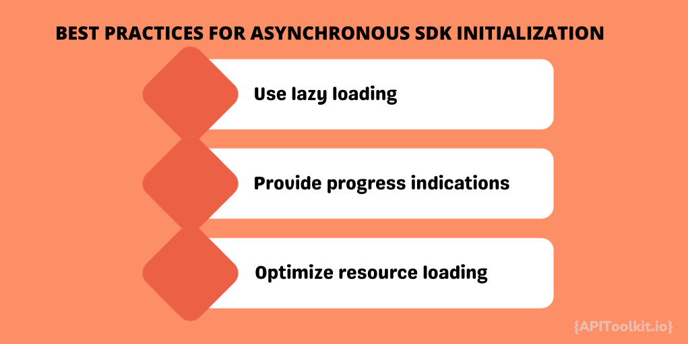

Skip links are an essential tool for enhancing the user experience in API SDKs. By providing users with shortcuts to navigate directly to specific content, skip links improve accessibility and usability. In this article, we will explore the best practices for implementing skip links in API SDKs and discuss the benefits they bring to both developers and end-users.## Enhancing User Experience with Skip Links. Skip links are a simple yet effective way to enhance the user experience in API SDKs. They enable users to bypass repetitive or irrelevant content and directly access the information they need. By reducing the time and effort required for navigation, skip links contribute to a more efficient and user-friendly SDK.

Implementing skip links involves adding a set of visible or hidden links at the beginning of the SDK [documentation](https://apitoolkit.io/blog/api-documentation-with-analytics/). These links allow users to jump directly to specific sections or functions within the SDK, skipping over introductory and less relevant information.

For example, imagine you are a developer who wants to integrate a payment gateway into your application using an API SDK. Without skip links, you would have to scroll through the entire [documentation](https://apitoolkit.io/blog/api-documentation-with-analytics/), reading through introductory paragraphs and irrelevant details, before finding the specific section or function you need. This can be time-consuming and frustrating, especially when you are under a tight deadline. However, with skip links, you can quickly navigate to the exact information you need, saving valuable time and effort.

### Improving Accessibility with Skip Links

One of the key benefits of skip links is their contribution to improved accessibility. They make it easier for users who rely on screen readers or keyboard navigation to navigate through the SDK [documentation](https://apitoolkit.io/blog/api-documentation-with-analytics/) more efficiently. Skip links ensure that all users, regardless of their abilities, can access the information they need without unnecessary obstacles or distractions.

Consider a visually impaired developer who uses a screen reader to access the SDK documentation. Without skip links, the screen reader would have to read through all the introductory paragraphs and less relevant content before reaching the desired section or function. This can be a tedious and time-consuming process. However, with skip links, the developer can simply navigate directly to the desired section, improving their overall experience and productivity.

To maximize accessibility, it is important to ensure that skip links are properly labeled and positioned in a logical order. Clear and descriptive link names should be used to indicate the destination of each skip link, allowing users to understand and anticipate the content they will navigate to.

For instance, instead of using generic labels like "Skip to Section 1" or "Skip to Function A," it is more helpful to use descriptive labels such as "Skip to Payment Methods" or "Skip to Authentication Function." This way, users can easily identify the content they want to access and navigate accordingly.

However, skip links are a valuable tool for enhancing user experience in API SDKs. They allow users to bypass repetitive or irrelevant content and directly access the information they need, saving time and effort. Moreover, skip links contribute to improved accessibility, ensuring that all users can navigate through the SDK [documentation](https://apitoolkit.io/blog/api-documentation-with-analytics/) efficiently, regardless of their abilities. By properly labeling and positioning skip links, developers can further enhance the user experience and make their SDKs more user-friendly.

## Securing and Optimizing SDK Initialization

SDK initialization plays a crucial role in the overall performance and security of API integrations. By following best practices for asynchronous SDK initialization, you can ensure a seamless and secure integration experience for developers.

### Best Practices for Asynchronous SDK Initialization

Asynchronous SDK initialization allows developers to load and initialize the SDK without blocking the main thread or user interface. This approach ensures a smooth user experience and prevents performance bottlenecks. Here are some best practices to consider when implementing asynchronous SDK initialization:

1. Use lazy loading: Load the SDK only when it is actually needed, rather than loading it on every page or screen.
2. Provide progress indications: Inform developers about the status of SDK initialization through progress indicators or callbacks.
3. Optimize resource loading: Minimize the size of the SDK and optimize the loading of external dependencies to reduce initialization time.

## Optimizing Network Traffic with Batch Processing

Efficiently handling heavy network traffic is essential for ensuring a responsive and performant [API](https://apitoolkit.io/blog/api-testing-automation/) SDK. Batch processing is a powerful technique that can help streamline network requests and minimize latency. When dealing with heavy network traffic, it is important to minimize the number of individual requests to the [API](https://apitoolkit.io/blog/api-testing-automation/) server. Batch processing allows multiple requests to be combined into a single request, reducing network overhead and improving overall performance. By grouping related operations into batches, such as retrieving multiple resources or performing multiple updates, you can reduce the number of round trips to the server and optimize network utilization.

Queuing is a powerful technique for maximizing the efficiency of API SDKs. It allows requests to be processed in a controlled manner, ensuring optimal resource utilization and minimizing the impact of network latency. Queue flushing is an essential aspect of local queuing. It involves strategically flushing queued requests to the server at the most opportune time, taking into account factors such as network availability, server capacity, and request priorities. By intelligently managing the flushing of queued requests, you can optimize performance, reduce the risk of data loss, and provide a seamless experience for end-users even in challenging network conditions.

Data transfer is a critical aspect of [API](https://apitoolkit.io/blog/api-testing-automation/) SDKs, and it is essential to optimize it for efficiency and performance. Compression techniques can significantly reduce the size of the data being transferred, resulting in faster transmission and lower bandwidth consumption.

## Customizing User-Agent for Better API Performance

The User-Agent header provides valuable information about the client making the API request. By customizing the User-Agent header in your API SDK, you can optimize API performance, gain insights, and improve troubleshooting capabilities.

## Gaining Insights with API Analytics

[API](https://apitoolkit.io/blog/api-testing-automation/) analytics tools offer valuable insights into how your API SDK is being used. By tracking and analyzing usage patterns, you can identify areas for improvement, optimize performance, and make data-driven decisions to enhance the overall user experience.

APIToolkit is a comprehensive API analytics platform that provides powerful tracking and monitoring capabilities. By integrating [APIToolkit](https://apitoolkit.io/) into your API SDK, you can gain detailed visibility into how developers are using your SDK, identify potential issues, and proactively address them.

## Keeping Up with API and SDK Changes

API and SDK updates are inevitable, and it is crucial to manage them effectively to ensure a smooth transition for developers and minimize disruptions. Proper documentation and communication are key to keeping developers informed and prepared for changes. When releasing updates to your API and SDK, it is essential to provide clear and comprehensive documentation. Clearly communicate any changes, including new features, deprecated functionality, and migration guides, to help developers understand and adapt to the changes.

Additionally, consider using versioning and deprecation strategies to ensure a smooth transition without breaking existing integrations. Providing ample notice and offering support during the migration process can help maintain developer trust and mitigate potential issues.

## Choosing Between Building and Buying API Management Solutions

[API management](https://apitoolkit.io/blog/optimizing-api-management/) solutions provide essential tools for managing, securing, and analyzing APIs. When considering API management, organizations face the choice between building their own solution or opting for a commercially available product. This section will delve into the factors to consider when making this decision and the benefits of each approach.

## Accelerating Proof of Concept with APIToolkit

Proof of concept is a crucial phase in the development and launch of new API SDKs. With [APIToolkit](https://apitoolkit.io/)'s comprehensive tracking and analytics capabilities, you can rapidly gather insights, measure developer adoption, and validate the viability of your API SDK before scaling it for production.

### Rapidly Track API and SDK Usage with APIToolkit

APIToolkit's powerful tracking and analytics platform enables you to easily track and monitor API usage and SDK adoption. By leveraging APIToolkit's features, you can gain real-time insights into how developers are interacting with your API, identify usage trends, and make data-driven decisions to improve your SDK's performance and user experience.

However, implementing skip links in API SDKs is a best practice that is essential for improving the user experience and accessibility of your SDK. By following the recommended practices for skip links, optimizing SDK initialization, network traffic, and data transfer, customizing user-agent headers, harnessing the power of API analytics, managing API and SDK updates effectively, and adopting pricing strategies and [API management ](https://apitoolkit.io/blog/optimizing-api-management/)solutions wisely, you can create a seamless and user-friendly experience for developers and end-users alike. With the right tools and practices in place, you can enhance the usability, performance, and overall success of your API SDK.

## Keep Reading
[How to Generate Automated API Documentation](https://apitoolkit.io/blog/how-to-generate-automated-api-documentation/)
[10 Must-Know API Trends in 2023](https://apitoolkit.io/blog/api-trends/)
[Ultimate Guide to API Testing Automation](https://apitoolkit.io/blog/api-testing-automation/)[Best API Monitoring and Observability Tools in 2023](https://apitoolkit.io/blog/best-api-monitoring-and-observability-tools/)
[Top 7 Reasons Why Your Team Should Use an API Monitoring Tool](https://apitoolkit.io/blog/why-you-need-an-api-monitoring-tool/)