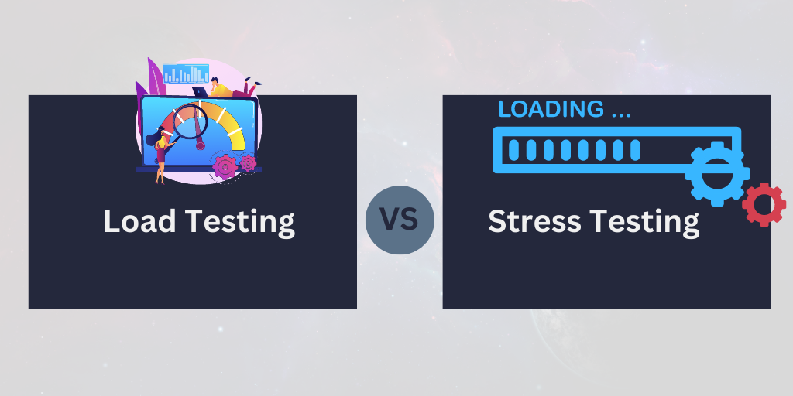
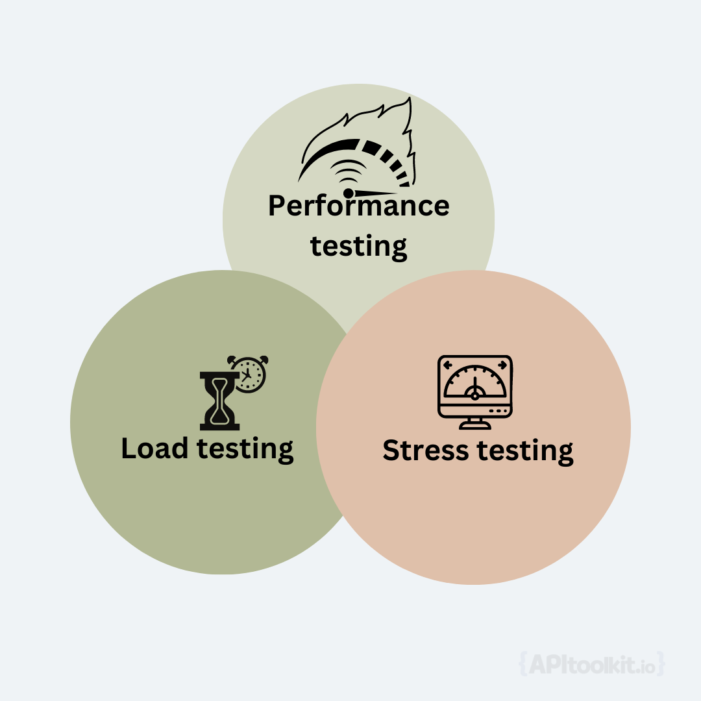
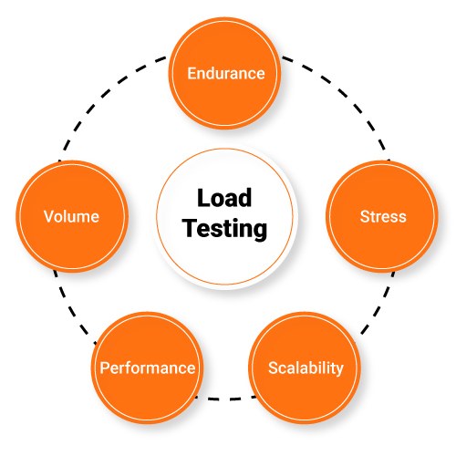

## Introduction

In the modern digital era, ensuring a website or application performs optimally is more crucial than ever. Often, we hear terms like "Load Testing" and "Stress Testing" used interchangeably. But, is it correct? Let's get down to the nitty-gritty.

---

Performance testing is a crucial aspect of software development and quality assurance. It ensures that the system meets the desired performance standards and provides a satisfactory user experience. However, performance testing is not a one-size-fits-all approach. There are different types of performance tests that serve other purposes and objectives. Two of the most common and important ones are load testing and stress testing.



Load testing and stress testing are often confused or used interchangeably, but they are not the same. They have distinct definitions, characteristics, benefits, and processes.

## Load Testing: In-Depth Analysis

Load testing is a type of performance testing that simulates the expected user load on the system and measures its performance under normal or peak conditions. In essence, it's like rehearsing for a big show. The main objectives of load testing are to verify that the system can handle the expected load without compromising its functionality, reliability, or speed, and to identify any performance bottlenecks or issues that may affect the user experience.


[Image source](./https://www.testbytes.net/blog/difference-between-load-testing-and-stress-testing/)

### Characteristics of Load Testing

Some of the key characteristics of load testing are:

- It uses realistic scenarios and data that reflect the actual usage patterns and behaviors of the target users.
- It varies the load intensity and duration according to the predefined test cases and criteria.
- It monitors various performance metrics such as response time, throughput, resource utilization, error rate, etc.
- It analyzes the results to determine the optimal performance level and capacity of the system.

### Benefits of Load Testing

Load testing has a range of benefits, which include:

- Helping to identify performance bottlenecks or issues that may degrade the system's performance or cause failures under high load.

- Ensuring that the system can maintain its stability, functionality, and speed under expected load conditions.

- Providing valuable insights into the system's behavior and performance under different load scenarios and helping to optimize the system accordingly.

### Steps to Load Testing

The load testing process typically consists of three main steps:

**Test planning and scenario creation**: This step involves defining the test objectives, scope, criteria, environment, tools, data, etc., and creating realistic load test scenarios that simulate the expected user load on the system.

**Test execution and monitoring**: This involves executing the load test scenarios using appropriate tools and techniques, and [monitoring the system performance](https://apitoolkit.io/blog/web-api-performance/) using various metrics and indicators.

**Data analysis and results interpretation**: This step concerns itself with analyzing the collected data and results to evaluate the system's performance under different load conditions, identify any performance issues or bottlenecks, and provide recommendations for improvement.

## Stress Testing: A Closer Look

Stress testing is another type of performance testing that applies an extreme or abnormal load to the system and measures its performance under stress conditions. The primary goals of stress testing are to uncover any system vulnerabilities or breaking points that may compromise its security, functionality, or reliability, and to assess how the system behaves or recovers from failure under extreme conditions.


Here are some of the notable peculiarities of stress testing:

- Stress testing uses unrealistic or exaggerated scenarios and data that exceed the normal or expected usage patterns and behaviors of the target users.

- Stress testing increases the load intensity and duration beyond the system's capacity or limits until it breaks down or fails.

- Stress testing focuses more on negative testing aspects such as error handling, fault tolerance, recovery time, etc., rather than positive aspects such as response time, throughput, etc.

- Stress testing analyzes the results to determine the maximum performance level and capacity of the system and its failure points.

### Advantages of Stress Testing

Some of the advantages of stress testing are:

1. It helps to uncover any system vulnerabilities or breaking points that may compromise its security, functionality, or reliability under extreme load or stress conditions.

2. It assesses how the system behaves or recovers from failure under extreme conditions and evaluates its resilience and robustness.

3. It provides valuable insights into the system behavior and performance under stress scenarios and helps to improve its security, functionality, or reliability accordingly.


### Steps to Stress Testing

The stress testing process typically consists of three main steps:

**Selecting stress test scenarios**: This step involves choosing appropriate stress test scenarios that apply an extreme or abnormal load on the system using various factors such as concurrency, data volume, frequency, etc.

**Gradually increasing the load and stress factors**: This step involves gradually increasing the load intensity and duration using appropriate tools and techniques until the system reaches its breaking point or fails.

**Observing system responses and failure points**: This step involves observing how the system responds to the increased load or stress factors using various metrics and indicators, identifying any system failures or errors, and measuring its recovery time.

## Key Differences Between Load Testing and Stress Testing

As we have seen above, load testing and stress testing have different definitions, characteristics, benefits, and processes. To summarize, here are some of the key differences between them:

**Testing objectives**

Load testing aims to verify that the system can handle the expected load without compromising its functionality, reliability, or speed. Stress testing aims to uncover any system vulnerabilities or breaking points that may compromise its security, functionality, or reliability.

**Testing scenarios and conditions**

Load testing uses realistic scenarios and data that reflect the actual usage patterns and behaviors of the target users. Stress testing uses unrealistic or exaggerated scenarios and data that exceed the normal or expected usage patterns and behaviors of the target users.

**Intensity and duration of the tests**

Load testing varies the load intensity and duration according to the predefined test cases and criteria. Stress testing increases the load intensity and duration beyond the system's capacity or limits until it breaks down or fails.

**Expected outcomes and insights**

Load testing provides insights into the optimal performance level and capacity of the system and identifies any performance bottlenecks or issues. Stress testing provides insights into the maximum performance level and capacity of the system and its failure points.

### Code Example for how you would Stress or Load Test using locust**: 

```python
# locustfile.py

from locust import HttpUser, task, between

class WebsiteUser(HttpUser):
    wait_time = between(5, 15)  # users wait between 5 to 15 seconds per task

    @task
    def index_page(self):
        self.client.get("/")

    @task(2)  # this task will be executed twice as often as the other tasks
    def about_page(self):
        self.client.get("/about/")

    @task(3)
    def contact_page(self):
        self.client.get("/contact/")
```

```bash
locust -f locustfile.py
```

The difference between a load test and stress test would usually be in the details. Eg by trying to ramp up the tests really fast, or simply using more and more traffic to identify the limit. Or running tests against certain complex endpoints at the same time, to put more stress on the underlying infrastructure. 


**Key Differences at a Glance**

| **Parameter**       | **Load Testing**                   | **Stress Testing**                   |
|---------------------|-----------------------------------|-------------------------------------|
| Goal                | [Assess performance under expected load](https://apitoolkit.io/blog/web-api-performance/) | Identify breaking points            |
| Duration            | Short-term                        | Extended                            |
| Real-world analogy  | Rehearsing for a show             | Balloon filling to burst            |

**Why the Distinction Matters**

Recognizing the differences ensures that you test your system's readiness and resilience effectively. Not doing so is akin to practicing for a sprint when you're actually running a marathon!

Read: [10 Must-Know API Trends in 2023](https://apitoolkit.io/blog/api-trends/)

Read: [Key Benefits of API Integration for Developers - with Statistics](https://apitoolkit.io/blog/benefits-of-api-integration/)

## Real-World Examples and Case Studies

### Case study: Load testing in e-commerce applications

E-commerce applications are one of the most common and critical use cases for load testing. Load testing helps ensure that the application can handle the expected number of concurrent users, transactions, and requests without compromising the user experience or the system performance. For example, an online retailer may want to load test their website before a major sales event, such as Black Friday or Cyber Monday, to avoid losing customers and revenue due to slow loading times, errors, or crashes.

One of the key aspects of load testing e-commerce applications is simulating concurrent user activity. This means creating realistic scenarios that mimic how users interact with the website, such as browsing products, adding items to the cart, checking out, etc. By using tools like [Testkit](https://usetestkit.com), JMeter or LoadRunner, testers can generate a large number of virtual users that perform these actions simultaneously and measure the response times and server loads. This way, they can identify any performance issues or bottlenecks that may affect the user satisfaction and retention.

### Case study: Stress testing in financial systems

Financial systems is one domain where stress testing is essential for ensuring the security, integrity and resilience of software systems. Stress testing helps evaluate how the system behaves under extreme conditions, such as high transaction volumes, peak market activity, cyberattacks, etc. For example, a bank may want to stress test their payment system before launching a new feature or service, such as mobile banking or instant transfers, to ensure that it can cope with the increased demand and complexity without compromising the data accuracy or availability.

One of the main challenges of stress testing financial systems is emulating extreme transaction volumes. This means generating a very high number of transactions that exceed the normal or expected capacity of the system, such as thousands or millions of transactions per second. Tools like Testkit, Gatling or Tsung can help testers create these scenarios and [monitor the system behavior](https://apitoolkit.io/blog/best-api-monitoring-and-observability-tools/) under stress. This way, they can identify any system failures or vulnerabilities that may pose a risk to the business continuity and reputation.

---

**Example Scenarios**

- **Load Testing a Chat Application**: Simulating multiple users joining and leaving.
- **Stress Testing a Banking Website**: Overloading with transaction requests to determine failure points.

---

**Granular Real-world Examples**

- [**How Amazon Prepares for Prime Day**](https://techbeacon.com/app-dev-testing/was-amazon-prime-day-intended-performance-test-production): Utilizing both load and stress testing.
- [**Netflix's Strategy for New Show Releases**](https://alexanderpodelko.com/blog/2014/02/11/load-testing-at-netflix-virtual-interview-with-coburn-watson/): Preparing their servers for binge-watchers globally.

---

## Common Misconceptions about Load and Stress Testing

**Myth 1: Load Testing and Stress Testing Serve the Same Purpose**

While both tests fall under the [performance testing](https://apitoolkit.io/blog/web-api-performance/) umbrella, their objectives differ. Load testing evaluates system behavior under anticipated load, while stress testing observes the system's reaction to extreme conditions.

**Myth 2: If Your System Passes Load Testing, It Will Sail Through Stress Testing**

Load testing checks the system's [performance](https://apitoolkit.io/blog/web-api-performance/) under expected conditions. Just because it performs well there doesn't mean it's ready for the harshest scenarios stress testing introduces.

**Myth 3: Load and Stress Tests Are Only for High-Traffic Sites**

Even smaller applications benefit from these tests. After all, no one likes downtime, right?

---

**Factors Influencing Load and Stress Testing Outcomes**

A myriad of factors can influence testing outcomes, some of which might surprise you!

- **System Infrastructure**: The robustness of servers, network bandwidth, and storage can make or break your test results.
- **Software Optimization**: Efficiently written code can handle more stress and load.
- **Concurrent User Load**: The number of simultaneous users impacts system response times significantly.
- **Type of User Requests**: Reading data is generally quicker than writing. Therefore, an application with predominantly read requests might perform differently than one with write requests.

---

**Recommendations for Effective Load and Stress Testing**

Diving headfirst without a plan can be counterproductive. Here are some steps to guide your testing process:

1. **Set Clear Objectives**: Know what you're trying to achieve.
2. **Choose the Right Tools**: Tools like Apache JMeter, LoadRunner, and others have their strengths. Select based on your needs.
3. **Simulate Real-World Scenarios**: Tests should mirror actual user behavior for accurate results.
4. **Iterate and Refine**: As your application evolves, so should your tests. Regularly update test cases and scenarios.
5. **Analyze and Act**: After testing, thoroughly analyze the results and make necessary changes.

---

**The Financial Impact of Neglecting Load and Stress Testing**

One might argue, "Why bother?" But, what if we told you neglecting these tests could burn a hole in your pocket?

- **Lost Sales**: Websites that are slow or crash frequently turn visitors away, leading to potential lost sales.
- **Brand Damage**: In the age of instant feedback, a bad user experience can tarnish your brand's reputation.
- **Increased Costs**: Identifying and rectifying issues post-launch can be significantly more expensive than catching them during testing.

---

**FAQs**

- **Is performance testing the same as load testing?**
No, performance testing is a broad umbrella that includes load, stress, and other types of testing to assess system performance.

- **Which is more important, load or stress testing?**
Both are essential; load testing for daily operations and stress testing for unforeseen traffic surges.

- **Can these tests predict every possible real-world scenario?**
While they simulate numerous scenarios, it's challenging to predict every possible situation. Regular testing is the key.

- **What tools can I use for these tests?**
Apache JMeter, LoadRunner, and Gatling are a few popular tools.

- **How often should I perform these tests?**
It's ideal before any major release, significant changes, or anticipated high-traffic events.

- **Are there any risks involved in stress testing?**
Yes, pushing a system to its breaking point can sometimes cause issues. It's advisable to conduct these tests in a controlled environment.

---

## Conclusion

Understanding the distinctions between Load Testing and Stress Testing isn't just technical nitpicking. It's fundamental in ensuring that our digital platforms provide the optimal experience for users while safeguarding against unexpected challenges.

They're essential tools in a developer's arsenal to ensure the software or application’s smooth operation. By actively engaging in these tests, you not only fortify your systems but also gain peace of mind in a digital age filled with uncertainties.

---
- [Learn about testing automation in general](https://apitoolkit.io/blog/api-testing-automation/) 
- [Learn more about these tests on Wikipedia](https://en.wikipedia.org/wiki/Software_performance_testing)
- [Check out the apitoolkit testing offerings](https://apitoolkit.io/api-testing)
- [Check out the testkit low code DSL for api testing and load+performance testing](https://usetestkit.com)

---

**5 Amazing Tools to Kick-start Your Testing Journey**

Engage with these platforms to ensure your software or application remains robust and resilient, come rain or high water.

---

**What's Next?**

Looking to delve deeper? Join our next session on **'Performance Testing: Beyond Just Load and Stress'**. Elevate your knowledge, one test at a time!

---

**Keep Reading**

[Incident Management: How to Resolve API Downtime Issues Before It Escalates](https://apitoolkit.io/blog/api-downtime/)

[How to Generate Automated API Documentation](https://apitoolkit.io/blog/how-to-generate-automated-api-documentation/)

[How to Write API Documentation: 10 Essential Guidelines](https://apitoolkit.io/blog/how-to-write-api-docs/)

[How to Tackle Anomalies in RESTful APIs (the Right Way)](https://apitoolkit.io/blog/anomalies-in-restful-apis/)

[How to Analyze API Logs and Metrics for Better Performance](https://apitoolkit.io/blog/api-logs-and-metrics/)