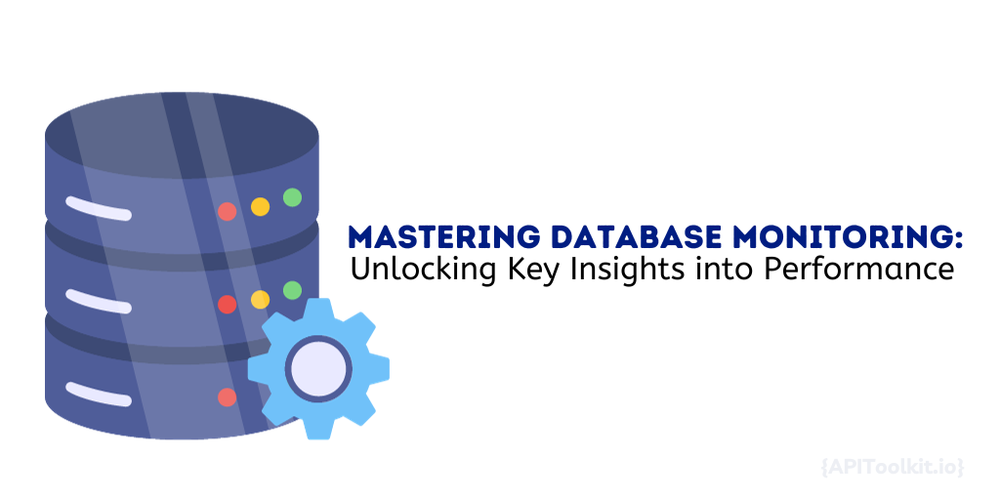

Database performance remains pivotal for the uninterrupted operation of applications and websites. As data volumes surge, businesses grapple with the challenge of sustaining optimal database functionality. This underscores the importance of database monitoring, which provides organizations with in-depth insights into database health, enabling them to initiate timely improvements.

## Gain Insights into Database Performance

One of the key benefits of database monitoring is the ability to gain deep insights into the [performance](https://apitoolkit.io/blog/frontend-api-performance/) of your database. By closely analyzing various aspects of your database, you can identify potential bottlenecks and areas for improvement. Let's explore some of the important insights that database monitoring can provide.

When it comes to database performance, one of the crucial aspects to analyze is the time spent on database calls. Database calls are integral to the functioning of applications, as they retrieve and manipulate data. However, if these calls are taking too long to process, it can significantly impact the overall [performance](https://apitoolkit.io/blog/web-api-performance/) of your system. Database monitoring tools enable you to track the time spent on each database call, allowing you to identify any queries that are slowing down your application. By pinpointing these queries, you can optimize them for better [performance](https://apitoolkit.io/blog/frontend-api-performance/), ensuring that your application runs smoothly.

In addition to analyzing the time spent on database calls, database monitoring tools also help in identifying slow SQL queries. SQL queries are the backbone of database interactions, as they retrieve, update, and delete data. However, poorly optimized or inefficient queries can have a detrimental impact on [performance](https://apitoolkit.io/blog/frontend-api-performance/). Database monitoring tools can help you identify slow SQL queries by tracking their execution time and providing recommendations for optimization. By optimizing these queries, you can improve the overall [performance](https://apitoolkit.io/blog/web-api-performance/) of your database and enhance the responsiveness of your application.

Another important aspect of database [monitoring](https://apitoolkit.io/blog/mastering-api-debugging/) is tracking the impact of database operations on transactions. Transactions are crucial for maintaining data integrity and consistency. They ensure that a series of database operations are executed as a single, atomic unit. Monitoring your database allows you to track the impact of database operations on transactions. By closely examining the transaction logs, you can identify any anomalies or inconsistencies that may be affecting the overall performance and reliability of your system. This insight enables you to take corrective actions and ensure the smooth functioning of your application. Database [monitoring](https://apitoolkit.io/blog/mastering-api-debugging/) provides valuable insights into the performance of your database. By analyzing the time spent on database calls, identifying slow SQL queries, and tracking the impact of database operations on transactions, you can optimize your database for better performance and ensure the smooth functioning of your application.

## Real-Time Performance Monitoring for Your Application

While gaining insights into database performance is essential, it is equally important to monitor the real-time performance of your application. Real-time performance [monitoring](https://apitoolkit.io/blog/mastering-api-debugging/) allows you to proactively detect and address any issues that may arise, ensuring optimal performance for your users.

Monitoring the [performance](https://apitoolkit.io/blog/web-api-performance/) of your application in real-time provides you with valuable insights into its behavior and allows you to make data-driven decisions to improve its performance. By continuously monitoring [key metrics](https://apitoolkit.io/blog/the-key-metrics/), you can identify patterns and trends, enabling you to optimize your application's performance and deliver an exceptional user experience.

Real-time [performance](https://apitoolkit.io/blog/web-api-performance/) monitoring offers a comprehensive view of your application's performance, allowing you to track various aspects, including transaction execution, database performance, external requests, and API failures. By closely monitoring these areas, you can ensure that your application operates smoothly and efficiently.

### Monitoring Transactions in Real-Time

Transaction monitoring allows you to track the execution of transactions in real-time. By monitoring the duration and success of each transaction, you can quickly identify any [performance](https://apitoolkit.io/blog/web-api-performance/) issues or failures and take immediate action to resolve them. This ensures that your application continues to deliver a seamless user experience.

Real-time transaction [monitoring](https://apitoolkit.io/blog/mastering-api-debugging/) provides you with insights into the performance of individual transactions, allowing you to identify bottlenecks and optimize critical areas of your application. By analyzing transaction data, you can uncover inefficiencies and make informed decisions to enhance performance.

### Keeping an Eye on Database Performance

Database performance can have a significant impact on the overall performance of your application. By monitoring crucial performance [metrics](https://apitoolkit.io/blog/the-key-metrics/), such as CPU and memory usage, disk I/O, and network latency, you can identify any abnormal behavior and optimize your database resources accordingly.

Real-time database performance monitoring enables you to detect and address [performance](https://apitoolkit.io/blog/web-api-performance/) issues before they impact your application's performance. By closely monitoring [key metrics](https://apitoolkit.io/blog/the-key-metrics/), you can ensure that your database operates efficiently, resulting in improved application performance and user satisfaction.

### Tracking External Requests

Modern applications often rely on external services and APIs for various functionalities. Monitoring external requests allows you to track the response times and success rates of these requests. By closely monitoring external dependencies, you can identify any [performance](https://apitoolkit.io/blog/web-api-performance/) bottlenecks and ensure a smooth experience for your users.

Real-time monitoring of external requests enables you to detect any issues with external services or APIs promptly. By monitoring response times and success rates, you can proactively address any performance issues, ensuring that your application seamlessly integrates with external services and delivers a reliable user experience.

### Analyzing Transaction Traces

Transaction traces provide detailed insights into the execution path of a transaction. By analyzing transaction traces, you can pinpoint the exact points of inefficiency or potential [performance](https://apitoolkit.io/blog/web-api-performance/) bottlenecks. This allows you to optimize critical areas of your application and ensure efficient database performance.

Real-time analysis of transaction traces empowers you to identify performance bottlenecks and optimize your application's performance. By understanding the execution path of transactions, you can make informed decisions to improve efficiency, resulting in enhanced user experience and increased application performance.

### Detecting and Resolving API Failures

API failures can greatly impact the functionality and performance of your application. By monitoring API requests and responses, you can quickly detect any failures or [errors](https://apitoolkit.io/blog/detecting-api-documentation-errors/) and take immediate action to resolve them. Timely resolution of API failures ensures the smooth execution of your application and enhances the user experience.

Real-time monitoring of API requests and responses allows you to proactively address any issues that may arise. By detecting and resolving API failures promptly, you can ensure that your application functions seamlessly, providing users with a reliable and efficient experience.

### Error Tracking for Improved Performance

Error tracking is essential for identifying and resolving issues that may arise during the execution of your application. By monitoring and tracking [errors](https://apitoolkit.io/blog/detecting-api-documentation-errors/), you can gain valuable insights into the root causes of performance issues and take measures to optimize your application's performance.

Real-time error tracking enables you to identify and address errors promptly, minimizing their impact on your application's performance. By understanding the root causes of errors, you can implement targeted solutions, resulting in improved performance and enhanced user satisfaction.

Mastering database [monitoring](https://apitoolkit.io/blog/mastering-api-debugging/) is crucial in today's data-driven world. By unlocking key insights into database performance, organizations can optimize their applications, enhance the user experience, and stay ahead of the competition. With real-time performance monitoring and the ability to track and resolve issues proactively, businesses can ensure that their databases are running at peak efficiency, resulting in improved performance and increased customer satisfaction.

**Keep Reading**

[Web API Performance Best Practices: the Ultimate Guide](https://apitoolkit.io/blog/web-api-performance/)
[10 Must-Know API trends in 2023](https://apitoolkit.io/blog/api-trends/)
[How to Analyze API Logs and Metrics for Better Performance](https://apitoolkit.io/blog/api-logs-and-metrics/)
[Incident Management: How to Resolve API Downtime Issues Before It Escalates](https://apitoolkit.io/blog/api-downtime/)
[How to Tackle Anomalies in RESTful APIs](https://apitoolkit.io/blog/anomalies-in-restful-apis/)
