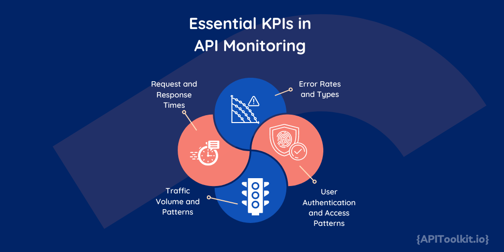

Understanding and analyzing API logs is fundamental to the success of software development and system management. These logs, which meticulously record the activities of APIs (Application Programming Interfaces), are a crucial resource for optimizing performance and bolstering security. This article will focus on the significance of thorough [API log monitoring](https://apitoolkit.io/blog/mastering-monitoring/) and explore the essential key performance indicators (KPIs) necessary for effective interpretation and management.

APIs are fundamental in the data-rich landscape of modern digital technology, serving as key channels for exchanging information and functionalities among diverse software applications and services. Resembling intricate diaries, API logs meticulously record every interaction, transaction, and event within these APIs. Through careful monitoring of these logs, organizations gain invaluable insights into the health, performance, and usage patterns of their APIs.

## Effective Monitoring of API Logs

[Monitoring API logs](https://apitoolkit.io/blog/mastering-monitoring/) plays a crucial role in various aspects of system management, each serving to enhance the overall functionality and security of the application.

Firstly, Enhancing Performance is a key benefit. Monitoring API logs allows for the identification of performance-related issues such as bottlenecks and slow response times. By pinpointing these areas, it becomes possible to make timely optimizations, thereby improving the operational efficiency of the APIs.

Secondly, in terms of Security and Compliance, [API logs](https://apitoolkit.io/blog/api-logs/) are invaluable. They are critical tools for detecting security breaches and unauthorized access attempts. Furthermore, they play a significant role in ensuring that the application remains compliant with data protection regulations. This aspect of [log monitoring](https://apitoolkit.io/blog/best-api-monitoring-and-observability-tools/) is essential in maintaining the trust and safety of the application's users.

Another vital aspect is Error Troubleshooting. API logs offer detailed insights into errors that occur during the application’s operation. By analyzing these logs, developers can understand the underlying causes of these issues, leading to more effective and prompt resolutions. This not only helps in maintaining a stable system but also reduces downtime caused by unexpected errors.

Lastly, monitoring plays a significant role in User Behavior Analysis. By examining how users interact with the application through the API logs, developers and system administrators can gain a deeper understanding of user behavior. This information is crucial for designing a better user experience and making functional improvements to the application. It ensures that the application evolves in a way that is aligned with the needs and preferences of its users. Effective [API log monitoring](https://apitoolkit.io/blog/best-api-monitoring-and-observability-tools/) is a multifaceted approach that enhances performance, ensures security and compliance, aids in troubleshooting, and provides insights into user behavior, each contributing to a more robust and user-centric application.

## Overview of Key Performance Indicators

In API management, [Key Performance Indicators](https://apitoolkit.io/blog/the-key-metrics/) (KPIs) are invaluable metrics that provide insights into the performance and health of an [API](https://apitoolkit.io/blog/how-apitoolkit-can-help-you-achieve-api-observability/). These KPIs serve as quantifiable measures, enabling teams to make informed, data-driven decisions for optimizing their systems. Among the most critical KPIs are Response Time and Error Rate. Response Time is essential as it measures how long an [API](https://apitoolkit.io/blog/how-apitoolkit-can-help-you-achieve-api-observability/) takes to respond to a request, directly impacting the user experience. A swift response time is often synonymous with a smooth and efficient user interface. On the other hand, the Error Rate is indicative of the frequency of errors within the API. A high error rate can be a red flag, signaling underlying problems in the API's infrastructure or code, necessitating prompt attention and resolution.

Additionally, Traffic Volume, Latency, and User Authentication Success Rate are pivotal KPIs. Traffic Volume tracks the number of requests an API receives, shedding light on usage patterns and potential scalability requirements. Latency, closely related to response time, focuses on delays in processing API requests and is a key factor in performance optimization. Meanwhile, the User Authentication Success Rate evaluates the API’s security efficacy, measuring successful user authentications against attempts. Understanding and monitoring these KPIs is crucial in analyzing API logs for performance tuning. In the following sections of this article, we will delve deeper into each of these KPIs, explore strategies for effective API log analysis, and discuss best practices in API log management. This comprehensive approach will unravel the complexities of API logs, guiding towards enhanced performance and robust API management.

## API Logs and API Logs Analysis

API logs are essential in maintaining the performance and health of APIs, serving as a diagnostic tool that offers real-time operational insights. These logs meticulously document every request and response, capturing details such as timestamps, payload data, headers, and occasionally the internal state of the API during transactions. This wealth of data is critical for various purposes. Performance optimization is achieved by analyzing response times and request throughput, helping developers identify and rectify issues like slow endpoints or resource-heavy queries. Health monitoring through regular [log](https://apitoolkit.io/blog/api-logs/) reviews aids in the early detection of anomalies or patterns that may indicate potential system failures, allowing for prompt resolution and reduced downtime. Additionally, API logs provide valuable insights into traffic patterns and peak usage times, information crucial for effective load balancing and resource scalability. Ensuring the API consistently meets service level agreements and quality standards is another key use of log analysis, directly impacting user satisfaction and trust.

The process of API log analysis is a comprehensive journey that begins with the collection of data from various sources. This crucial first step involves gathering extensive log information, which is then normalized and stored efficiently for further analysis. The next phase utilizes advanced analytical tools and dashboards, which are essential for sifting through the data, identifying trends, detecting anomalies, and visualizing [key metrics](https://apitoolkit.io/blog/the-most-important-metric/). The employment of advanced analytics techniques, particularly machine learning, plays a significant role in delving deeper into the logs to unearth more profound insights. The ultimate objective of this meticulous process is to convert the analyzed data into actionable insights by pinpointing specific areas in need of improvement.

API log analysis transcends being just a reactive tool for troubleshooting; it embodies a strategic approach to enhancing API performance and health. Continuous monitoring is a vital component of this strategy, and tools like [APIToolkit](https://apitoolkit.io/) are instrumental in maintaining a vigilant eye on API performance and health indicators. This ongoing vigilance ensures that APIs remain robust, secure, and perform efficiently. By leveraging the rich trove of information contained within API logs, organizations are empowered to not only respond to immediate issues but also to anticipate and preempt potential future challenges, thereby ensuring the long-term effectiveness and reliability of their API infrastructures.

## Essential KPIs in API Monitoring

In the realm of API monitoring, certain Key Performance Indicators (KPIs) stand out as critical metrics for assessing API performance and reliability. These indicators provide actionable insights that can guide improvements and optimizations. Below are some of the most essential KPIs in API monitoring:

1. **Request and Response Times:** This KPI measures the time taken for an API to process a request and return a response. It is a direct indicator of the API’s performance from a user’s perspective. Shorter response times are generally indicative of a more efficient and responsive API. Monitoring these times helps in identifying performance lags and bottlenecks, which can then be targeted for optimization.

2. **Error Rates and Types:** Error rates refer to the frequency of errors occurring during API interactions. Monitoring error rates is crucial for maintaining the reliability of an API. High error rates can indicate underlying issues with the API’s code, infrastructure, or interaction with other services. Additionally, understanding the types of errors (e.g., client-side 4xx errors, server-side 5xx errors) can help in pinpointing specific issues and informing the necessary corrective actions.

3. **Traffic Volume and Patterns:** This KPI tracks the amount of traffic an API receives over a given period. High traffic volumes can stress the API and the underlying infrastructure, leading to performance issues. Understanding traffic patterns – such as peak usage times and common request types – is vital for effective load management and resource allocation.

4. **User Authentication and Access Patterns:** In APIs, especially those dealing with sensitive data or requiring user authentication, it’s important to monitor how users are accessing the API. This includes tracking successful and failed authentication attempts, access frequencies, and usage patterns. Such monitoring helps in identifying potential security threats, such as brute force attacks, and ensures that the API’s authentication mechanisms are functioning correctly.

Monitoring these KPIs is not just about collecting data; it’s about gaining insights that can drive meaningful improvements in API design, development, and maintenance. Utilizing tools like APIToolkit can streamline the monitoring process, offering a comprehensive view of an API’s performance and health. By keeping a close eye on these essential KPIs, developers and system administrators can ensure their APIs are robust, efficient, and secure.

## Optimizing API Performance Through Log Analysis

Effectively analyzing API logs is a critical process in fine-tuning the performance of APIs. This analysis helps in identifying areas that require optimization, ensuring that the APIs function efficiently and reliably. Key aspects of this analysis include identifying slow APIs, diagnosing frequent errors, and understanding user behavior.

1. **Identifying Slow APIs**: One of the primary goals of performance tuning is to identify and improve slow APIs. Slow APIs can significantly impact user experience and overall system performance. By analyzing the response times recorded in the [API logs](https://apitoolkit.io/blog/api-logs-and-user-behaviour-tracking/), it's possible to pinpoint which APIs are taking longer than expected to respond. This analysis can lead to discovering underlying issues such as inefficient code, slow database queries, or inadequate server resources. Once identified, these slow APIs can be targeted for optimization through code refactoring, database indexing, or scaling the infrastructure, as appropriate.

2. **Diagnosing Frequent Errors**: API logs are a rich source of information about the errors encountered during API interactions. Regularly reviewing these logs helps in identifying patterns or trends in errors. This could include frequent timeout errors, which might indicate an overloaded server, or a common 500 Internal Server Error, suggesting a bug within the API’s code. Understanding the types and frequencies of these errors is crucial for prioritizing the issues that need immediate attention. Addressing these errors not only improves the API's reliability but also enhances the overall user experience.

3. **Understanding User Behavior**: [API logs](https://apitoolkit.io/blog/api-logs-and-user-behaviour-tracking/) also provide valuable insights into how users are interacting with the API. This includes information on the most frequently accessed endpoints, the types of requests made, and the volume of data being transferred. By analyzing this user behavior, developers can gain a better understanding of the real-world usage of their APIs. This information is invaluable for making data-driven decisions regarding API enhancements, feature development, and capacity planning.

Effective API log analysis for performance tuning often requires sophisticated tools that can handle large volumes of data and provide intuitive ways to visualize and interpret the data. Tools like those offered by APIToolkit can be invaluable in this regard. They can automate the collection and analysis of log data, provide real-time monitoring capabilities, and highlight areas in need of optimization. Through diligent analysis and continuous monitoring of API logs, organizations can ensure their APIs deliver the high performance and reliability that users expect.

## Best Practices for API Log Management

Effective management of API logs is crucial for maintaining a robust and efficient API infrastructure. Proper log management supports performance tuning, error resolution, and compliance with data protection standards.

**Log Storage and Management**: Fundamental to effective log management is the efficient storage and organization of log data. This involves centralized log storage, which simplifies access and analysis and can be achieved using cloud-based solutions or dedicated log management systems. It's important to ensure that the storage solution can scale with the growing volume of log data. Secure storage practices are essential, especially for logs containing sensitive information, and should include encryption and access controls. Additionally, implementing log retention policies is crucial for balancing historical data analysis needs with storage costs and compliance requirements.

**Effective Log Analysis Strategies**: Given the volume of data, analyzing API logs requires effective strategies. Automated analysis tools are beneficial for parsing, filtering, and analyzing log data quickly to identify trends, anomalies, and issues. [Real-time monitoring](https://apitoolkit.io/blog/api-observability-and-api-monitoring/)of critical KPIs allows for prompt issue detection and response. Regular audits and reviews of logs help proactively identify potential issues, and custom alerts can be configured for specific events or thresholds.

**Integrating with API Toolkit Solutions**: Integrating with specialized API toolkit solutions enhances log management capabilities. These tools provide features like automated log collection and aggregation, advanced data visualization for easier interpretation, performance benchmarking against industry standards, and machine learning algorithms for predictive analysis and proactive optimization.

## Advanced Metrics for Proactive API Management

The adoption of advanced metrics like predictive analysis and machine learning is critical for a proactive approach. Predictive analysis utilizes historical data to forecast future trends and potential challenges, enabling a more anticipatory stance in API management. This approach encompasses various aspects such as predicting traffic and load, forecasting error rates, and modeling user behavior. These predictive models are instrumental in forecasting future usage spikes, identifying error patterns, and understanding evolving user behavior trends, all of which are crucial for optimizing both performance and user experience.

Machine learning is transforming the way API logs are processed and interpreted. By automating the detection of anomalies, improving error diagnosis, and optimizing overall API performance, machine learning offers a significant enhancement in log analysis. These models can adeptly identify unusual patterns or deviations in [API logs](https://apitoolkit.io/blog/api-logs-and-user-behaviour-tracking/), predict possible system failures or performance issues, and bolster security monitoring by recognizing breach-indicative patterns. Furthermore, the field of API monitoring is rapidly evolving with trends such as AI-driven analytics, a heightened focus on security, adaptations to serverless architectures, and a shift toward user-centric [monitoring](https://apitoolkit.io/blog/api-observability-and-api-monitoring/). These developments underscore the growing importance of AI in managing data from IoT devices, emphasize the need for performance and scalability in serverless computing, and advocate for a monitoring perspective that prioritizes the end-user experience.

Embracing these advanced metrics in API management goes beyond merely adhering to current standards; it is about strategically preparing for future needs and challenges. Staying abreast of these emerging trends in API monitoring allows organizations to ensure that their API strategies are not only robust and secure but also adaptable to the changing landscape of business and technology.

## Conclusion

API logs are invaluable, providing deep insights into API performance, health, and [security](https://apitoolkit.io/blog/api-logs-in-cybersecurity/). They meticulously record transaction details like response times, error rates, and user interactions. Key Performance Indicators (KPIs) such as response times, error rates, traffic volumes, and user authentication patterns are essential in assessing API robustness and reliability. Proactive analysis, particularly using predictive analytics and machine learning, allows organizations to foresee and mitigate potential issues, enhancing API performance. Additionally, keeping pace with evolving trends, such as AI-driven analytics, heightened [API security](https://apitoolkit.io/blog/api-logs-in-cybersecurity/), and adaptations to serverless architectures, is critical for sustaining efficient and up-to-date APIs. Effective log management, characterized by strategies like centralized storage, meticulous log analysis, and the integration of advanced toolkit solutions, ensures that the valuable data in logs is fully utilized.

Continuous [API log monitoring](https://apitoolkit.io/blog/why-you-need-an-api-monitoring-tool/) is far more than a troubleshooting tool; it is a strategic asset in API management. It enables early detection and quick resolution of performance issues and security threats, minimizing user impact. This ongoing analysis of log data paves the way for informed, data-driven decision-making, ensuring API strategies align with user patterns and performance metrics. Regular monitoring also guarantees that APIs meet performance benchmarks and service level agreements, which is crucial for maintaining user trust and satisfaction. Moreover, in a technological landscape that is constantly evolving, continuous [monitoring](https://apitoolkit.io/blog/why-you-need-an-api-monitoring-tool/) equips organizations to remain agile and responsive, prepared to meet future challenges and opportunities. In essence, effective API log management and monitoring are fundamental to any successful API strategy, ensuring not just current robustness and security, but also positioning APIs for future growth and innovation.

## Keep Reading

[How to Tackle Anomalies in RESTful APIs](https://apitoolkit.io/blog/anomalies-in-restful-apis/)
[Web API Performance Best Practices: the Ultimate Guide](https://apitoolkit.io/blog/web-api-performance/)
[Enhancing Customer Experience Through API Log Insights](https://apitoolkit.io/blog/enhancing-customer-experience/)
[Bridging the Gap Between API Logs and User Behavior Tracking](https://apitoolkit.io/blog/api-logs-and-user-behaviour-tracking/)
[Incident Management: How to Resolve API Downtime Issues Before It Escalates](https://apitoolkit.io/blog/api-downtime/)

