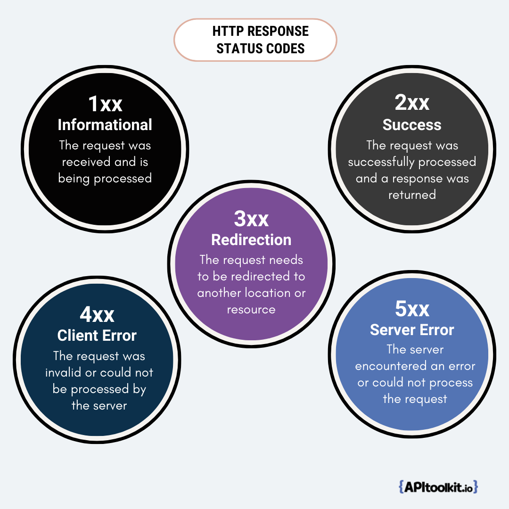

In our rapidly evolving digital landscape, having efficient endpoint troubleshooting capabilities is essential for any organization relying on [APIs](https://apitoolkit.io/blog/the-ultimate-api-management-strategy/). The ability to quickly identify and resolve failures can ensure smooth operations and a seamless user experience. Enter [APIToolkit](https://apitoolkit.io), a comprehensive application performance monitoring tool that offers powerful features for monitoring and analyzing API failures. In this guide, we will explore how APIToolkit can streamline your endpoint troubleshooting process and help uncover the root cause of failures. Additionally, we will discuss the importance of real-time performance monitoring and comprehensive error tracking and analysis. Let's dive in!

## Streamline Endpoint Troubleshooting

### Efficiently Identify and Diagnose Failing Endpoints

When it comes to troubleshooting API failures, time is of the essence. With APITookit, you can efficiently identify and diagnose failing endpoints, minimizing downtime and ensuring a seamless user experience. Monitoring key metrics such as response times, error rates, and throughput, can help you gain real-time insights into the health of your API endpoints. This enables you to proactively address issues before they impact your users.

### Analyzing the Impact of 4xx and 5xx Codes on Endpoints

HTTP response codes such as 4xx (client errors) and 5xx (server errors) can provide valuable insights into the root cause of API failures. APIToolkit allows you to analyze the impact of these codes on your endpoints, helping you to pinpoint the underlying issues. By understanding which error codes are most prevalent and their frequency of occurrence, you can prioritize troubleshooting efforts and minimize the impact on your users.

When troubleshooting API failures, it is crucial to have a comprehensive understanding of the impact of different HTTP response codes on your endpoints. 

The 4xx codes indicate client errors, which are typically caused by invalid requests or unauthorized access. By analyzing the frequency of these codes, you can identify patterns and potential vulnerabilities in your API endpoints.

Similarly, the 5xx codes represent server errors, indicating issues with the server-side processing of requests. These errors can be caused by various factors such as server overload, database connectivity problems, or software bugs. By closely monitoring the occurrence of 5xx codes, you can quickly identify and address any server-side issues that may be affecting the performance and reliability of your API endpoints.

[APIToolkit](https://apitoolkit.io) goes beyond simply providing visibility into the occurrence of these error codes. It allows you to drill down into the specific endpoints that are experiencing the most failures, enabling you to focus your troubleshooting efforts where they are needed the most. Identifying the root cause of these failures can help you implement targeted fixes and optimizations to improve the overall stability and performance of your API.

API Anomalies Dashboard on APIToolkit

Furthermore, APIToolkit provides real-time insights into [key metrics](https://apitoolkit.io/api-logs-and-metrics/) such as response times, error rates, and throughput. This granular level of monitoring allows you to detect any anomalies or performance degradation in your API endpoints. Addressing these issues means that you can prevent potential failures and ensure a seamless user experience.

## Uncover the Root Cause of Failures

### Deep Dive into Endpoint Failures for Root Cause Analysis

When an [API failure](https://apitoolkit.io/blog/api-downtime/) occurs, it is crucial to identify the root cause in order to resolve the issue effectively. APIToolkit offers powerful diagnostic tools that allow you to dive deep into endpoint failures, capturing detailed performance data and transaction traces. This comprehensive visibility enables you to pinpoint the exact point of failure and take targeted corrective actions. With APIToolkit, you can minimize downtime and ensure optimal performance of your API endpoints.

Imagine a scenario where your API suddenly stops responding, causing a major disruption to your business operations. Without proper visibility into the root cause of the failure, you would be left guessing and trying various troubleshooting methods, wasting valuable time and resources. This is where APIToolkit comes to the rescue.

API Requests Grouped by Endpoints on APIToolkti

With APIToolkit, you can gain deep insights into the performance of your API endpoints. The [diagnostic tools](https://apitoolkit.io/api-performance-monitoring-and-compliance/) provided by APIToolkit go beyond just surface-level monitoring and into [API observability](https://apitoolkit.io/blog/api-observability-software-development-/), allowing you to dig deep into the underlying issues that may be causing the failures. By capturing detailed performance data and transaction traces, APIToolkit provides you with a comprehensive view of what is happening behind the scenes.

One of the key features of APIToolkit is its ability to pinpoint the exact point of failure. Whether it's a database query that is taking too long to execute, a network issue causing delays in response times, or a code error that is causing the API to crash, APIToolkit can help you identify the root cause with precision. This level of visibility is crucial for effective troubleshooting and resolution of the issue.

But APIToolkit doesn't stop at just identifying the root cause of the failures. It also empowers you to take targeted corrective actions. Armed with the knowledge of what went wrong, you can make informed decisions and implement the necessary fixes to ensure that the failures don't happen again in the future. This proactive approach not only minimizes downtime but also helps in maintaining optimal performance of your API endpoints.

Furthermore, APIToolkit provides real-time monitoring and alerting capabilities, allowing you to stay on top of any potential issues before they escalate into major failures. Setting up custom alerts based on performance thresholds can keep you up to speed when any of your API endpoints start exhibiting abnormal behavior. This proactive monitoring helps you address issues before they impact your users and business.

APIToolkit offers a comprehensive solution for uncovering the root cause of failures in your API endpoints. With its powerful diagnostic tools, detailed performance data, and transaction traces, APIToolkit enables you to dive deep into the underlying issues and take targeted corrective actions. The goal of every API-reliant business is to minimize downtime and ensure optimal performance. This is where APIToolkit helps you deliver a seamless experience to your users and maintain the reliability of your API endpoints.

## Real-Time Performance Monitoring

### Monitoring Transactions for Optimal Performance

Transactions are at the core of any API-based application. Monitoring the performance of these transactions in real-time is vital for ensuring [optimal performance](https://apitoolkit.io/blog/web-api-performance/). APIToolkit offers transaction monitoring capabilities that provide insights into response times, throughput, and error rates. 

But what exactly are transactions? In the context of API-based applications, transactions refer to the interactions between the client and the server. These interactions can include requests for data, updates, or any other operation that involves communication between the client and the server. Monitoring these transactions allows you to gain visibility into how your API is performing and identify any issues that may arise.

[Get Started on APIToolkit](https://apitoolkit.io).

## Keeping a Close Eye on Database Performance

API failures can often be traced back to issues with [database performance](https://apitoolkit.io/blog/database-monitoring). With APIToolkit, you can track and monitor the performance of your database queries, ensuring efficient and reliable [data retrieval](https://apitoolkit.io/blog/data-retrieval-and-filtering-for-web-api-performance/). By proactively identifying and addressing database performance issues, you can prevent potential API failures and maintain a seamless user experience.

Databases are important because they are where your API stores and retrieves data. If the performance of your database is slow or inefficient, it can significantly impact the overall performance of your API. Slow database queries can lead to delays in data retrieval, which in turn can result in slower response times for your API. By closely monitoring your database performance, you can ensure that your API is running smoothly and efficiently.

### Tracking External Requests for Improved Performance

APIs often rely on external services and third-party integrations. Therefore, monitoring the performance of these external requests is crucial for maintaining optimal API performance. APIToolkit allows you to track and analyze the performance of external requests, helping you identify any bottlenecks or issues that may impact the overall performance of your API.

External requests can include interactions with other APIs, web services, or any other external system that your API depends on. These interactions can introduce additional complexities and potential points of failure. Monitoring the performance of these external requests can help you proactively identify any issues and take appropriate actions to optimize performance. This can include optimizing network connections, improving caching strategies, or even considering alternative integration options.

Overall, [real-time performance monitoring](https://apitoolkit.io/api-performance-monitoring-and-compliance/) is essential for maintaining the optimal performance of your API-based application.

## Comprehensive Error Tracking and Analysis

### Analyzing Transaction Traces for Error Detection

Transaction traces can reveal valuable insights into API failures and errors. With APIToolkit, you can analyze transaction traces to detect errors, exceptions, and potential performance issues. Understanding the flow of transactions and identifying error patterns can help resolve issues fast and ensure a seamless user experience.

Image source: Tracking errors on APIToolkit

### Identifying and Resolving API Failures

API failures can have a significant impact on your business. With APIToolkit, you can identify and resolve API failures quickly and efficiently. By analyzing error logs and performance data, APIToolkit enables you  pinpoint the root cause of failures and take immediate corrective actions. This proactive approach allows you to minimize downtime, maintain customer satisfaction, and drive business success.

### Effective Error Tracking for Enhanced Performance

Error tracking is a crucial component of troubleshooting API failures. APIToolkit offers comprehensive error tracking capabilities, allowing you to capture and analyze errors in real-time. This data-driven approach enables you optimize performance, enhance reliability, and ensure a seamless user experience.

In conclusion, efficient endpoint troubleshooting is vital for maintaining a high-performing API. With APIToolkit, you can streamline your troubleshooting process, uncover the root cause of failures, and ensure optimal performance.

[Best API Monitoring and Observability Tools in 2023](https://apitoolkit.io/blog/best-api-monitoring-and-observability-tools/)

[10 Must-Know API Trends in 2023](https://apitoolkit.io/blog/api-trends/)

[Ultimate Guide to API Testing Automation](https://apitoolkit.io/blog/api-testing-automation/) 

[Web API Performance Best Practices - the Ultimate Guide](https://apitoolkit.io/blog/web-api-performance/)

[How to Analyze API Logs and Metrics for Better Performance](https://apitoolkit.io/blog/api-logs-and-metrics/)

[API Documentation and Monitoring: the Truth You Must Know](https://apitoolkit.io/blog/api-documentation-and-observability-the-truth-you-must-know/)