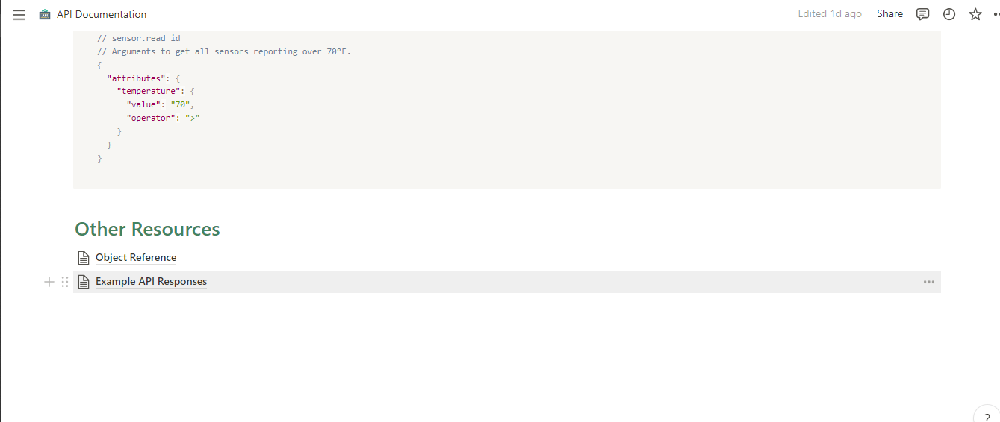

We talked about using [Notion for documentation](../using-notion-for-API-documentation/index.md) last week; today, we'll take a quick look at how to use the same software for API documentation. You can take a look if you haven’t read the article and just in case you don't know the difference between API Documentation and Documentation you can simply click on the link to read more.

APIs have increased significantly with the usage of API documentation. With proper API documentation, users have a better experience with the functionality and instructions for using and integrating the project, coupled with updates on the API lifespan. This doesn’t entirely mean that you can’t use an API without documentation but the idea is to make things a lot easier for the user who might probably be a first time user and giving access to the technical content of the API and integration rules to make work easier and convienient for them. There are a lot of tools that can help simplify and manage this document and notion is one of those tools, notion is an all-in-one workspace, it goes beyond just basic documentation to API documentation giving you access to code blocks, navigation blocks, etc.

## Using Notion For API Doc
Creating an API Doc can be quite complex, especially at the point of finding a template that works. Today we will create an API doc with an existing template from Beestat and create an API doc from scratch.

### Working with a Template
We'll make use of a template from [Beestat](https://www.notion.so/API-Documentation-e4a7746e6a3f45dbb58ea6b45b8f9744). This template is a perfect choice for API documentation. It includes a navigation bar at the top page, a sub-page, lists, and code blocks to generate all of the product documentation in Notion. This template is divided into three sections: the navigation section, the documentation section, and the references section.

The Navigation
The navigation section is also what we know as the table of content section. It is created to automatically update as you add new header sections (i.e /h1, /h2, /h3) to your page. This is a really practical and simply one more fantastic feature Notion has.

The Documentation
This part contains the content that you want your readers to read. There s no word limit, it can be anything, it all depends on you

The Reference
The reference is a list of resources located at the page's footer. You can add additional pages here, and then use the notation @pagename to refer to them elsewhere in the documentation. This is incredibly practical because it allows for numerous references to the same page and provides a simple "back" button on those subpages.

To reproduce the template, just click the link. Select "duplicate" in the top-right corner of the page, and then sign up for a Notion account just in case you do not have one. And you can simply go ahead to customize the content as you desire.

### Creating an API Doc with a new template
Here is a video I created on the loom that shows how I created a template from scratch for my API Doc on Golang Integration
[API Doc Video](5a3a5a93766c4270a0117f60d54aa8df.mp4)

Deployment 
Using Notion's page publishing feature is the simplest approach to deploying these docs.
The button can be made active by clicking the "Share to web" button in the top right corner and then switching it to the right. This is a sample of what your doc link will look like.
https://www.notion.so/Golang-Integration-dcb8e308ffd8462ea00de6cdee2f4dea

## Automation is fast and more effective 
I started out explaining the need for an and how it is an essential part of an API project and how the documentation should accurately reflect each step of the process and should be easy to understand for new users; because, if it is written with no form of orderliness or in a hurry, it may end up being jumbled.

Notion is totally perfect as an app for maintaining a workflow environment but has a bit of lapse as it has to do with API documenting. The important thing to note is that not all developers have enough time on their plate to go about the notion process so they will prefer automatic documentation tools like APIToolkit to automate their documentation and keep it up to date. To promote this workflow, we created APIToolkit automatic documenter. APIToolkit documenter is optimized for speed, it allows you to auto-generate API documentation within minutes. Click to learn more about APIToolkit Automatic Documenter.
