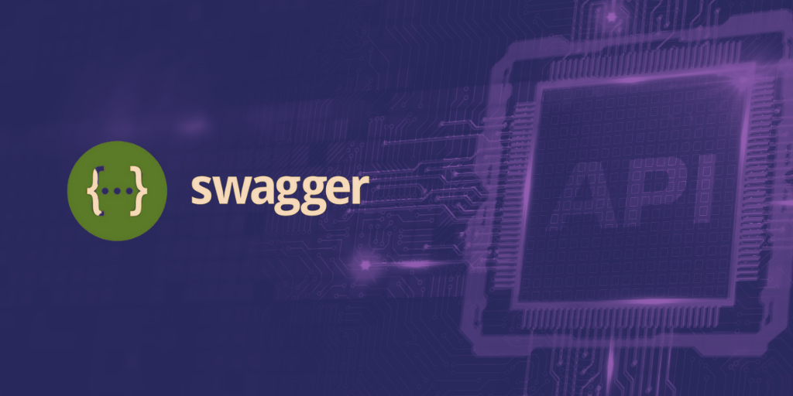

As a developer who works with APIs, you must be familiar with OpenAPI (Swagger) Specification. But what is it exactly, and why should you use it in your API development? In this blog, we will answer these questions and show you how OpenAPI can help you create better APIs faster and easier.

## Introduction

OpenAPI (Swagger) [Specification](https://apitoolkit.io/blog/api-documentation-vs-api-specification/) is a standard format for describing [RESTful APIs](https://apitoolkit.io/blog/everything-about-rest-apis/) ina YAML or JSON file. It allows you to define the structure, parameters, responses, and security of your API in a human- and machine-readable way. By using OpenAPI, you can benefit from various tools and features that can improve your API development process.

## Understanding OpenAPI Specification

[OpenAPI Specification](https://swagger.io/specification/) was originally developed by [SmartBear Software](https://smartbear.com/) under the name Swagger Specification, and later donated to the [Linux Foundation](https://www.linuxfoundation.org/) as an open source project. The current version of the specification is 3.1.0, released in February 2021.

OpenAPI Specification defines a set of key features and concepts that describe an API, such as:

- **Paths**: The endpoints or routes of the API, along with the HTTP methods and parameters that they support.
- **Schemas**: The data models or structures that the API uses or returns, such as objects, arrays, or primitives.
- **Responses**: The possible outcomes or results of calling an API endpoint, including status codes, headers, and body content.
- **Security**: The authentication and authorization mechanisms that the API requires or supports, such as API keys, OAuth2, or JWT.
- **Components**: The reusable elements or definitions that can be referenced throughout the specification, such as schemas, parameters, responses, or security schemes.

## OpenAPI vs. Swagger: Clarifying the Terminology

One of the common sources of confusion when talking about OpenAPI is the terminology. What is the difference between OpenAPI and Swagger?

The answer is simple: OpenAPI is the name of the specification, while Swagger is the name of a set of tools that support the specification. Swagger was the original name of the specification before it became an open source project under the Linux Foundation. However, the name Swagger still remains as a trademark of SmartBear Software, which offers various tools and services based on OpenAPI.

Some of the most popular Swagger tools are:

- **Swagger Editor**: A web-based editor that allows you to write and validate your OpenAPI specification in YAML or JSON.
- **Swagger UI**: A web-based interface that displays your OpenAPI specification as interactive documentation that users can explore and test.
- **Swagger Codegen**: A tool that generates client and server code for your API in various programming languages from your OpenAPI specification.
- **Swagger Hub**: A cloud-based platform that enables you to design, document, manage, and collaborate on your APIs using OpenAPI.

Another important thing to note is that OpenAPI has different versions that are not fully compatible with each other. The current version is 3.1.0, which introduced some major changes from the previous version 3.0.x. For example, version 3.1.0 supports JSON Schema 2020-12 for defining schemas, while version 3.0.x supports a subset of JSON Schema Draft 4.

Therefore, when working with OpenAPI, you should always check which version of the specification your tools and libraries support, and make sure they are consistent with your specification file.

## Benefits of Adopting OpenAPI Specification

Now that we have a basic understanding of what OpenAPI Specification is and how it works, let's look at some of the benefits of using it in your API development.

### 1. Improved API Documentation

One of the main advantages of using OpenAPI is that it enables you to generate [high-quality documentation](https://apitoolkit.io/blog/how-to-write-api-docs/) for your API automatically from your specification file. This means that you don't have to write or maintain separate documentation for your API manually, which can be time-consuming and error-prone.

By using tools like Swagger UI or Swagger Hub, you can convert your OpenAPI specification into user-friendly documentation that developers can easily access and interact with. Your documentation will always be [up-to-date](https://apitoolkit.io/api-documentation-and-developer-portals/) with your API changes, and will provide clear and accurate information about your API endpoints, parameters, responses, and security.

Moreover, your documentation will be enhanced by features like:

- **Interactive testing**: Users can try out your API endpoints directly from your documentation by sending requests and viewing responses, without the need for additional tools or code.
- **Code samples**: Users can view and copy code snippets for your API in various programming languages, which can help them integrate your API into their applications faster and easier.
- **Customization**: You can customize the look and feel of your documentation by adding logos, colors, themes, or additional information, such as descriptions, examples, or external links.

### 2. Enhanced Collaboration

Another benefit of using OpenAPI is that it fosters collaboration among development teams and stakeholders. By using a common format and language to describe your API, you can ensure that everyone involved in your API project has a consistent and shared understanding of your API design and functionality.

OpenAPI also facilitates communication and feedback among different parties, such as:

- **Developers**: Developers can collaborate on designing, developing, [testing](https://apitoolkit.io/blog/api-testing-automation/), and debugging your API using tools like Swagger Editor or Swagger Hub, which allow them to edit, validate, and share your OpenAPI specification online.
- **Clients**: Clients can easily discover, explore, and consume your API using tools like Swagger UI or Swagger Hub, which provide them with interactive documentation and code samples for your API.
- **Managers**: Managers can monitor and manage your API lifecycle using tools like Swagger Hub, which provide them with features like version control, team collaboration, API analytics, and governance.

### 3. Code Generation

OpenAPI enables you to generate code for your API in multiple programming languages from your specification file. This means that you don't have to write or maintain code for your API manually, which can save you time and reduce errors.

By using tools like Swagger Codegen or Swagger Hub, you can generate client and server code for your API in various languages and frameworks, such as Java, Python, Ruby, Node.js, PHP, C#, Go, etc. You can also customize the generated code by adding options or templates to suit your preferences and needs.

Code generation can help you with tasks like:

- **Prototyping**: You can quickly create a prototype or mock of your API from your OpenAPI specification, which can help you validate your API design and functionality before implementing it.
- **Development**: You can speed up your development process by generating boilerplate code for your API from your OpenAPI specification, which can help you avoid repetitive or tedious coding tasks.
- **Integration**: You can simplify your integration process by generating client code for your API from your OpenAPI specification, which can help you connect your API to other applications or services easily.

### 4. API Testing and Validation

OpenAPI simplifies testing and validation processes for your API. By using tools like Swagger Validator or Swagger Hub, you can ensure that your OpenAPI specification is correct and complete, and that it conforms to the OpenAPI standard.

You can also use tools like Swagger Inspector or Swagger Hub to test and validate your API endpoints against your OpenAPI specification. You can send requests to your API endpoints and compare the responses with the expected outcomes defined in your specification. You can also generate test cases and reports for your API from your specification.

Testing and validation can help you with tasks like:

- **Debugging**: You can identify and fix errors or bugs in your API by testing and validating it against your OpenAPI specification, which can help you improve the quality and reliability of your API.
- **Compliance**: You can ensure that your API meets the requirements and expectations of your clients or stakeholders by testing and validating it against your OpenAPI specification, which can help you avoid conflicts or disputes.
- **Security**: You can verify that your API implements the security mechanisms defined in your OpenAPI specification by testing and validating it against it, which can help you protect your API from unauthorized access or attacks.

Read: [Key Benefits of API Integration for Developers (with Statistics)](https://apitoolkit.io/blog/benefits-of-api-integration/)

Read: [10 Must-Know API Trends in 2023](https://apitoolkit.io/blog/api-trends/)

Read: [API Monitoring and Documentation: the Truth You Must Know](https://apitoolkit.io/blog/api-documentation-and-observability-the-truth-you-must-know/)

## Steps to Implement OpenAPI Specification

Now that we have seen some of the benefits of using OpenAPI Specification in our API development, let's look at some of the steps to implement it in our own API projects.

### Designing Your API with OpenAPI

The first step to implement OpenAPI Specification is to design your API with it. This means that you need to create an OpenAPI specification file that describes the structure, parameters, responses, and security of your API in a YAML or JSON format.

You can use tools like Swagger Editor or Swagger Hub to write and edit your OpenAPI specification file online. These tools provide features like syntax highlighting, auto-completion, validation, previewing, etc., that can help you create a valid and complete specification file.

Alternatively, you can use other tools or libraries that support OpenAPI Specification in various languages or frameworks. For example, you can use [APIToolkit](https://apitoolkit.io), Springdoc for Java Spring Boot applications, FastAPI for Python applications, Swashbuckle for .NET applications, etc.

### Validating Your API

The second step is to validate your API against your OpenAPI Specification file. This can help you ensure that your API conforms to the specification and follows the best practices. Validation can also help you identify and fix errors, inconsistencies, or missing information in your OAS file.

There are different tools and methods for validating your API. One option is to use the Swagger UI, an online tool that displays your OAS file as an interactive documentation and allows you to test your API endpoints. You can also use other tools such as validators, linters, or testing frameworks that support the OAS. [APIToolkit](https://apitoolkit.io) is one of such tools.

### Generating Documentation

The third step is to [generate documentation](https://apitoolkit.io/blog/how-to-generate-automated-api-documentation/) for your API based on your OAS file. Documentation can help you communicate the features and functionality of your API to your users and stakeholders. Documentation can also help you increase the usability and adoption of your API.

There are different tools and formats for generating documentation from your OAS file. One option is to use [APIToolkit](apitoolkit.io), an API management software that automatically generates and hosts documentation for your OAS file. You can also use other tools such as the Swagger Hub, converters, generators, or templates that support the OAS.

## Best practices for OpenAPI specification

There are a number of best practices that should be followed when creating OpenAPI specifications. These best practices will help to ensure that the specifications are complete, accurate, and easy to use.

### 1. Use clear and concise language

When writing the OpenAPI specification, it is important to use clear and concise language. The specification should be easy to read and understand, even for developers who are not familiar with OpenAPI.

### 2. Be complete

The OpenAPI specification should be complete and should describe all of the resources, operations, parameters, and responses of the API. This will help developers to understand how to use the API and what to expect from it.

### 3. Be accurate

The OpenAPI specification should be accurate and should reflect the current state of the API. If the API changes, the specification should be updated accordingly. APIToolkit can keep your specififcations updated with auto-generated documentation based off your live traffic.

### 4. Be consistent

The OpenAPI specification should be consistent in its use of terminology and formatting. This will make the specification easier to read and understand.

### 5. Use examples

Examples can be very helpful for developers when trying to understand how to use an API. When writing the OpenAPI specification, it is a good idea to provide examples of requests and responses for each operation.

### 6. Use tags

Tags can be used to organize the operations in the OpenAPI specification. This can make it easier for developers to find the operations that they are looking for.

### 7. Use external documentation

If there is any additional documentation that is relevant to the API, such as a getting started guide or authentication documentation, links to this documentation can be included in the OpenAPI specification.

### 8. Use a validation tool

There are a number of tools available that can be used to validate OpenAPI specifications. Using a [validation tool](https://apitoolkit.io) can help to ensure that the specification is complete and accurate.

### 9. Use a design-first approach

If possible, it is a good idea to design the API using OpenAPI before implementing it. This will help to ensure that the API is well-designed and easy to use.

## Conclusion

The OpenAPI Specification is a powerful and versatile way to describe your API in a standard and machine-readable way. The future of API development with OpenAPI is one of endless possibilities. It is a future where businesses can innovate and connect with unprecedented ease, where developers can build with confidence, and where digital interactions are as seamless as they are secure. Embracing OpenAPI is not just a choice for today; it is an investment in a future where the potential of APIs knows no limitation.

**Also read**:

[Best API Monitoring and Observability Tools in 2023](https://apitoolkit.io/blog/best-api-monitoring-and-observability-tools/) 

[Ultimate Guide to API Testing Automation](https://apitoolkit.io/blog/api-testing-automation/) 

[Web API Performance Best Practices - the Ultimate Guide](https://apitoolkit.io/blog/web-api-performance/)

[How to Analyze API Logs and Metrics for Better Performance](https://apitoolkit.io/blog/api-logs-and-metrics/)

[API Documentation and Monitoring: the Truth You Must Know](https://apitoolkit.io/blog/api-documentation-and-observability-the-truth-you-must-know/)

