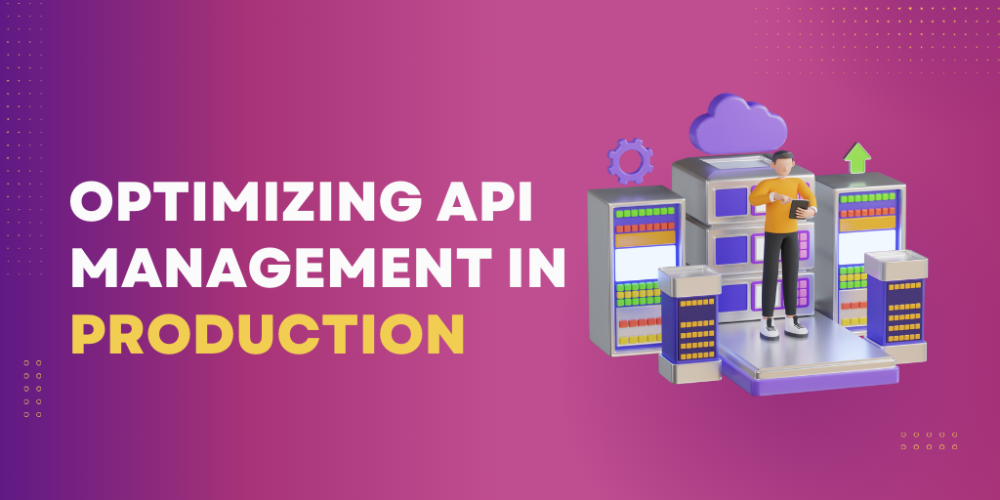

API management plays a critical role in the success of any production environment. It involves streamlining navigation, simplifying SDK management, understanding versioning, scaling [APIs](https://apitoolkit.io/blog/how-to-generate-automated-api-documentation/), unlocking the power of API gateways, mastering best practices, ensuring security, and using essential tools for API gateways. In this comprehensive guide, we will explore each of these areas in detail to help you optimize your [API management](https://apitoolkit.io/blog/api-downtime/) in production.

## Streamlining Navigation with Skip Links

Navigating through an API can sometimes be a complex task, especially for users who are new to the system. Skip links provide an effective solution by allowing users to jump directly to the main content of the page, thus saving time and making navigation more efficient.

Skip links are implemented using HTML anchors and CSS. By defining specific anchor points within the [API documentation](https://apitoolkit.io/blog/api-documentation-and-observability-the-truth-you-must-know/) and linking them at the top of the page, users can easily skip to the relevant section without having to scroll through the entire document.

Imagine you are a developer working on a large-scale project that involves integrating multiple [APIs](https://apitoolkit.io/blog/fintech-api/). As you dive into the documentation of each API, you realize that finding the relevant information can be a daunting task. You have to scroll through long pages of technical jargon, trying to locate the specific details you need.

This is where skip links come to the rescue. With skip links, you can quickly navigate to the main sections of the [API documentation](https://apitoolkit.io/blog/api-documentation-and-observability-the-truth-you-must-know/), such as endpoints, parameters, and response examples, without wasting time scrolling through introductory paragraphs or unrelated content.

Let's say you are working on an e-commerce platform and need to integrate a payment gateway API. Without skip links, you would have to manually search for the payment-related information within the API documentation. This could involve scrolling through pages of irrelevant details about user authentication, error handling, and other unrelated topics.

However, with skip links in place, you can simply click on a link at the top of the page that says "Payment Methods" or "Transaction Endpoints," and you will be instantly taken to the relevant section. This saves you valuable time and allows you to focus on the specific information you need to complete your integration.

Implementing skip links is relatively straightforward. You can use HTML anchors to define the anchor points within the API documentation. These anchor points can be strategically placed at the beginning of each major section or topic. For example, you can have an anchor point for "Authentication," another for "Endpoints," and so on.

Once the anchor points are defined, you can create skip links at the top of the page using HTML and CSS. These skip links can be styled to stand out from the rest of the content, making them easily noticeable. When a user clicks on a skip link, they will be smoothly scrolled to the corresponding anchor point, instantly landing on the desired section.

Not only do skip links enhance the user experience by streamlining navigation, but they also improve accessibility. Users with disabilities or those who rely on assistive technologies can benefit greatly from skip links. These users can quickly jump to the main content of the page, bypassing repetitive navigation elements or lengthy introductions.

In conclusion, skip links are a valuable tool for improving the usability and accessibility of [API documentation](https://apitoolkit.io/blog/api-documentation-and-observability-the-truth-you-must-know/). By allowing users to skip directly to the relevant sections, they save time and make navigation more efficient. Whether you are a developer integrating APIs or a user trying to understand complex technical concepts, skip links can greatly enhance your experience.

## Simplifying SDK Management

Software Development Kits (SDKs) are instrumental in simplifying API integration for developers. They provide pre-written code snippets and libraries that encapsulate the API's functionality, making it easier for developers to incorporate the API into their applications.

When it comes to SDK management, there are several key factors to consider. One of the most important aspects is ensuring timely updates. As APIs evolve and improve, it is crucial to keep the SDKs up to date with the latest features and bug fixes. This requires a dedicated team that actively monitors the API's development and releases regular updates for the SDK.

Proper documentation is another critical element in SDK management. Developers rely on clear and comprehensive [documentation](https://apitoolkit.io/blog/api-documentation-and-observability-the-truth-you-must-know/) to understand how to use the SDK effectively. This includes detailed explanations of the SDK's functions, sample code snippets, and step-by-step guides on integrating the SDK into different programming languages and frameworks.

Furthermore, providing release notes for each SDK update is essential. Release notes inform developers about the changes and improvements made in each version, allowing them to assess the impact on their existing code and plan for any necessary modifications. Clear and concise release notes help developers stay informed and make informed decisions about updating their SDK versions.

Effective communication with developers is also crucial in SDK [management](https://apitoolkit.io/blog/api-downtime/). Providing a dedicated support channel, such as a developer forum or a ticketing system, allows developers to ask questions, report issues, and receive timely assistance. This support channel should be actively monitored by knowledgeable staff who can provide prompt and accurate responses to developers' inquiries.

In addition to support, it is important to foster a community around the SDK. This can be achieved through developer meetups, online forums, and even hackathons. Building a community of developers who use the SDK encourages collaboration, knowledge sharing, and the development of innovative applications.

In conclusion, simplifying SDK [management](https://apitoolkit.io/blog/api-downtime/) involves ensuring timely updates, providing comprehensive documentation and release notes, and maintaining clear communication with developers. By focusing on these aspects, developers can seamlessly integrate and maintain the API within their applications, ultimately enhancing the overall developer experience.

## Understanding the Importance of Versioning

API versioning plays a crucial role in maintaining backward compatibility and ensuring smooth transitions during updates. By adhering to versioning best practices, organizations can avoid breaking changes and provide a stable environment for their API consumers.

It is recommended to use semantic versioning to indicate the compatibility and significance of each API release. Well-documented release notes and clear communication channels help API consumers stay informed about the changes and their impact on their applications.

## Scaling Your APIs for Success

As the demand for your [API](https://apitoolkit.io/blog/how-to-generate-automated-api-documentation/) grows, it becomes imperative to scale it to handle increased traffic and maintain optimal performance. Scaling can be achieved both vertically (adding more resources to a single server) and horizontally (distributing the load across multiple servers).

In a production environment, it is crucial to [monitor](https://apitoolkit.io/blog/best-api-monitoring-and-observability-tools/)  API performance, set up load balancers, employ caching mechanisms, and utilize auto-scaling capabilities to ensure smooth operation under varying traffic conditions. Implementing these measures will help you effectively scale your APIs and meet the demands of your users.

## Unlocking the Power of API Gateways

API gateways act as a central hub for managing [APIs](https://apitoolkit.io/blog/how-to-generate-automated-api-documentation/) and can significantly enhance the performance, security, and functionality of your API ecosystem. They provide features like request routing, load balancing, security enforcement, and caching, all in a single, unified interface.

By leveraging API gateways, you can simplify your API architecture, offload complex operations, and reduce the burden on individual services. Additionally, gateways can provide valuable insights and analytics into API usage, allowing you to make data-driven decisions for further optimization.

## Mastering API Management Best Practices

Optimizing [API management](https://apitoolkit.io/blog/api-downtime/) requires a comprehensive understanding of best practices. This includes establishing clear design and coding standards, enforcing robust testing and monitoring processes, and fostering collaboration between development and operations teams.

Adhering to best practices such as proper error handling, consistent response formats, and effective [documentation](https://apitoolkit.io/blog/api-documentation-and-observability-the-truth-you-must-know/) will ensure that your [API](https://apitoolkit.io/blog/how-to-generate-automated-api-documentation/) is reliable, maintainable, and easy to use. Regularly reviewing and improving your API management processes will help you stay ahead and provide an exceptional experience to your users.

## Ensuring Security in API Development

API security is of utmost importance in any production environment. This section focuses on authentication, authorization, and managing API scopes to enhance security.

### The Role of Authentication and Authorization in API Security

Authentication verifies the identity of API consumers, while authorization determines what actions they are allowed to perform within the system. A robust authentication mechanism like OAuth 2.0 or JSON Web Tokens (JWT) coupled with proper authorization checks ensures that only authenticated and authorized users can access sensitive API resources.

### Managing API Scopes for Enhanced Security

API scopes define the set of permissions available to different user roles. By granularly defining scopes and associating them with user roles, you can restrict access to specific API endpoints and prevent unauthorized access to sensitive data or actions.

Properly managing API scopes and keeping them up to date is crucial for maintaining a secure API environment. Regular audits, role-based access control (RBAC), and continuous monitoring are essential practices to ensure the integrity and security of your APIs.

## Essential Tools for API Gateways

API gateways require a range of tools to facilitate seamless [management](https://apitoolkit.io/blog/api-downtime/) and optimization. These include:

* [Monitoring and Analytics](https://apitoolkit.io/blog/best-api-monitoring-and-observability-tools/)  tools to track API performance, detect anomalies, and gain insights into usage patterns.
* Load balancers to distribute incoming API requests across multiple backend servers and ensure optimal performance.
* Security tools like Web Application Firewalls (WAF) and Intrusion Detection Systems (IDS) to protect against malicious attacks.

By leveraging these tools, you can effectively manage and optimize your API gateway, providing a secure and high-performing environment for your APIs.

## Simplifying API Descriptions with the Right Tools

Clear and comprehensive [API documentation](https://apitoolkit.io/blog/api-documentation-and-observability-the-truth-you-must-know/) is essential for effective API management. Utilizing the right tools can simplify the process of documenting your API and make it more accessible to developers.

There are several popular tools available, such as Swagger and OpenAPI, that allow you to describe your API in a machine-readable format. These tools generate interactive [documentation](https://apitoolkit.io/blog/api-documentation-and-observability-the-truth-you-must-know/), code samples, and client SDKs automatically. By leveraging these tools, you can save time and enhance the developer experience with your API.

Optimizing API management in production requires a holistic approach that encompasses navigation, SDK management, versioning, scaling, API gateways, best practices, security, essential tools, and API descriptions. By following the guidelines outlined in this comprehensive guide, you can ensure the success of your API ecosystem and provide a seamless experience for your users.

**Keep Reading**

[A Comprehensive Guide to API Management, Analytics, and Monitoring](https://apitoolkit.io/blog/unlocking-the-full-potential-of-api-gateways/)

[API Monitoring and Documentation: The Truth You Must Know](https://apitoolkit.io/blog/api-documentation-and-observability-the-truth-you-must-know/)

[How to Generate Automated API Documentation](https://apitoolkit.io/blog/how-to-generate-automated-api-documentation/)

[API Observability and Monitoring: What's the Difference](https://apitoolkit.io/blog/api-observability-and-api-monitoring/)

[How to Analyze API Logs and Metrics for Better Performance](https://apitoolkit.io/blog/api-logs-and-metrics/)
