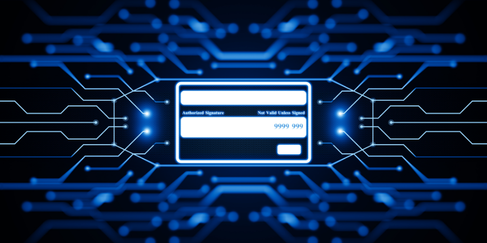

Payment gateway API testing is a crucial aspect of ensuring the smooth and secure operation of an online payment system. The truth is, thoroughly testing the API (Application Programming Interface) can help businesses identify and address any issues before they become a problem for users.

In this article, we will delve into the key components of API testing for payment gateways. We will also explore strategies for effectively testing and monitoring the API, as well as provide insights into improving quality assurance in [API testing](https://apitoolkit.io/blog/api-testing-automation/).

## Understanding Payment Gateway API Testing

In order to grasp the significance of API testing for payment gateways, it is necessary to understand the role of quality assurance (QA) in API testing. QA plays a crucial role in ensuring that the API functions as intended, is secure, and provides a seamless experience for users.

When it comes to testing [APIs](https://apitoolkit.io/blog/web-api-performance/) for payment gateways, quality assurance becomes even more important. The API serves as a connection between different systems, allowing them to communicate and exchange information. Any malfunction in the API can result in disrupted operations, compromised user data, and potential financial losses. Quality assurance aims to prevent these issues by rigorously testing the API and ensuring its reliability, security, and [performance](https://apitoolkit.io/blog/web-api-performance/).

### The Importance of Quality Assurance in API Testing

Quality assurance in API testing involves a comprehensive approach to ensuring the overall quality of the API. It encompasses various aspects, including functional testing, security testing, performance testing, and more.

**Functional testing** focuses on verifying that the API functions as intended and meets the specified requirements. This includes testing various API endpoints, validating input and output [data](https://apitoolkit.io/blog/data-retrieval-and-filtering-for-web-api-performance/), and ensuring the correct behavior of the API under different scenarios.

**Security testing** is another critical aspect of quality assurance in API testing. Payment gateway APIs deal with sensitive user data, such as credit card information and personal details. Therefore, it is imperative to verify that the [API has robust security measures](https://apitoolkit.io/blog/api-security/) in place. This includes encrypting data transmission, protecting against unauthorized access, and preventing common security vulnerabilities like SQL injection and cross-site scripting.

**Performance testing** is also an essential part of quality assurance in API testing. It involves evaluating the speed, scalability, and stability of the API under various load conditions. This ensures that the API can handle high volumes of transactions without degrading performance or experiencing downtime. [Performance testing](https://apitoolkit.io/blog/load-testing-vs-stress-testing-differences/) may involve [stress testing](https://apitoolkit.io/blog/load-testing-vs-stress-testing-differences/), load testing, and endurance testing to simulate real-world usage scenarios.

## Key Components of Payment Gateway API Testing

Payment gateway API testing comprises several key components that must be thoroughly examined to ensure the proper functioning of the payment system.

**Validation of requests and responses**. This involves ensuring that all data transmitted through the API is accurately received, processed, and validated according to predetermined rules and specifications. Validating requests and responses help identify any discrepancies or errors in [data transmission](https://apitoolkit.io/blog/advanced-techniques-api-testing/), ensuring the integrity of the payment process.

**Security testing**. Given the sensitivity of payment-related data, it is imperative to verify that the API has robust security measures in place. This includes encrypting data transmission, protecting against unauthorized access, and preventing common security vulnerabilities. Security testing involves conducting vulnerability assessments, penetration testing, and analyzing the API's compliance with industry security standards.

**Performance testing**. This is another critical component of payment gateway API testing. It involves evaluating the speed, scalability, and stability of the API under various load conditions. This ensures that it can handle high volumes of transactions without degrading performance or experiencing downtime. Performance testing may include load testing, stress testing, and endurance testing to simulate real-world usage scenarios and identify any performance bottlenecks or limitations.

**Usability testing**. This one focuses on evaluating the user experience of the API, ensuring that it is intuitive, user-friendly, and meets the needs of the end-users. Usability testing involves conducting user surveys, gathering feedback, and analyzing user interactions with the API to identify any usability issues or areas for improvement.
Overall, payment gateway API testing is a complex process that requires thorough quality assurance practices. You have to evaluate usability, validate requests and responses, and conduct security and performance testing. This is the right way to ensure the reliability, security, and seamless operation of your payment systems.

## Strategies for Effective Payment Gateway API Testing

To ensure thorough and efficient testing of payment gateway APIs, it is essential to implement effective strategies throughout the testing process.

Here are some of those strategies:

**Use a sandbox environment**: Most payment gateway providers offer a sandbox environment where you can test your API calls without using real money. This is a great way to avoid making mistakes that could cost you real money in production.

**Create a test plan**: A test plan will help you organize your testing and ensure that you are covering all of the important scenarios. Your test plan should include the following:

- The specific APIs that you will be testing
- The test cases that you will be using
- The expected results of each test case

**Use a variety of test data**: When testing payment gateways, it is important to use a variety of test data. This includes different types of credit cards, expiration dates, and CVV codes. You should also test with different amounts of money.

**Manually test and automate tests**: While it remains a viable option to automate API tests, it is also good to manually test your payment gateway APIs. This will help you identify any problems that you may not have caught with automated tests.

**Monitor your results**: Once you have completed your testing, it is important to monitor the results. This will help you identify any problems that may have been missed during testing. You should also monitor your payment gateway for any suspicious activity.

**Keep your test data up to date**: The credit card numbers and other test data that you use should be up to date. This will help you ensure that your tests are accurate.

**Use a testing tool**: There are a variety of testing tools available that can be used to test payment gateway APIs. Choose the tools that are right for your needs. We recommend [Testkit](https://usetestkit.com) by APIToolkit. It's a powerful and reliable testing tool that guarantees quality assurance at scale.

**Train your team on payment gateway security**: Your team should be trained on the security risks associated with payment gateways. This will help them identify and prevent security breaches.

## Monitoring Payment Gateway APIs

[Monitoring APIs](https://apitoolkit.io/blog/best-api-monitoring-and-observability-tools/) is essential for ensuring their optimal performance and identifying any potential issues before they impact users. This process involves regularly checking and analyzing the API's [performance metrics](https://apitoolkit.io/blog/api-logs-and-metrics/), error rates, and traffic patterns to ensure that it is operating smoothly and efficiently.

By doing this, you can gain valuable insights into your API's response times, error rates, and overall performance. This information allows you to proactively address any performance issues or bottlenecks that may arise, ensuring that the API can handle high volumes of transactions without any disruptions.

One of the [key tools used for monitoring API performance](https://apitoolkit.io/blog/best-api-monitoring-and-observability-tools/) is a [performance monitoring platform](https://apitoolkit.io/api-performance-monitoring-and-compliance/). This platform collects and analyzes data from the API, providing businesses with real-time visibility into its performance. With this information, businesses can identify any potential issues and take immediate action to resolve them.

## Identifying and Addressing Common API Issues

Payment gateway APIs can encounter various issues, such as latency, data inconsistency, and compatibility problems. Continuous monitoring helps in identifying and addressing these issues promptly, minimizing the impact on users. You should closely monitor API logs, error messages, and system metrics. This can help your business quickly diagnose and resolve issues, ensuring uninterrupted payment processing.

## Improving Quality Assurance in Payment Gateway API Testing
Continuous improvement is essential to enhance the quality assurance practices in payment gateway API testing.

Implement best practices like thorough documentation of test cases, utilizing version control for test scripts, and conducting regular code reviews to identify potential defects before they make their way into production. Additionally, adopting [shift-left testing](https://en.wikipedia.org/wiki/Shift-left_testing#:~:text=Shift%2Dleft%20testing%20is%20an,by%20Larry%20Smith%20in%202001.), where testing is conducted earlier in the software development lifecycle, can help identify issues at an early stage, reducing the cost and effort required to fix them.

### Continuous Improvement in API Testing
API testing is not a one-time process but rather an ongoing activity that should be iteratively improved. By collecting feedback from stakeholders, analyzing test results, and incorporating lessons learned, QA teams can enhance their testing approach and continuously raise the bar for quality assurance.

## The Future of Payment Gateway API Testing

The field of API testing is constantly evolving, driven by technological advancements and changing business requirements. One emerging trend is the increased adoption of microservices architecture, which presents new challenges in API testing. With microservices, different components of an application are broken down into smaller, independent services that communicate via APIs. Testing these individual services as well as the overall system becomes crucial for ensuring smooth operations.

Also, prioritize security testing. As cyber threats become more sophisticated, businesses need to continuously assess the security posture of their payment gateway APIs to mitigate risks and protect sensitive user data.

### Preparing for Future API Testing Challenges

While APIs continue to play a critical role in modern payment systems, it is important for your business to stay ahead of emerging challenges. This can be achieved by investing in skilled QA professionals. Additionally, keeping an eye on industry developments and leveraging innovative testing tools and frameworks will help ensure that your payment gateway APIs remain secure, efficient, and user-friendly.

In conclusion, testing payment gateway APIs is a vital aspect of ensuring the smooth and secure functioning of online payment systems. By implementing effective testing strategies and continuously monitoring and improving the testing process, businesses can enhance the reliability, security, and performance of their APIs.

**Keep reading**
