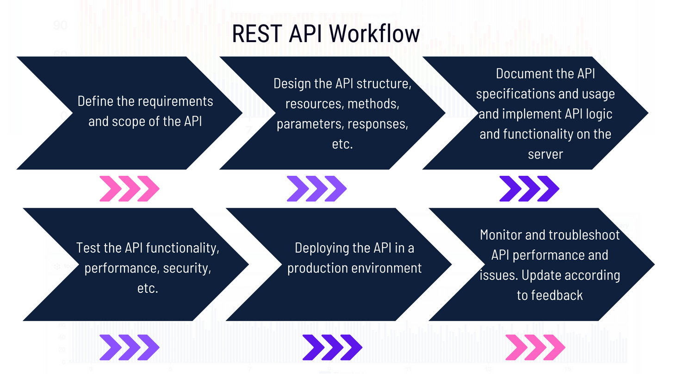

As a developer who works with web applications, chances are you have encountered [REST APIs](https://apitoolkit.io/blog/what-are-rest-apis/). REST stands for Representational State Transfer, and it is a software architectural style that defines how web services communicate with each other. A REST API is an application programming interface that follows the REST principles and allows clients to access and manipulate data on a server.

A well-optimized REST API workflow can make your development process more efficient, reliable, and scalable. It can also improve the user experience and satisfaction of your web application. However, creating and maintaining a good REST API workflow is not a trivial task. It requires careful planning, design, documentation, testing, and maintenance.

In this blog post, we will explore what a REST API workflow is, how to evaluate its effectiveness, and what the key elements of a good REST API workflow are. By the end of this post, you will have a better understanding of how to optimize your REST API workflow and deliver high-quality web services.

## Understanding REST API Workflow

Before we dive into the details of a REST API workflow, let's first review the REST architectural style and its core principles. The REST architectural style was proposed by Roy Fielding [in his doctoral dissertation in 2000](https://www.ics.uci.edu/~fielding/pubs/dissertation/fielding_dissertation.pdf). It is based on the idea that web services should be modeled as resources that can be identified by a uniform resource identifier (URI), and that clients can interact with these resources using a standard set of methods (HTTP verbs).

## The core principles of a RESTful API

The core principles of a RESTful API are:

- **Uniform interface**: The interface between the client and the server should be consistent and predictable. The client should be able to access any resource using a URI and perform operations using HTTP verbs (GET, POST, PUT, DELETE, etc.). The server should return responses in a standard format (such as JSON or XML) and use HTTP status codes to indicate the outcome of the request.
- **Stateless**: The server should not store any information about the client's state or session. Each request from the client should contain all the information necessary for the server to process it. This makes the server more scalable and reliable, as it does not have to maintain any state information or deal with concurrency issues.
- **Cacheable**: The server should indicate whether the responses are cacheable or not, and for how long. The client should be able to store and reuse cached responses to reduce network traffic and improve performance.
- **Client-server**: The client and the server should be decoupled and independent of each other. The client should not have to know anything about the server's implementation or logic, and vice versa. This allows both sides to evolve separately and maintain interoperability.
- **Layered system**: The system should be composed of multiple layers that can be accessed through a uniform interface. Each layer can perform specific functions such as load balancing, security, caching, etc. This enhances the modularity and scalability of the system, as well as its ability to handle failures.
- **Code on demand (optional)**: The server can optionally send executable code (such as JavaScript) to the client to extend its functionality or behavior. This can improve the user experience and reduce the complexity of the client.


A REST API workflow is the process of designing, developing, testing, deploying, and maintaining a [RESTful API](https://apitoolkit.io/blog/anomalies-in-restful-apis/). It involves various steps, such as:

- Defining the requirements and scope of the API
- Designing the API structure, resources, methods, parameters, responses, etc.
- Documenting the API specifications and usage
- Implementing the API logic and functionality on the server
- Testing the API functionality, performance, security, etc.
- Deploying the API in a production environment
- Monitoring and troubleshooting API performance and issues
- Updating and maintaining the API according to changing needs or feedback



## Evaluating the Effectiveness of Your REST API Workflow

How do you know if your REST API workflow is effective or not? How do you measure its quality and efficiency? How do you identify areas for improvement or optimization? These are some of the questions that you should ask yourself when evaluating your REST API workflow.

Some of the common challenges that developers face when working with APIs are:

- Inconsistent or unclear API design
- Inadequate or outdated API documentation
- Poor API performance or reliability
- Lack of API security or authentication
- Difficulty in testing or debugging APIs
- Breaking changes or compatibility issues in API versions

To overcome these challenges, you need to establish some [metrics](https://apitoolkit.io/blog/api-logs-and-metrics/) to measure your API workflow performance. Some of these metrics are:

- **Time-to-market**: How long does it take to design, develop, [test](https://apitoolkit.io/blog/api-testing-automation), and deploy your API? How often do you update or release new versions of your API?
- **User satisfaction**: How satisfied are your users with your API? How easy is it for them to use your API? How well does your API meet their expectations and needs?
- **Error rate**: How often does your API encounter errors or failures? How severe are these errors or failures? How quickly do you resolve them?
- **Availability**: How available is your API? How often does it experience downtime or interruptions? How resilient is it to handle high traffic or load?
- **Scalability**: How scalable is your API? How well does it handle increasing or varying demand or usage? How flexible is it to adapt to changing needs or requirements?
- **Maintainability**: How maintainable is your API? How easy is it to update, modify, or extend your API? How well do you document and communicate your API changes?

To compare your workflow against industry best practices, you can use some of the tools or frameworks available for API development and management. Some of these tools or frameworks are:

- **OpenAPI**: A widely used standard for describing and documenting RESTful APIs. It allows you to define your API specifications in a machine-readable and human-readable format (such as YAML or JSON), and generate interactive documentation, client libraries, server stubs, testing tools, etc. based on your specifications.

- **Swagger**: A set of tools and frameworks for designing, building, documenting, and testing RESTful APIs. It is based on the OpenAPI specification and provides various features such as Swagger Editor, Swagger UI, Swagger Codegen, Swagger Hub, etc.

- **APIToolkit**: A popular tool for designing, monitoring, testing, and debugging RESTful APIs. It allows you to create, send, and analyze HTTP requests and responses, and automate your testing workflows using collections, scripts, variables, etc. It also integrates with OpenAPI and other tools for documentation, collaboration, monitoring, etc.

## Your Possible API Workflow Before APIToolkit

Like many API developers out there, before APIToolkit you were probably in that tiresome cycle that leaves you with barely enough information to discover issues, investigate anomalies, and perform thorough testing to ensure that bugs don’t get reintroduced into your APIs.

A cycle that looks like this:

- You build and deploy new features
- Your deployment introduces bugs
- Users discover bugs. They are frustrated and some leave
- Some users complain but only give vague pointers
- Cycle repeats
- Deploy changes and maybe introduce new bugs
- Guess incorrectly and fix the wrong bug, or only a symptom
- Spend weeks guessing and failing to reproduce bug

You will agree with me that this can be insufferably tiresome!

But with APIToolkit, you can:

- Swiftly detect and fix API anomalies and bugs before they affect your users.
- Automatically generate and update your API documentation.
- Monitor your API's performance and track throughput and latency changes before your customers.
- Utilize your open API specification to track a large class of errors on your backend service
- Have access to data visualization so you can explore and analyze your API logs and metrics.
- Test and validate your API functionality and performance.
- Maintain a bird’s eye view of your entire API.

Get started [here](https://apitoolkit.io).

## Key Elements of a Good REST API Workflow

Now that we have discussed what a REST API workflow is and how to evaluate its effectiveness, let's look at some of the key elements that make a good REST API workflow. 

These elements are:

### API Design and Documentation

One of the most important aspects of a good REST API workflow is the [design and documentation](https://apitoolkit.io/blog/how-to-write-api-docs/) of the API. A clear and consistent API design can make your API easy to understand, use, and maintain. A descriptive and helpful API documentation can make your API accessible, discoverable, and trustworthy.

Some of the best practices for API design and documentation are:

- Use nouns to name your resources and use plural forms to indicate collections of resources. For example, /users, /posts, /comments.
- Use HTTP verbs to indicate the actions or operations on your resources. For example, GET /users to retrieve a list of users, POST /users to create a new user, PUT /users/{id} to update an existing user, DELETE /users/{id} to delete an existing user.
- Use query parameters to filter, sort, paginate, or search your resources. For example, GET /users?name=John&age=25&sort=asc&page=2&limit=10.
- Use path parameters to identify specific resources or sub-resources. For example, GET /users/{id} to retrieve a specific user by id, GET /users/{id}/posts to retrieve the posts of a specific user by id.
- Use status codes to indicate the outcome of the request. For example, 200 OK for successful requests, 201 Created for resource creation requests, 400 Bad Request for invalid requests, 401 Unauthorized for authentication failures, 404 Not Found for non-existing resources, 500 Internal Server Error for [server errors](https://apitoolkit.io/blog/api-downtime/).
- Use descriptive and consistent error messages to provide more information about the error. For example,

```json
{
"status": 404,
"message": "User not found",
"details": "The user with id 123 does not exist"
}
```

- Use a standard format (such as JSON or XML) for your request and response bodies. For example,

```json
{
"id": 123,
"name": "John",
"age": 25,
"email": "john@example.com"
}
```

- Use OpenAPI [specifications](https://apitoolkit.io/blog/api-documentation-vs-api-specification/) to define your API structure, resources, methods, parameters,
responses, etc. in a machine-readable and human-readable format (such as YAML or JSON). For example,

```yaml
openapi: 3.0.0
info:
title: User API
version: 1.0.0
paths:
/users:
get:
summary: Get all users
parameters:
- name: name
in: query
description: Filter users by name
schema:
type: string
- name: age
in: query
description: Filter users by age
schema:
type: integer
- name: sort
in: query
description: Sort users by name (asc or desc)
schema:
```

**Read**: 

[Best API Monitoring and Observability Tools in 2023](https://apitoolkit.io/blog/best-api-monitoring-and-observability-tools/)

[AP Documentation and Observability: the Truth You Must Know](https://apitoolkit.io/blog/api-documentation-and-observability-the-truth-you-must-know/)

[10 Must-Know API Trends in 2023](https://apitoolkit.io/blog/api-trends/)

### Versioning and Stability

Another important element of a good REST API workflow is versioning. Versioning is the process of managing changes to your APIs over time. Versioning can help you:

- Introduce new features, enhancements, or [bug fixes](https://apitoolkit.io/api-anomalies-validation-and-checks/) to your APIs
- Communicate changes to your users and stakeholders
- Maintain backward compatibility with older versions of your APIs

Versioning is especially important for RESTful APIs because they are often used by multiple clients or applications that may have different expectations or dependencies on your APIs. If you change your APIs without proper versioning, you may break existing functionality or cause unexpected errors for your users.

One of the best practices for versioning your RESTful APIs is to use semantic versioning. Semantic versioning is a convention that assigns a version number to your APIs based on three components: major, minor, and patch. For example:

- Major version: Indicates a breaking change that may affect existing functionality or compatibility
- Minor version: Indicates a non-breaking change that adds new functionality or enhances existing functionality
- Patch version: Indicates a non-breaking change that fixes bugs or improves performance

Semantic versioning can help you:

- Follow a consistent and logical scheme for versioning your APIs
- Communicate the level of impact of each change to your users
- Ensure backward compatibility by following the principle of least surprise

Another best practice for versioning your RESTful APIs is to use headers or query parameters to indicate the version of your APIs. For example:

- Headers: You can use the Accept or Content-Type headers to specify the version of your APIs in the media type. For example: Accept: application/json;version=1
- Query parameters: You can use a query parameter to specify the version of your APIs in the URI. For example: https://example.com/api/v1/users

Using headers or query parameters can help you:

- Avoid changing the structure or meaning of your URIs
- Support multiple versions of your APIs simultaneously
- Allow users to choose the version of your APIs they want to use

Other key elements of a good REST API workflow include:

- [Monitoring and observability](https://apitoolkit.io/blog/api-downtime/)
- [Error handling and status codes](https://apitoolkit.io/blog/api-logs-and-metrics/)
- [Authentication and security](https://apitoolkit.io/blog/api-security/)
- [Performance and optimization](https://apitoolkit.io/blog/web-api-performance/)

## Evolving Your Workflow to Align with Future Requirements

As your business requirements change and new features or functionalities are added to your APIs, you need to evolve your workflow accordingly to ensure that your APIs remain consistent, compatible, and secure. Some of the best practices for evolving your REST API workflow are:

- **Follow a versioning strategy for your APIs**. Versioning allows you to introduce changes or updates to your APIs without breaking the existing clients or consumers. You can use different methods for versioning, such as using URL parameters, headers, media types, etc. You should also document and communicate your versioning policy and changes clearly and transparently to your clients or consumers.

- **Implement a testing strategy for your APIs**. [Testing](https://apitoolkit.io/blog/api-testing-automation) ensures that your APIs function correctly and meet the expected quality standards. You can use different types of testing, such as unit testing, integration testing, functional testing, performance testing, security testing, etc. You should also automate your testing process using tools and frameworks that support REST API testing.

- **Adopt a documentation strategy for your APIs**. Documentation provides a clear and comprehensive description of your APIs' features, functionalities, parameters, responses, errors, etc. Documentation helps your clients or consumers understand and use your APIs effectively and efficiently. You can use different formats and tools for documentation, such as Swagger, [APIToolkit](https://apitoolkit.io), Postman, Markdown, etc. You should also update your documentation regularly and consistently with your API changes or updates.

## Conclusion

By following a good REST API workflow, you can create RESTful APIs that are reliable, secure, scalable, and user-friendly. You can also improve your productivity, quality, and collaboration as a developer or consumer of RESTful APIs.

**Keep Reading**

[Ultimate Guide to API Testing Automation](https://apitoolkit.io/blog/api-testing-automation)

[How to Generate Automated API Documentation](https://apitoolkit.io/blog/how-to-generate-automated-api-documentation/)

[API Observability and Monitoring: What's the Difference](https://apitoolkit.io/blog/api-observability-and-api-monitoring/)

[Key Benefits of API Integration for Developers](https://apitoolkit.io/blog/benefits-of-api-integration/)
