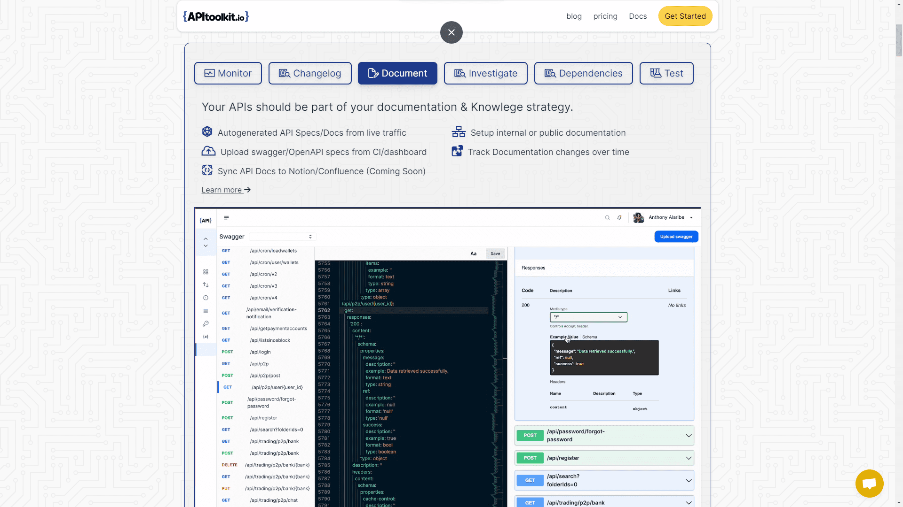
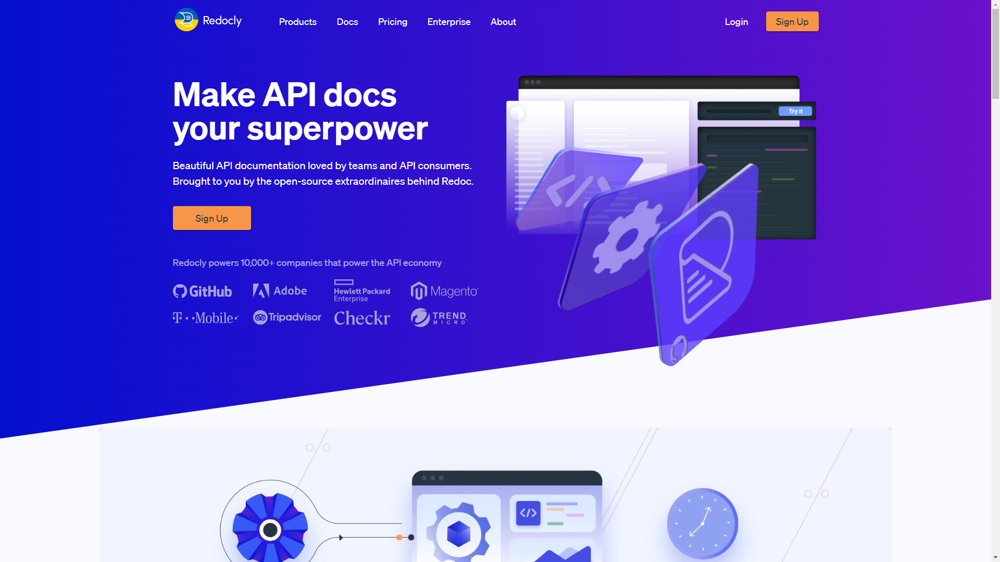
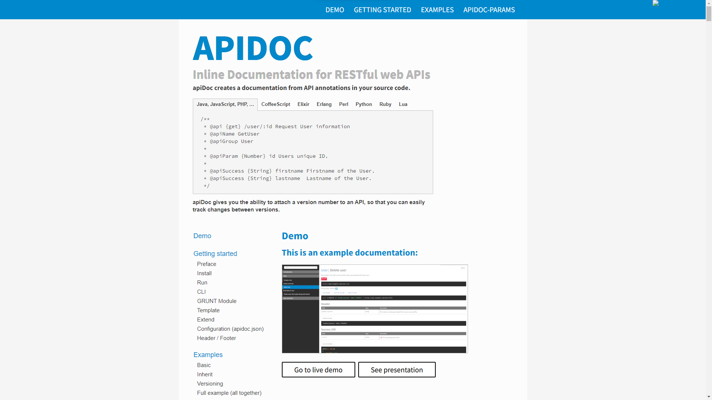
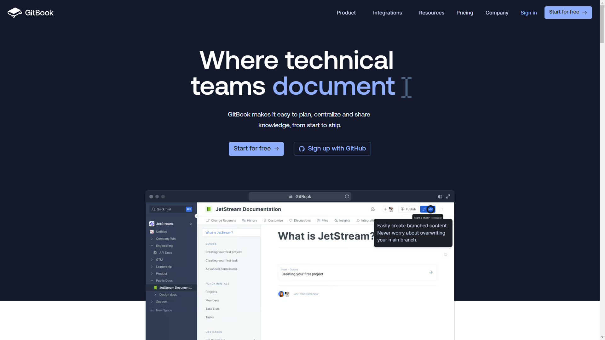

Application Programming Interfaces (APIs) have become the building blocks of modern digital experiences. However, even the most robust APIs are rendered ineffective if they lack clear and comprehensive documentation. This is where [API documentation](https://apitoolkit.io/blog/how-to-generate-automated-api-documentation/) tools come into play. These tools not only help developers create readable and user-friendly documents but also facilitate easier maintenance and updates. With a plethora of options available, choosing the right API documentation tool can be a daunting task.

When done right, API documentation serves as one of the most reliable sources of knowledge about how an [API](https://apitoolkit.io/) operates. It should include information on quickstarts, endpoints, parameters, and more in a well-organized format that is simple to grasp for both developers and non-technical users. It frequently contains tutorials and examples that will aid the user in understanding how various components of the API interact. In this article, we'll explore the top 8 [API documentation](/blog/api-documentation-vs-api-specification/) tools, examining their features, pros, and cons, to help you make an informed decision.

## Advantages of Documentation

Devoting the right amount of time and resources to producing high-quality API documentation, as an [API](https://apitoolkit.io/) company is very important, and here are the reasons why:
- Reduced Dependence on Support: Effective documentation frees up your API experts to focus on other tasks while assisting other users in solving their problems. It doesn't matter if your API is only utilized internally or by tens of thousands of users, this still holds.
- Encouraging Non-developers: Your API documentation enhances discussions about how your APIs and data may be used to achieve your business goals by expanding the expertise of non-coding colleagues.
- Speed: A detailed and easy-to-use API documentation speeds up the integration of your API by making it more accessible to new users and even returning users. 
- Increased User Satisfaction: Your company will benefit from having well-written and comprehensive API documentation because you will get satisfied clients who will be willing to send in referrals.

## Importance of API Documentation for Developers
API documentation serves as the instruction manual for developers, providing essential details on how to effectively use and integrate an API. It covers aspects like endpoints, request/response types, authentication methods, and error codes. Good documentation can significantly reduce the learning curve for new developers and streamline the development process. In essence, well-documented APIs foster better collaboration, quicker adoption, and ultimately, successful implementation.

## What to Look for in an API Documentation Tool
When choosing an API documentation tool, there are several key factors to consider:

- Ease of Use: The tool should be intuitive and easy to navigate, allowing for quick document creation and updates.
- Interactivity: Features like "Try it out" buttons, which allow users to make API calls within the documentation, can enhance the user experience.
- Collaboration: Look for tools that enable multiple team members to collaborate in real-time, providing features like version control and comments.
- Customization: The ability to customize the look and feel of the documentation to align with your brand can be a significant advantage.
- Integration: Compatibility with existing systems or the ability to export documentation in various formats can be crucial for many organizations.
By taking these factors into account, you can select a tool that not only makes your API documentation more effective but also simplifies the development process.

## Basis of a good documentation
A good [documentation](https://apitoolkit.io/blog/how-to-generate-automated-api-documentation/) serves as a comprehensive guide for users and developers, facilitating understanding, implementation, and troubleshooting. Here are some fundamental elements that form the basis of good documentation:

1. **Clarity and Simplicity**: The language should be clear and straightforward. Avoid jargon or, if you must use it, provide explanations.

2. **Completeness**: All aspects of the subject should be covered. For APIs, this means information on endpoints, methods, parameters, and possible responses, among other things.

3. **Structure and Organization**: Information should be well-organized, usually starting with a table of contents, followed by an introduction, main content sections, and finally, a summary or conclusion.

4. **Searchability**: Users should be able to easily search for the information they are looking for, either through a search function or a well-organized index.

5. **Examples and Use-Cases**: Real-world examples and use-cases can greatly help in understanding the subject matter.

6. **Up-to-Date Information**: Technology evolves rapidly, and documentation should keep pace. Outdated information can lead to a lot of confusion and wasted time.

7. **Accessibility**: The documentation should be easily accessible, whether it's online, downloadable as a PDF, or available in multiple formats.

8. **Visual Aids**: Diagrams, screenshots, and even videos can make complex topics much easier to understand.

9. **Interactivity**: In the case of API documentation, interactivity like "Try it Out" buttons can be very helpful.

10. **Feedback Loop**: Providing a way for users to give feedback on the documentation can help you make continuous improvements.

By incorporating these elements, you can create documentation that is not only informative but also user-friendly, aiding in quicker understanding and implementation.

## The Best API Documentation Tools

There are various widely available API documentation tools. These are a few:

### [Apitoolkit](https://www.apitoolkit.io/)

[APIToolkit](https://app.apitoolkit.io) offers a unique approach to API documentation by automating much of the process. It distinguishes itself with features that learn from live production traffic, allowing for real-time updates and issue detection. The tool also auto-generates Swagger or OpenAPI documentation, eliminating the need for manual YAML file creation, command-line tools, or code annotations. This level of automation makes it incredibly user-friendly and ensures that the documentation remains accurate and up-to-date. The key advantages of using [APIToolkit](https://app.apitoolkit.io) lie in its automation and real-time capabilities. By learning from live traffic, it ensures that your API documentation is always up-to-date and accurate. This not only saves an immense amount of time but also minimizes the risk of errors that can occur during manual documentation. In a field where precision and timeliness are paramount, [APIToolkit](https://app.apitoolkit.io) emerges as an invaluable tool for hassle-free, accurate API documentation.

### [Postman](https://www.postman.com/)

Postman's online API documentation tool can assist you in creating and maintaining machine-readable API documentation. Postman automatically gathers your sample requests, headers, code snippets, and more to populate your documentation with dynamic examples and machine-readable instructions. When you make changes to your collection, it also immediately updates your documentation. Postman's distinctive feature is its commenting system. Using this feature, you may submit comments and code reviews to share feedback and notify your coworkers of any changes or issues in real time.

### [Redocly](https://redocly.com/)

This is a developer documentation tool that creates API documentation based on the OpenAPI specification. It is a Visual Studio Code extension that assists you in creating, validating, and maintaining OpenAPI documents. It alerts you to OpenAPI definition errors and allows you to rapidly access referenced schemas or open the files that contain them. The extension supports OpenAPI 2.0 and 3.0 specifications, as well as rudimentary OpenAPI 3.1 functionality. The goal is to create a great API journey that is simple, unique, and easy to grasp for both developers and non-techies.

### [Dapperdox](http://dapperdox.io/)

Dapperdox is appreciated for several reasons. It is that one documentation tool designed to provide the best developer experience possible by producing rich, browsable reference documentation and instructions for your APIs. dapperDox is a documentation generator in the development category that is a themed documentation generator, server, and API explorer for OpenAPI (Swagger) Specifications. DapperDox has six variants for various platforms, including online / web-based, self-hosted solutions, SaaS, Mac, and Linux.

### [SwaggerHub](https://swagger.io/tools/swaggerhub/)

 SwaggerHub, formerly known as Swagger, is an online API documentation platform that aims to simplify and accelerate API documentation. Using this API editor, you can easily achieve an  OpenAPI Specification compliance and also get smart error feedback and syntax auto-completion. Another useful feature is real-time commenting and problem monitoring, which makes it simple for developers to leave comments..

### [ReadMe](https://readme.com/)

This is an interactive tool used by developers to auto-generate code samples, alter the material in the ReadMe editor, merge a recommended edit, respond to inquiries in the help forum, and more. One of ReadMe's main benefits is that it tracks metrics like page visits, API calls, API errors, and queries to various endpoints among others so you can see how your API and API documentation are used over time. Your team can determine where to concentrate its efforts on improving by using these useful insights.

### [APIDOC](https://apidocjs.com)

This is an open-source REST API documentation that generates documentation from API descriptions in your source code automatically. Almost any programming language can be used with it (as long as it allows block documentation). Developers can see what has changed between versions since apiDoc enables you to assign a version number to an API. This makes it perfect for managing updates to your API in a transparent manner, or for API versioning.

### [GitBook](https://www.gitbook.com/)

GitBook is an excellent choice for teams looking for a versatile and user-friendly documentation tool. Its emphasis on collaboration and ease of use makes it particularly beneficial for teams that include both technical and non-technical members. While it may not offer some of the specialized features found in tools dedicated solely to API documentation, its broad range of capabilities makes it a strong contender in the field.

Any of the technologies listed above can help you create interactive, user-friendly, and easy-to-maintain online API documentation. When evaluating tools, keep your must-haves and nice-to-haves in mind to find the one that best meets your needs and fits your budget.

---

## Keep Reading

[The Importance of API Observability in Software Development](https://apitoolkit.io/blog/api-observability-software-development-/)

[The Rise of API-as-a-Product: How Companies are Leveraging APIs to Drive Revenue](https://apitoolkit.io/blog/api-as-a-product/)

[API Observability and Monitoring: What’s the Difference?](https://apitoolkit.io/blog/api-observability-and-api-monitoring/)

[How to Optimize Security for Web API Performance in 2023](https://apitoolkit.io/blog/api-security/)

[Ultimate Guide to API Testing Automation](https://apitoolkit.io/blog/api-testing-automation/)

