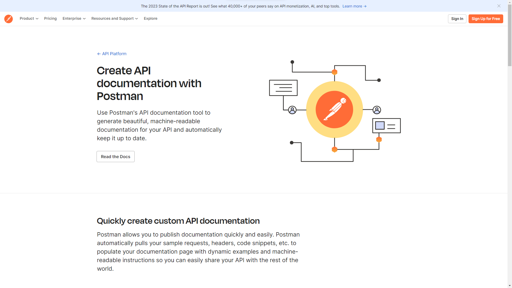
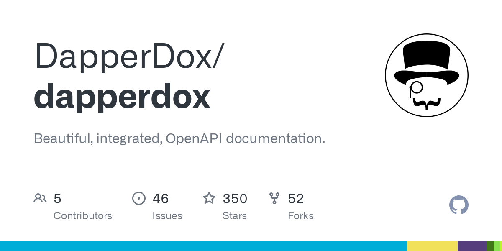
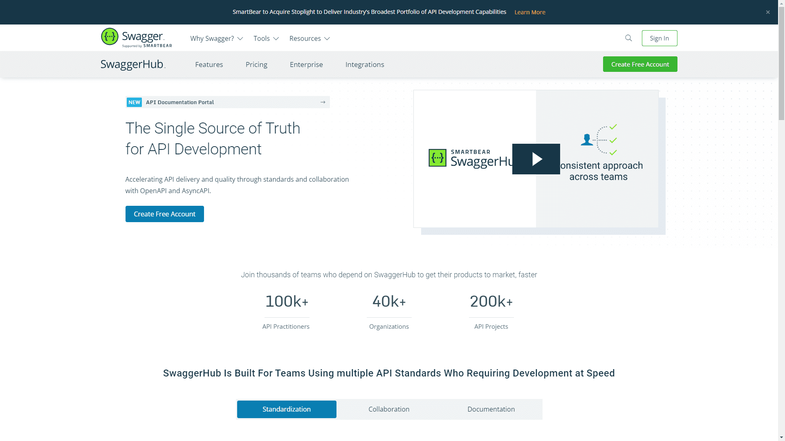
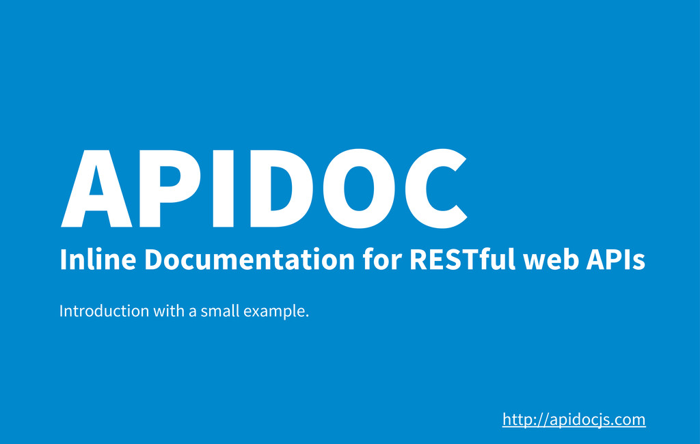

If you are going to make a product which connects to the internet you will certainly need an API. Just incase you do not know what an API is you can [take a look.](../what-is-api-testing/index.md) API documentation is technical content that explains the how-tos of an API and what a particular API can perform. It is a precise reference source that thoroughly explains the API procedures and can also serve as a manual and instructional tool that aids users in learning how to utilize it. 

When done right, API documentation serves as one of the most reliable sources of knowledge about how an API operates. It should include information on quickstarts, endpoints, parameters, and more in a well-organized format that is simple to grasp for both developers and non-technical users. It frequently contains tutorials and examples that will aid the user in understanding how various components of the API interact. [See also API documentation and API specification](/blog/api-documentation-vs-api-specification/)

When it comes to creating good API Documentation, it takes careful balancing and detailing to provide comprehensive technical information while still making it easy to understand. If you are finding it difficult it is best to observe successful organizations to see how it is done so that third-party developers can easily access them, lot of well-known programs and APIs make their API documentation available online. 

## Advantages of Documentation 
Devoting the right amount of time and resources to producing high-quality API documentation, as an API company is very important, and here are the reasons why:
- Reduced Dependence on Support: Effective documentation frees up your API experts to focus on other tasks while assisting other users in solving their problems. It doesn't matter if your API is only utilized internally or by tens of thousands of users, this still holds. 
- Encouraging Non-developers: Your API documentation enhances discussions about how your APIs and data may be used to achieve your business goals by expanding the expertise of non-coding colleagues. 
- Speed: A detailed and easy-to-use API documentation speeds up the integration of your API by making it more accessible to new users and even returning users. 
- Increased User Satisfaction: Your company will benefit from having well-written and comprehensive API documentation because you will get satisfied clients who will be willing to send in referrals. 

## Basis of a good documentation 
Good documentation is effective for the following reasons:
- Make your API documentation simple for developers to be able to locate solutions to occurrent issues so that they can swiftly obtain what they require. Don’t give out information that isn't necessary or difficult to comprehend the API and how it operates. Most time users don’t have the patience to read through anything especially when there is an issue, they want usable solutions/documentation, not unnecessary information. 
- Make no assumptions about the reader's prior knowledge. Be direct yet detailed. 
- Be well organized. Give information in a well-structured, consistent, and simple manner to enable users to read fluently. For users trying to learn something new or find a solution to a problem, this lowers friction. 

## The Best API Documentation Tools
There are various widely available API documentation tools. These are a few:

### [Apitoolkit](https://www.apitoolkit.io/)

If you feel that documenting is difficult and stressful then you need to try [Apitoolkit](https://app.apitoolkit.io) . APIoolkit is a middleware that constantly learns from your live production traffic, so it can detect issues and insights for you automatically. But the best part is that it generates an always up to date Swagger/OpenAPI documentation for you. We're biased, but we believe this is the best API documentation tool. No need to manually write a YAML file or run any commandline tools or annotate any codebase. An always up to date documentation makes this the best tool for API docuentation in my books.

### [Postman](https://www.postman.com/)

Postman's online API documentation tool can assist you in creating and maintaining machine-readable API documentation. Postman automatically gathers your sample requests, headers, code snippets, and more to populate your documentation with dynamic examples and machine-readable instructions. When you make changes to your collection, it also immediately updates your documentation. Postman's distinctive feature is its commenting system. Using this feature, you may submit comments and code reviews to share feedback and notify your coworkers of any changes or issues in real time. 

### [Redocly](https://redocly.com/)

This is a developer documentation tool that creates API documentation based on the OpenAPI specification. It is a Visual Studio Code extension that assists you in creating, validating, and maintaining OpenAPI documents. It alerts you to OpenAPI definition errors and allows you to rapidly access referenced schemas or open the files that contain them. The extension supports OpenAPI 2.0 and 3.0 specifications, as well as rudimentary OpenAPI 3.1 functionality. The goal is to create a great API journey that is simple, unique, and easy to grasp for both developers and non-techies.

### [Dapperdox](http://dapperdox.io/)

Dapperdox is appreciated for several reasons. It is that one documentation tool designed to provide the best developer experience possible by producing rich, browsable reference documentation and instructions for your APIs. dapperDox is a documentation generator in the development category that is a themed documentation generator, server, and API explorer for OpenAPI (Swagger) Specifications. DapperDox has six variants for various platforms, including online / web-based, self-hosted solutions, SaaS, Mac, and Linux.
 
### [SwaggerHub](https://swagger.io/tools/swaggerhub/)

 SwaggerHub, formerly known as Swagger, is an online API documentation platform that aims to simplify and accelerate API documentation. Using this API editor, you can easily achieve an  OpenAPI Specification compliance and also get smart error feedback and syntax auto-completion. Another useful feature is real-time commenting and problem monitoring, which makes it simple for developers to leave comments..

### [ReadMe](https://readme.com/)

This is an interactive tool used by developers to auto-generate code samples, alter the material in the ReadMe editor, merge a recommended edit, respond to inquiries in the help forum, and more. One of ReadMe's main benefits is that it tracks metrics like page visits, API calls, API errors, and queries to various endpoints among others so you can see how your API and API documentation are used over time. Your team can determine where to concentrate its efforts on improving by using these useful insights.

### [APIDOC](https://apidocjs.com)

This is an open-source REST API documentation that generates documentation from API descriptions in your source code automatically. Almost any programming language can be used with it (as long as it allows block documentation). Developers can see what has changed between versions since apiDoc enables you to assign a version number to an API. This makes it perfect for managing updates to your API in a transparent manner, or for API versioning.

### [ProtoForce](https://www.protoforce.io/)

API development has been revamped. With auto-generated clients, servers, and documentation in several languages, you can accelerate the creation of services, mobile, and online applications. Reduce development expenses and time by up to 50%.

Any of the technologies listed above can help you create interactive, user-friendly, and easy-to-maintain online API documentation. When evaluating tools, keep your must-haves and nice-to-haves in mind to find the one that best meets your needs and fits your budget.
