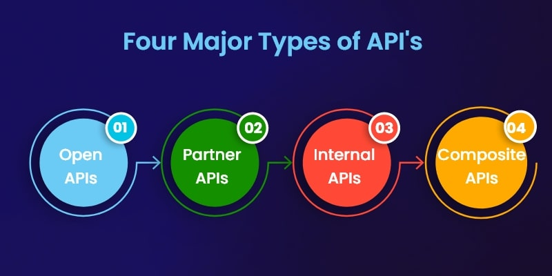

In today's vastly interconnected digital landscape, [Application Programming Interfaces (APIs)](https://apitoolkit.io/blog/api-documentation-and-observability-the-truth-you-must-know/) play a pivotal role in enabling seamless communication and data exchange between different software applications. Think of them as a bridge, enabling [developers](https://apitoolkit.io/blog/top-8-api-documentation-tools-for-developers/) to access the resources and functionalities of other systems, opening up a vast array of opportunities for innovation and integration.

APIs are simply amazing. They make work easy. But the truth is, APIs are not all created equal.

## What is an API?

APIs are applications that enable communication between diverse software systems. API stands for [Application Programming Interface](https://en.wikipedia.org/wiki/API). 

APIs allow a vast array of unrelated software systems to interoperate with one another. Additionally, APIs provide a way for developers to add functionality to software by leveraging a comprehensive set of available APIs. This is why complex systems require [API monitoring](https://apitoolkit.io/blog/why-you-need-an-api-monitoring-tool/). 

APIs do not all operate similarly, however. Developers can work with various API types, protocols, and structures that suit the differing needs of different application software and businesses.

Read: [Best API Monitoring and Observability Tools in 2023](https://apitoolkit.io/blog/best-api-monitoring-and-observability-tools/)

## What are the Principal Types of APIs?

There are four main types of APIs for the web:
- Open/Public
- Partner
- Internal/Private
- Composite

### Open/Public APIs

Open or public APIs are user agnostic. They have no restrictions whatsoever so anyone can use these APIs for their purposes. They provide a standardized set of functionalities and data, allowing third-party developers to create new applications or enhance existing ones. Open APIs promote collaboration, fostering a vibrant ecosystem of innovation and integration. Organizations often expose Open APIs to facilitate the development of complementary products, extend their reach, and leverage the collective creativity of the developer community.

Open APIs offer a multitude of benefits, including enhanced customer experiences, expanded market presence, and accelerated development cycles. By integrating Open APIs into your systems, your business can tap into external resources, leverage new technologies, and access diverse data sets, all while reducing development costs and time-to-market. Prominent examples of Open APIs include social media platform APIs, payment gateway APIs, and mapping service APIs.

Also, public APIs involve limited authentication and authorization. Organizations that offer public APIs could choose to monetize it on a per-call basis. 

Public APIs are usually issued by large enterprises.

Read: [Must-Know API Trends in 2023](https://apitoolkit.io/blog/api-trends/)

### Partner APIs

Partner APIs, as the name implies, are specifically tailored for collaboration with trusted partners. These APIs are selectively available and allow organizations to securely share selected functionalities and data with external entities, such as vendors, suppliers, or strategic allies. Partner APIs facilitate streamlined information exchange and enable businesses to build mutually beneficial relationships while maintaining control over their resources.

Partner APIs could be paid or free. In either case, partners use such APIs to facilitate business dealings with the API provider. 

Examples of Partner APIs include those used by e-commerce platforms to integrate with payment processors, logistics providers, or inventory management systems.

Stripe is a notable example of how partner APIs work. As a payment processor, Stripe provides APIs to businesses that want to use their platform as a payment gateway. Stripe benefits through payments for services rather than for the APIs themselves. 

Developers and API consumers are given clear rights and licenses [guiding the use of partner APIs](https://www.3pillarglobal.com/insights/criteria-for-and-benefits-of-selecting-an-api-partner/). 

Read: [Key Benefits of API Integration for Developers (with Statistics)](https://apitoolkit.io/blog/benefits-of-api-integration/)

### Internal/Private APIs

Private APIs are created for use within organizations to connect internal systems and applications. They empower businesses to achieve greater agility, optimize internal processes, and enable cross-functional collaboration.

Because internal APIs are intended for private use, they usually have low level security and authentication. Whatever security is needed is provided by company policies. 

This trend is however changing with more information surfacing about the need for security in API strategy.

By utilizing Internal APIs, businesses can streamline operations, enhance productivity, and drive innovation by integrating disparate systems and applications.

Internal APIs can be used to connect CRM systems with marketing automation platforms, link HR software with payroll systems, or integrate inventory management solutions with e-commerce platforms.

Read: [API Documentation vs API Specification - What it means for you](https://apitoolkit.io/blog/api-documentation-vs-api-specification/)

### Composite APIs
Composite APIs, also known as Aggregator APIs or Orchestrator APIs, are a special type of API that combines multiple underlying APIs into a single, unified interface. That is to say, they produce a sequence of related operations through the combination of multiple APIs. 

Their main use case is to address complex API behaviors. They also improve speed and performance in comparison with individual APIs. 

## Closing Thoughts

APIs are the backbone of modern software integration, enabling organizations to unlock new possibilities, drive innovation, and enhance their digital capabilities.

As a developer or API consumer, the choice of what type of API to use or build depends on the desired use case. 

There are [public libraries](https://github.com/public-apis/public-apis) available for open APIs and businesses usually detail everything you need to know about using partner APIs. 

This makes collaboration easy and seamless. So don't let anything stop you from building that project.

Recommended Post: [How to Generate Automated API Documentation](https://apitoolkit.io/blog/how-to-generate-automated-api-documentation/)

Recommended Post: [How to Tackle Anomalies in RESTful APIs (the Right Way)](https://apitoolkit.io/blog/anomalies-in-restful-apis/)

Recommended Post: [How to Write API Documentation: 10 Essential Guidelines](https://apitoolkit.io/blog/how-to-write-api-docs/)

Recommended Post: [A Comprehensive API Management Strategy for Businesses](https://apitoolkit.io/blog/the-ultimate-api-management-strategy/)

