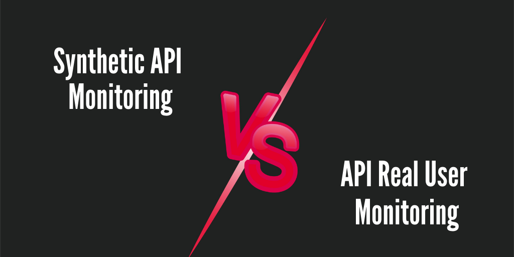

Performance and dependability of Application Programming Interfaces (APIs) are essential for any business. [API monitoring](https://apitoolkit.io/blog/best-api-monitoring-and-observability-tools/) plays a vital role in maintaining the seamless functioning of applications and delivering exceptional user experiences. However, there are two different approaches to API monitoring: Synthetic API Monitoring and API Real User [Monitoring](https://apitoolkit.io/blog/best-api-monitoring-and-observability-tools/) (RUM).

## Streamlining Navigation with Skip Links

Skip links are an essential component of website accessibility. They allow users to navigate directly to specific content on a page, bypassing repetitive or irrelevant sections. By streamlining navigation, skip links enhance the overall user experience, especially for those using assistive technologies.

Imagine you are visiting a website that has a long and complex navigation menu. Without skip links, you would have to scroll through the entire menu to find the content you are looking for. This can be time-consuming and frustrating, especially for individuals with visual impairments or motor disabilities.

However, with the implementation of skip links, users can easily skip over the navigation menu and jump directly to the main content of the page. This not only saves time but also reduces cognitive load, allowing users to focus on the information that is most relevant to them.  

### Enhancing Accessibility with Skip Links

Accessibility is a core principle in web development. Skip links are an effective way to make websites more accessible for users with disabilities. By providing shortcuts to content, individuals can quickly jump to the information they need without having to navigate through every section of a page.

For example, imagine a user with a visual impairment who relies on a screen reader to access web content. Without skip links, the screen reader would have to read through the entire page, including the navigation menu and other repetitive elements, before reaching the main content. This can be overwhelming and time-consuming for the user.

However, by incorporating skip links, the user can skip directly to the main content, bypassing the navigation menu and any other irrelevant sections. This not only improves the user experience but also ensures that individuals with disabilities have equal access to information on the web. Moreover, skip links can also benefit users who have cognitive disabilities or attention disorders. These individuals may find it challenging to navigate through complex menus or lengthy pages. With skip links, they can quickly jump to the specific content they are interested in, without getting lost or overwhelmed by the surrounding elements.

Skip links are a valuable tool for enhancing website accessibility. By providing shortcuts to content, they streamline navigation and improve the user experience for individuals with disabilities. Whether it's a visually impaired user relying on a screen reader or someone with cognitive challenges, skip links ensure that everyone can easily access the information they need on the web.

## Understanding the Importance of Monitoring

[Monitoring](https://apitoolkit.io/blog/best-api-monitoring-and-observability-tools/) is an integral part of any API strategy. It allows businesses to proactively identify and address performance issues, ensuring the smooth functioning of APIs and minimizing downtime. Monitoring plays a crucial role in maintaining customer satisfaction and preventing revenue loss.

When it comes to [APIs](https://apitoolkit.io/blog/how-to-generate-automated-api-documentation/), monitoring is not just about keeping an eye on the technical aspects of the system. It goes beyond that. Monitoring also involves understanding the usage patterns, analyzing the data, and making informed decisions based on the insights gained.

By [monitoring APIs](https://apitoolkit.io/blog/best-api-monitoring-and-observability-tools/), businesses can gain valuable insights into how their customers are interacting with their products or services. They can track the number of [API](https://apitoolkit.io/blog/fintech-api/) calls made, the response times, and the success rates. This information can help businesses identify trends and patterns, and make data-driven decisions to improve their offerings.

### The Role of Monitoring in Ensuring Application Performance

[Monitoring](https://apitoolkit.io/blog/best-api-monitoring-and-observability-tools/) ensures that applications are performing optimally and meeting the expected performance standards. By continuously [monitoring](https://apitoolkit.io/blog/best-api-monitoring-and-observability-tools/) APIs, businesses can identify and resolve bottlenecks, optimize response times, and improve overall application performance.

Imagine a scenario where an e-commerce website experiences a sudden surge in traffic due to a flash sale. Without proper [monitoring](https://apitoolkit.io/blog/best-api-monitoring-and-observability-tools/) in place, the website may not be able to handle the increased load, resulting in slow response times or even crashes. This can lead to frustrated customers, abandoned carts, and ultimately, revenue loss.

However, with effective monitoring, businesses can proactively detect such spikes in traffic and take necessary actions to scale their infrastructure accordingly. They can allocate additional resources, optimize their code, or even implement caching mechanisms to ensure that the website remains responsive and performs well even under heavy load.

Monitoring also helps in identifying potential security vulnerabilities. By monitoring API traffic, businesses can detect any suspicious activity or unauthorized access attempts. They can set up alerts to notify them of any unusual patterns or anomalies, allowing them to take immediate action to protect their systems and data.

Furthermore, [monitoring](https://apitoolkit.io/blog/best-api-monitoring-and-observability-tools/) plays a crucial role in ensuring compliance with service level agreements (SLAs). Businesses often have contractual obligations to meet certain performance targets, such as minimum response times or maximum downtime. By monitoring their [APIs](https://apitoolkit.io/blog/fintech-api/), businesses can track their performance [metrics](https://apitoolkit.io/blog/api-logs-and-metrics/) in real-time and take proactive measures to meet their SLAs.

[Monitoring](https://apitoolkit.io/blog/best-api-monitoring-and-observability-tools/) is not just a technical necessity, but a strategic tool that businesses can leverage to improve their overall performance, enhance customer satisfaction, and drive revenue growth. By investing in robust monitoring solutions and practices, businesses can stay ahead of the competition and deliver exceptional experiences to their customers.

## Exploring Synthetic Monitoring

Synthetic [monitoring](https://apitoolkit.io/blog/best-api-monitoring-and-observability-tools/) involves simulating user interactions with [APIs](https://apitoolkit.io/blog/fintech-api/) to measure performance and detect any issues or abnormalities. This type of monitoring allows businesses to proactively test their APIs under various conditions and anticipate potential problems before they impact real users.

With synthetic monitoring, businesses can gain valuable insights into the performance of their APIs by replicating user interactions. By simulating actions such as requesting data, submitting forms, or performing transactions, companies can evaluate how well their [APIs](https://apitoolkit.io/blog/fintech-api/) handle different scenarios. This comprehensive evaluation helps identify potential performance bottlenecks and enables businesses to optimize their APIs accordingly.

### Simulating User Interactions for Effective Performance Testing

Synthetic monitoring replicates user interactions with APIs, enabling businesses to evaluate performance under different scenarios. By simulating user actions such as requesting data, submitting forms, or performing transactions, it becomes possible to identify potential performance bottlenecks and optimize the [API](https://apitoolkit.io/blog/fintech-api/) accordingly.

For example, a company that offers an e-commerce platform can use synthetic monitoring to simulate user interactions like adding items to the cart, applying discount codes, and checking out. By monitoring the response time and success rate of these interactions, the company can identify any performance issues that may arise when the platform experiences high traffic or during peak shopping seasons.

Furthermore, synthetic [monitoring](https://apitoolkit.io/blog/best-api-monitoring-and-observability-tools/) allows businesses to test their APIs in controlled environments. By creating synthetic users with specific characteristics, such as different device types, network speeds, or geographic locations, companies can evaluate how their [APIs](https://apitoolkit.io/blog/fintech-api/) perform under various conditions. This level of testing helps businesses ensure that their APIs deliver a consistent and satisfactory user experience across different devices and locations.

### The Benefits of Synthetic Monitoring in Proactive Issue Detection

Synthetic monitoring enables businesses to detect and address performance issues before real users are affected. By continuously monitoring APIs from various geographical locations and simulating user interactions, any anomalies or deviations from expected behavior can be identified and rectified in a proactive manner.

For instance, a company that provides a mobile banking application can use synthetic monitoring to simulate user interactions like logging in, checking account balances, and making transactions. By [monitoring](https://apitoolkit.io/blog/best-api-monitoring-and-observability-tools/) the response time and accuracy of these interactions, the company can quickly detect any performance issues that may arise due to server overload, network latency, or software bugs.

By proactively detecting and addressing performance issues, businesses can prevent potential revenue loss, customer dissatisfaction, and negative brand reputation. Synthetic [monitoring](https://apitoolkit.io/blog/best-api-monitoring-and-observability-tools/) empowers companies to take corrective actions before real users experience any disruptions or inconveniences, ensuring a seamless and reliable user experience.

Synthetic monitoring is a crucial tool for businesses to evaluate the performance of their APIs and detect any issues or abnormalities. By simulating user interactions and continuously [monitoring APIs](https://apitoolkit.io/blog/best-api-monitoring-and-observability-tools/), companies can proactively optimize their [APIs](https://apitoolkit.io/blog/fintech-api/) and provide a seamless user experience. With the ability to anticipate potential problems before they impact real users, synthetic [monitoring](https://apitoolkit.io/blog/best-api-monitoring-and-observability-tools/) is a valuable practice in today's digital landscape.

## Real User Monitoring: Gaining Insights from Actual User Interactions

Real User Monitoring (RUM) provides insights into how users interact with APIs in real-world scenarios. This type of monitoring captures and analyzes data from actual users, allowing businesses to understand performance from the perspective of their target audience.

## Wrapping Up: Key Takeaways on Monitoring

[Monitoring](https://apitoolkit.io/blog/best-api-monitoring-and-observability-tools/)  APIs is essential for ensuring optimal performance and maximizing user satisfaction. Synthetic [monitoring](https://apitoolkit.io/blog/best-api-monitoring-and-observability-tools/) offers proactive issue detection and performance optimization, while real user monitoring provides insights into how APIs perform in real-world situations. Implementing a comprehensive monitoring strategy that combines both approaches is crucial for maintaining [API](https://apitoolkit.io/blog/fintech-api/) reliability and meeting user expectations.

## The Ultimate Guide to SaaS Reverse Trials

[SaaS]([Fintech API: Unlocking the Secrets to its Rapid Growth in the Financial Sector](https://apitoolkit.io/blog/fintech-api/)) (Software-as-a-Service) reverse trials have gained popularity as a customer acquisition and retention strategy. This guide explores the concept of reverse trials, their benefits, and how businesses can effectively implement them to attract and convert potential customers.

## Effective Pricing Strategies for API Products

Choosing the right pricing strategy is vital for the success of [API products](https://apitoolkit.io/blog/api-as-a-product/). Different pricing models, such as pay-as-you-go, tiered pricing, and subscription-based pricing, offer various advantages and suit different business models. This section dives into the intricacies of API pricing and provides insights to help businesses make informed pricing decisions.

## Making the Decision: Build Vs Buy for API Management Solutions

When it comes to API management solutions, businesses face a decision: whether to build a custom solution in-house or utilize a pre-built solution from a vendor. This article weighs the pros and cons of both approaches and provides guidance to help businesses make an informed decision based on their specific needs and resources.

## Accelerating Proof of Concept with APIToolkit: A Comparison

[APIToolkit](https://apitoolkit.i0) is a popular API analytics platform that helps businesses gain insights into [API](https://apitoolkit.io/blog/fintech-api/) usage and performance. This section compares APIToolkit with other similar solutions, exploring their features, benefits, and evaluating how they accelerate the proof of concept process for businesses looking to leverage API analytics.

## Keep Reading

[10 Must-Know API trends in 2023](https://apitoolkit.io/blog/api-trends/)
[Fintech API: Unlocking the Secrets to its Rapid Growth in the Financial Sector](https://apitoolkit.io/blog/fintech-api/)
[Best API Monitoring and Observability Tools in 2023](https://apitoolkit.io/blog/best-api-monitoring-and-observability-tools/)
[The Rise of API-as-a-Product: How Companies are Leveraging APIs to Drive Revenue](https://apitoolkit.io/blog/api-as-a-product/)
[How to Analyze API Logs and Metrics for Better Performance](https://apitoolkit.io/blog/api-logs-and-metrics/)
