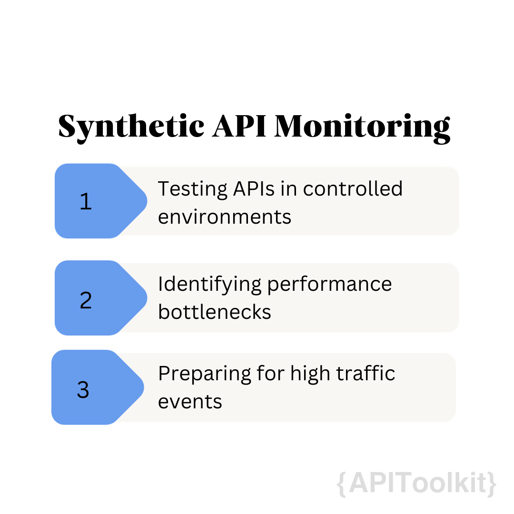
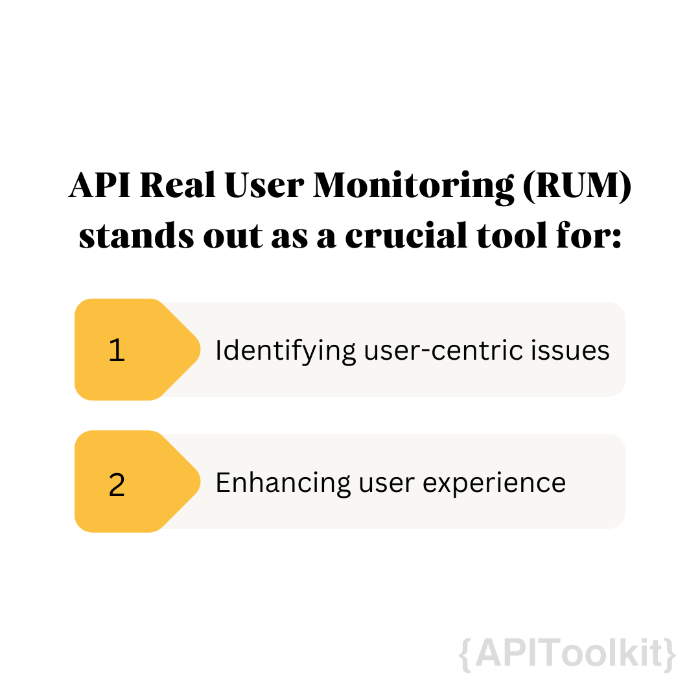

Performance and dependability of Application Programming Interfaces (APIs) are essential for any business. [API monitoring](https://apitoolkit.io/blog/best-api-monitoring-and-observability-tools/) plays a vital role in maintaining the seamless functioning of applications and delivering exceptional user experiences. However, there are two different approaches to API monitoring: Synthetic API Monitoring and API Real User [Monitoring](https://apitoolkit.io/blog/best-api-monitoring-and-observability-tools/) (RUM).

## Importance of Monitoring

[Monitoring](https://apitoolkit.io/blog/best-api-monitoring-and-observability-tools/) is an integral part of any API strategy. It allows businesses to proactively identify and address performance issues, ensuring the smooth functioning of APIs and minimizing downtime. Monitoring plays a crucial role in maintaining customer satisfaction and preventing revenue loss. When it comes to [APIs](https://apitoolkit.io/blog/how-to-generate-automated-api-documentation/), monitoring is not just about keeping an eye on the technical aspects of the system. It goes beyond that. Monitoring also involves understanding the usage patterns, analyzing the data, and making informed decisions based on the insights gained.

By [monitoring APIs](https://apitoolkit.io/blog/best-api-monitoring-and-observability-tools/), businesses can gain valuable insights into how their customers are interacting with their products or services. They can track the number of [API](https://apitoolkit.io/blog/fintech-api/) calls made, the response times, and the success rates. This information can help businesses identify trends and patterns, and make data-driven decisions to improve their offerings.

### The Role of Monitoring in Ensuring Application Performance

[Monitoring](https://apitoolkit.io/blog/best-api-monitoring-and-observability-tools/) ensures that applications are performing optimally and meeting the expected performance standards. By continuously [monitoring](https://apitoolkit.io/blog/best-api-monitoring-and-observability-tools/) APIs, businesses can identify and resolve bottlenecks, optimize response times, and improve overall application performance.

Imagine a scenario where an e-commerce website experiences a sudden surge in traffic due to a flash sale. Without proper [monitoring](https://apitoolkit.io/blog/best-api-monitoring-and-observability-tools/) in place, the website may not be able to handle the increased load, resulting in slow response times or even crashes. This can lead to frustrated customers, abandoned carts, and ultimately, revenue loss.

However, with effective monitoring, businesses can proactively detect such spikes in traffic and take necessary actions to scale their infrastructure accordingly. They can allocate additional resources, optimize their code, or even implement caching mechanisms to ensure that the website remains responsive and performs well even under heavy load. Monitoring goes a long way in identifying potential security vulnerabilities. By monitoring API traffic, businesses can detect any suspicious activity or unauthorized access attempts. They can set up alerts to notify them of any unusual patterns or anomalies, allowing them to take immediate action to protect their systems and data.

[Monitoring](https://apitoolkit.io/blog/best-api-monitoring-and-observability-tools/) plays a crucial role in ensuring compliance with service level agreements (SLAs). Businesses often have contractual obligations to meet certain performance targets, such as minimum response times or maximum downtime. By monitoring their [APIs](https://apitoolkit.io/blog/fintech-api/), businesses can track their performance [metrics](https://apitoolkit.io/blog/api-logs-and-metrics/) in real-time and take proactive measures to meet their SLAs.

[Monitoring](https://apitoolkit.io/blog/best-api-monitoring-and-observability-tools/) has gone beyond just being a technical necessity, but a strategic tool that businesses can leverage to improve their overall performance, enhance customer satisfaction, and drive revenue growth. By investing in robust monitoring solutions and practices, businesses can stay ahead of the competition and deliver exceptional experiences to their customers.

## Synthetic API Monitoring

Synthetic API Monitoring is a strategic approach to testing and evaluating the performance of Application Programming Interfaces (APIs) by simulating user interactions. It enables businesses to detect and address performance issues before real users are affected. By continuously monitoring APIs from various geographical locations and simulating user interactions, any anomalies or deviations from expected behavior can be identified and rectified in a proactive manner. This proactive method of monitoring offers several significant advantages to businesses in ways that include:

**Testing APIs in Controlled Environments:** [Synthetic API Monitoring](https://apitoolkit.io/blog/rum-vs-synthetic-monitoring/) allows companies to test their APIs in controlled environments, where they can simulate a variety of user interactions under different conditions. This approach is crucial for evaluating [API performance](https://apitoolkit.io/blog/database-monitoring/), as it ensures that APIs can handle varied scenarios effectively. In a controlled environment, developers can create specific situations that an API might encounter in the real world. This includes testing under various network conditions, user behaviors, and load levels. The benefit of this approach is the ability to isolate variables and understand how particular changes affect the API’s performance. Early detection of issues in this stage is invaluable, as it allows for adjustments and optimizations before the APIs face real users, ensuring smoother operations post-deployment.

**Identifying Performance Bottlenecks:** Synthetic monitoring involves replicating actions such as data requests or transactions, which users would typically perform. This replication helps businesses to identify any performance bottlenecks in their APIs. By observing how these simulated actions affect the API, developers can pinpoint specific areas where [performance](https://apitoolkit.io/blog/mastering-monitoring/) lags, such as during heavy data processing or high-volume requests. Understanding these bottlenecks is essential for optimizing the API’s functionality. Once identified, developers can focus on these problem areas to enhance the API’s efficiency, ensuring that it can handle real-life tasks without significant delays or failures.

**Preparing for High Traffic Events:** One of the significant advantages of synthetic API [monitoring](https://apitoolkit.io/blog/monitoring-api-failures-with-apitoolkit/) is its utility in preparing for high-traffic events, such as e-commerce flash sales. By simulating periods of peak usage, businesses can predict how their APIs will perform during these critical times. This foresight is crucial for making informed decisions about scaling the infrastructure to meet increased demand. For instance, if a simulation reveals that an API struggles under a surge of user requests, a business might increase server capacity or optimize load balancing to accommodate the spike in traffic. Ensuring that APIs can withstand these surges is vital for maintaining a seamless user experience, which is pivotal in retaining customer trust and satisfaction during such high-stakes events.

Overall synthetic monitoring is a crucial tool for businesses to evaluate the performance of their APIs and detect any issues or abnormalities. By simulating user interactions and continuously [monitoring APIs](https://apitoolkit.io/blog/best-api-monitoring-and-observability-tools/), companies can proactively optimize their [APIs](https://apitoolkit.io/blog/fintech-api/) and provide a seamless user experience. With the ability to anticipate potential problems before they impact real users, synthetic [monitoring](https://apitoolkit.io/blog/best-api-monitoring-and-observability-tools/) is a valuable practice in today's digital landscape.

## API Real User Monitoring (RUM)

API [Real User Monitoring (RUM)](https://apitoolkit.io/blog/rum-vs-synthetic-monitoring/) stands out as a crucial tool for understanding how actual users interact with APIs in a live environment. Unlike synthetic monitoring, which simulates [user interactions](https://apitoolkit.io/blog/improving-user-experience/), RUM provides authentic insights by analyzing real user interaction data. This method captures a wide array of information, including how quickly APIs respond to user requests, how they perform under varying loads, and how different user segments interact with the API. This real-world performance data is invaluable for businesses as it reflects the true user experience. By understanding how their APIs function in real-world scenarios, developers can better gauge the effectiveness of their APIs and identify areas that may need improvement to enhance overall functionality and reliability.

**Identifying User-Centric Issues:** One of the key advantages of RUM is its ability to identify issues that may not be evident during synthetic testing. Real user [monitoring](https://apitoolkit.io/blog/monitoring-api-failures-with-apitoolkit/) delves into the nuances of user behavior, shedding light on how specific user actions or patterns can cause stress on the APIs. For instance, RUM can reveal if certain API endpoints are being overutilized or if certain types of requests frequently lead to errors. This level of insight is crucial for understanding the user-centric issues that could impact the API's performance. By analyzing the patterns and trends in user behavior, businesses can pinpoint specific areas where their APIs might struggle, allowing them to proactively address these issues and enhance the API's resilience and efficiency.

**Enhancing User Experience:** The ultimate goal of API RUM is to enhance the user experience. By providing a clear picture of how real users interact with the API, RUM enables businesses to make user-focused improvements. This might include optimizing API response times for more commonly used endpoints, adjusting the API to better handle specific types of requests, or even redesigning aspects of the API to be more intuitive and user-friendly. Improvements based on RUM data are directly aligned with actual user needs and behaviors, which leads to a more satisfactory and engaging user experience. As businesses continually adapt their APIs based on RUM insights, they can ensure that their services remain relevant, responsive, and appealing to their user base, ultimately driving higher user satisfaction and loyalty.

API Real User Monitoring is an essential component in the toolkit of modern web development. It bridges the gap between hypothetical performance and actual user experience, providing tangible data that businesses can use to refine their APIs. By leveraging the insights gained from RUM, companies can ensure their APIs are not just technically proficient but are also perfectly attuned to the needs and expectations of their real users.

## Complementing Monitoring Approaches for Optimal Performance

In the digital world, businesses must ensure that their Application Programming Interfaces (APIs) are not only functionally robust but also align with user expectations and needs. This necessity brings to the forefront the critical role of two complementary monitoring strategies: Synthetic API Monitoring and API Real User Monitoring (RUM). Together, these approaches form a comprehensive monitoring framework that optimizes API performance and enhances user experience.

### The Proactive Testing Front

Synthetic Monitoring serves as a proactive mechanism in API management. It involves creating simulated scenarios to test APIs in a controlled environment. This approach allows businesses to:

1. **Preemptively Identify and Address Issues**: By simulating user requests and actions, companies can uncover potential flaws or performance bottlenecks in their APIs before they impact real users.
   
2. **Test Under Varied Conditions**: Synthetic Monitoring offers the flexibility to test APIs under a range of conditions, including peak loads, different geographical locations, and varied network environments, ensuring the API’s robustness and scalability.

3. **Optimize for Peak Performance**: It provides the opportunity to fine-tune and optimize APIs, ensuring they meet the desired performance standards under all anticipated conditions.

### Insights from Actual Usage

RUM, on the other hand, focuses on monitoring and analyzing the performance of APIs based on actual user interactions. This user-centric approach provides insights that are critical for:

1. **Understanding User Behavior and Preferences**: RUM tracks how real users interact with APIs, providing invaluable data on user behavior, preferences, and patterns.
   
2. **Identifying Real-World Issues**: It helps in detecting issues that may not be apparent in controlled testing environments, offering a realistic picture of the API’s performance in live scenarios.

3. **Enhancing User Experience**: Insights gained from RUM enable businesses to make user-focused improvements, ensuring that APIs are not only technically sound but also resonate with user expectations and needs.

### Integrating Synthetic Monitoring and RUM for Holistic API Strategy

The integration of [Synthetic Monitoring](https://apitoolkit.io/blog/rum-vs-synthetic-monitoring/) and RUM forms a holistic API monitoring strategy that addresses both the technical and experiential aspects of API functionality. This dual approach ensures:

1. **Comprehensive Coverage**: While Synthetic Monitoring provides a safeguard against potential technical failures, RUM brings to light the user-centric issues, ensuring a comprehensive coverage of all aspects of API performance.

2. **Balanced Optimization**: The insights from both monitoring types allow businesses to balance technical optimization with user experience improvements, creating APIs that are both high-performing and user-friendly.

3. **Adaptability and Responsiveness**: With continuous feedback from both synthetic tests and real user data, businesses can rapidly adapt and respond to changing user needs and technological advancements, maintaining the relevance and efficacy of their APIs.

4. **Enhanced Reliability and User Satisfaction**: By preemptively identifying potential issues and continuously refining the API based on user feedback, companies can enhance the reliability of their APIs and improve overall user satisfaction.

## Conclusion

[Monitoring](https://apitoolkit.io/blog/best-api-monitoring-and-observability-tools/) APIs is essential for ensuring optimal performance and maximizing user satisfaction. Synthetic [monitoring](https://apitoolkit.io/blog/best-api-monitoring-and-observability-tools/) offers proactive issue detection and performance optimization, while real user monitoring provides insights into how APIs perform in real-world situations. Implementing a comprehensive monitoring strategy that combines both approaches is crucial for maintaining [API](https://apitoolkit.io/blog/fintech-api/) reliability and meeting user expectations.

## Keep Reading

[10 Must-Know API trends in 2023](https://apitoolkit.io/blog/api-trends/)
[Fintech API: Unlocking the Secrets to its Rapid Growth in the Financial Sector](https://apitoolkit.io/blog/fintech-api/)
[Best API Monitoring and Observability Tools in 2023](https://apitoolkit.io/blog/best-api-monitoring-and-observability-tools/)
[The Rise of API-as-a-Product: How Companies are Leveraging APIs to Drive Revenue](https://apitoolkit.io/blog/api-as-a-product/)
[How to Analyze API Logs and Metrics for Better Performance](https://apitoolkit.io/blog/api-logs-and-metrics/)