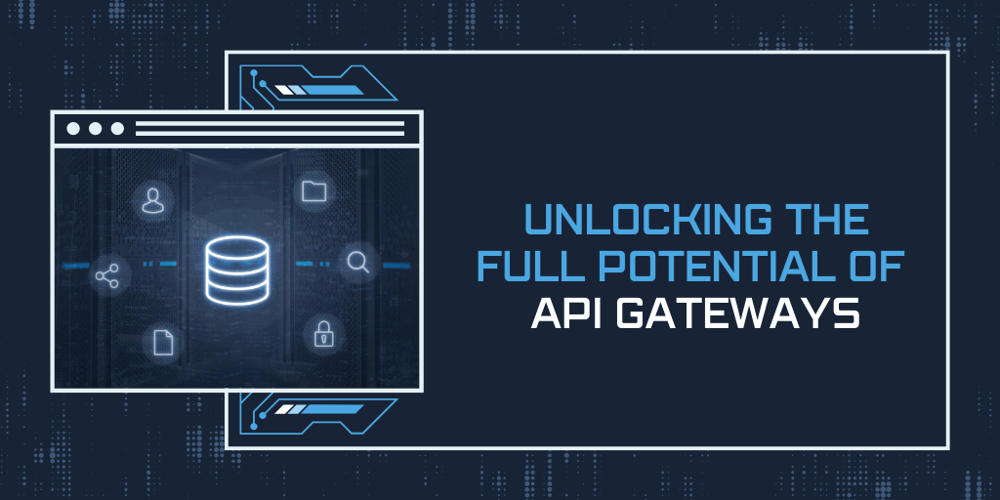

API gateways serve as a crucial component in modern software development, acting as a gateway between external clients and backend servers. However, their true power lies in their ability to unlock the full potential of APIs, enabling organizations to streamline their development process, enhance security, boost performance, and gain valuable insights through analytics and monitoring. In this comprehensive guide, we will delve into various strategies and best practices for maximizing the potential of API gateways, while highlighting the importance of [API management](https://apitoolkit.io/blog/api-downtime/), analytics, and monitoring in achieving organizational goals.

## Maximizing the Potential of API Gateways

API gateways open up a world of possibilities for businesses, enabling them to deliver more robust and innovative solutions to their clients. To fully harness the power of API gateways, organizations should pay attention to the following areas:

### Enhancing Security with Authentication & Rate Limiting

Securing [APIs](https://apitoolkit.io/blog/how-to-generate-automated-api-documentation/) is of utmost importance, as they expose valuable data and functionality to external clients. API gateways provide a central location to implement authentication mechanisms, such as API keys, OAuth, or JWT, ensuring only authorized parties can access the APIs. This helps protect sensitive information and prevent unauthorized access. API gateways also offer rate limiting capabilities. By setting limits on the number of requests that can be made within a certain time period, organizations can prevent abuse and protect backend servers from being overwhelmed. This ensures that the APIs remain available and responsive to all clients, even during periods of high traffic.

### Boosting Performance with Caching & CORS Policies

API gateways can significantly improve performance by implementing caching mechanisms. By caching responses, commonly accessed data can be served directly from the gateway, reducing the load on backend systems and improving response times. This not only enhances the user experience but also helps optimize resource utilization and scalability.

Furthermore, Cross-Origin Resource Sharing (CORS) policies can be implemented at the gateway to control which external domains are allowed to access the APIs. By specifying the allowed origins, methods, and headers, organizations can prevent unauthorized requests and improve overall security. This ensures that only trusted clients can interact with the APIs, reducing the risk of malicious activities.

### Ensuring Data Integrity with Validation & Transformation

Validating incoming requests and transforming data to match backend requirements are vital steps in [API](https://apitoolkit.io/blog/how-to-generate-automated-api-documentation/) development. API gateways can enforce request validation rules, ensuring that only properly formatted data is allowed to pass through to the backend. This helps maintain data integrity and prevents errors or inconsistencies from propagating to the backend systems.

Additionally, data transformation can be performed at the gateway, converting data formats or modifying requests to align with the backend systems. This allows organizations to decouple the frontend and backend, enabling them to make changes to the [APIs](https://apitoolkit.io/blog/how-to-generate-automated-api-documentation/) without affecting the existing clients. It also simplifies the integration process for clients, as they can receive data in a format that is most convenient for their use cases.

### Seamless API Updates with Canary Release/Versioning

One challenge in API development is deploying updates without causing disruptions to existing clients. API gateways offer a solution through canary release or versioning mechanisms. By gradually rolling out updates to a small subset of clients, organizations can test the compatibility and stability of new features before fully releasing them to all clients, minimizing the chances of service interruptions.

This approach allows organizations to gather feedback and address any issues or concerns before making the updates available to a wider audience. It also provides a safety net, as the impact of any potential problems is limited to a smaller group of users. This iterative approach to updates ensures a smoother transition and helps maintain a high level of service reliability.

## Unleashing the Power of API Analytics

While API gateways excel at enabling secure and performant communication between clients and servers, they also serve as valuable sources of data and insights. API analytics provide organizations with the ability to understand how their APIs are being utilized, identify usage patterns, and make data-driven decisions. Here are some key aspects to consider:

### Gaining Insights with API Product Analytics

API gateways can collect detailed analytics on [API](https://apitoolkit.io/blog/how-to-generate-automated-api-documentation/) usage, allowing organizations to gain insights into which endpoints and functionalities are being utilized the most. This data can be used to identify popular features, prioritize development efforts, and even drive business decisions such as pricing or feature offerings.

For example, let's say a company offers an API that provides weather data to developers. By analyzing the API product analytics, the company may discover that the endpoint providing real-time temperature data is the most frequently accessed. Armed with this information, the company can allocate resources to further enhance this feature, ensuring it remains reliable and efficient.

Furthermore, API product analytics can also reveal usage patterns over time. Organizations can identify [trends](https://apitoolkit.io/blog/api-trends/), such as increased API usage during specific seasons or events, and adjust their strategies accordingly. This data-driven approach allows organizations to stay ahead of market demands and deliver the most impactful API solutions.

### Streamlining Troubleshooting with API Logging/Debugging

When issues arise, API gateways can play a vital role in troubleshooting and resolving them quickly. By enabling comprehensive logging and debugging capabilities, organizations can obtain valuable information about the flow of requests, response times, and any errors or exceptions that occur along the way. This data can assist in identifying and resolving issues promptly, minimizing downtime and improving overall system reliability.

For instance, imagine a scenario where an API integration suddenly starts returning errors. With API logging and debugging, organizations can trace the request flow and pinpoint the exact step where the error occurred. This level of visibility enables developers to quickly identify the root cause and implement a fix, ensuring uninterrupted service for clients.

Moreover, API logging and debugging can also provide insights into performance bottlenecks. By analyzing the response times and identifying any slowdowns, organizations can optimize their APIs for better efficiency and responsiveness. This proactive approach helps maintain a high-quality user experience and prevents potential issues from escalating.

### Proactive Monitoring for API Performance

Monitoring the performance of APIs is crucial to ensure that they meet service level agreements (SLAs) and provide a seamless experience to clients. API gateways can be configured to monitor key performance metrics, such as response times, error rates, and throughput. By proactively monitoring these metrics, organizations can detect and address performance bottlenecks before they impact end-users.

For example, let's consider an e-commerce company that relies heavily on an API for processing customer orders. By monitoring the API's response times and error rates, the company can quickly identify any degradation in performance. This allows them to take immediate action, whether it's scaling up resources, optimizing code, or fine-tuning configurations, to ensure a smooth and uninterrupted shopping experience for their customers.

Additionally, proactive monitoring can also help organizations identify usage patterns that may require scaling or resource allocation adjustments. By analyzing the throughput of API requests, organizations can anticipate peak usage periods and allocate resources accordingly, preventing any potential performance issues.

### Collaborative Decision-Making with Team Dashboards

API gateways can serve as a centralized hub for teams working on API-related projects. Dashboard views can be created to provide real-time insights into key metrics, allowing teams to collaborate effectively and make data-driven decisions. Whether it's tracking API usage, monitoring performance, or identifying potential issues, team dashboards can streamline communication and foster collaboration.

For instance, imagine a development team working on an API that powers a mobile application. With a team dashboard, each member can have visibility into the API's usage metrics, such as the number of requests per minute and the average response time. This shared understanding enables the team to align their efforts, prioritize tasks, and optimize the API's performance collectively.

Furthermore, team dashboards can also facilitate cross-functional collaboration. By providing insights into API usage and performance to stakeholders from different departments, such as marketing or sales, organizations can foster a collaborative environment where decisions are based on real-time data. This collaborative decision-making approach ensures that the API aligns with the overall business objectives and meets the needs of various stakeholders.

### Understanding User and Company Needs with Personas

Developing deep insights into the needs and preferences of users is essential for building successful APIs. API gateways can facilitate the creation and implementation of user personas, representing different segments of the user base. By understanding these personas and their requirements, organizations can tailor their APIs to offer the most relevant features, ultimately improving user satisfaction and adoption rates.

For example, consider a social media platform that provides an API for developers to integrate its features into their applications. By creating user personas based on demographics, interests, and usage patterns, the platform can gain a better understanding of its developer community. This knowledge enables the platform to prioritize API enhancements that align with the needs of different developer personas, resulting in increased adoption and engagement.

Moreover, user personas can also help organizations identify potential gaps in their API offerings. By analyzing the needs and pain points of different personas, organizations can uncover opportunities for new features or improvements. This user-centric approach ensures that APIs evolve in line with user expectations, driving long-term success and customer loyalty.

## Streamlining API Management

Managing APIs effectively is crucial for their successful implementation and ongoing maintenance. API gateways play a pivotal role in streamlining API management tasks, ensuring smooth operations and maximizing the potential of APIs. Consider the following strategies:

In conclusion, API gateways serve as the backbone of modern software development, providing organizations with the means to unlock the full potential of APIs. By focusing on maximizing the potential of API gateways, unleashing the power of API analytics, and streamlining [API management](https://apitoolkit.io/blog/api-downtime/), businesses can harness the true power of APIs and achieve their organizational goals.

## Keep Reading

[Web API Performance Best Practices: the Ultimate Guide](https://apitoolkit.io/blog/web-api-performance/)
[10 Must-Know API trends in 2023](https://apitoolkit.io/blog/api-trends/)
[How to Analyze API Logs and Metrics for Better Performance](https://apitoolkit.io/blog/api-logs-and-metrics/)
[Incident Management: How to Resolve API Downtime Issues Before It Escalates](https://apitoolkit.io/blog/api-downtime/)
[How to Tackle Anomalies in RESTful APIs](https://apitoolkit.io/blog/anomalies-in-restful-apis/)
[Top 7 Reasons Why Your Team Should Use an API Monitoring Tool](https://apitoolkit.io/blog/why-you-need-an-api-monitoring-tool/)