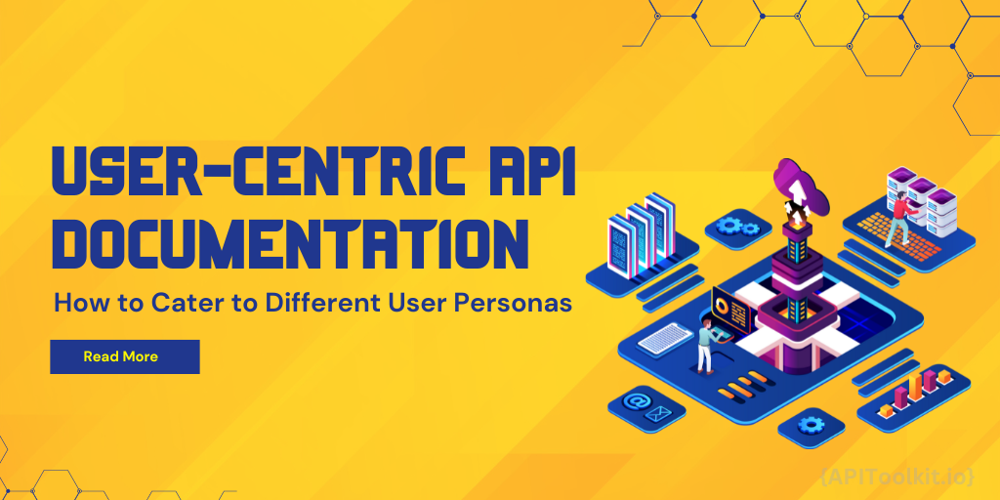
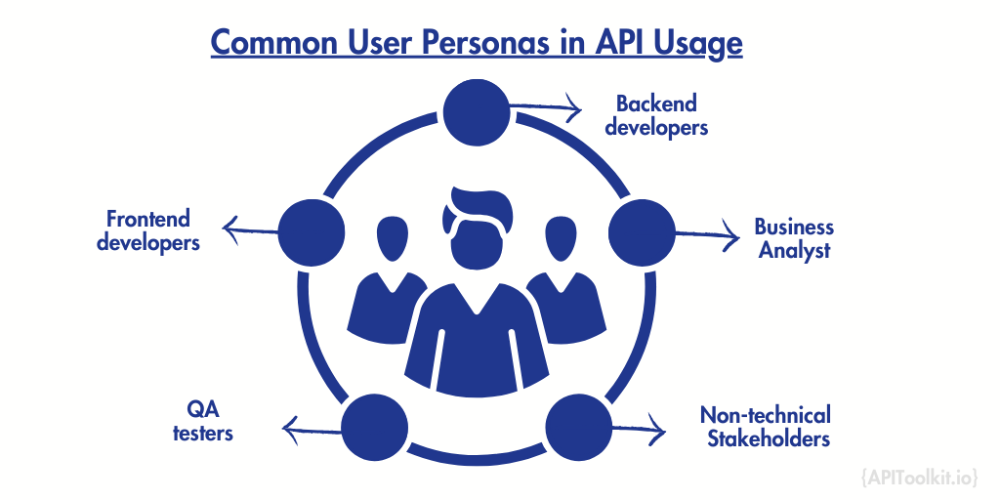

In the dynamic field of programming, Application Programming Interfaces (APIs) function as the key connectors between diverse digital environments, streamlining interactions and improving how users engage with software. But what good is a powerful API if its documentation doesn't speak to the varied needs of its users? The concept of "User-Centric [API Documentation](https://apitoolkit.io/blog/how-to-generate-automated-api-documentation/),"is  an innovative change aimed at adapting API guides to suit different user personas. In this comprehensive guide, we'll delve into how you can make your API documentation more user-centric by understanding the critical role of API observability and API modeling. Whether you're a developer, a Quality Assurance (QA) tester, or a business analyst, read on to discover how personalized, insightful, and actionable API documentation can make your life easier and your projects more successful.

## Why Traditional API Documentation Falls Short

APIs are the backbone of many software applications, yet their [documentation](https://apitoolkit.io/blog/how-to-write-api-docs/) often leaves much to be desired. Traditional API guides are typically designed as a one-size-fits-all resource, focusing solely on technical aspects like endpoints, request methods, and status codes. While these details are undoubtedly crucial, they don't necessarily cater to the diverse needs of different users interacting with the API.

For instance, a backend developer might be looking for in-depth information about API observability metrics, while a business analyst could be more interested in high-level overviews and use cases. QA testers, on the other hand, might require detailed examples for testing scenarios. Traditional documentation rarely addresses these diverse needs adequately, leading to inefficiencies, misunderstandings, and ultimately, suboptimal usage of the API.

That's where the concept of User-Centric [API Documentation](https://apitoolkit.io/blog/how-to-generate-automated-api-documentation/) comes into play, offering a more tailored approach that considers the unique requirements of various user personas. By integrating elements of [API observability](https://apitoolkit.io/blog/api-documentation-and-observability-the-truth-you-must-know/) and [API modeling](https://apitoolkit.io/blog/api-documentation-and-observability-the-truth-you-must-know/), we can create documentation that is not just informative but also actionable, setting the stage for more effective API interactions for all involved.

## Understanding User Personas

At the heart of user-centric [API documentation](https://apitoolkit.io/blog/how-to-write-api-docs/) is the principle of empathy. To create documentation that truly resonates, it's essential to understand the individuals who'll be using the API and, by extension, the documentation. This is where the concept of 'user personas' comes into play.

A user persona is a semi-fictional representation of an ideal user based on real-world data and research. It encapsulates a user's goals, challenges, behaviors, and needs. By crafting distinct personas, we can better understand the varied ways in which different users might interact with an API.

For example, consider the persona of "Oliver, the Backend Developer." Oliver is experienced and seeks in-depth technical details. He wants to understand the nitty-gritty of the API, from request-response cycles to error handling. In contrast, "Ava, the Business Analyst," might be more interested in understanding how the API can be integrated into broader business processes and its potential impact on workflows.

Recognizing and catering to these distinct personas ensures that each user finds the information they need quickly and efficiently. It paves the way for documentation that isn't just a static resource, but a dynamic tool that adapts to the needs of its audience, bolstered by insights from API observability and the clarity of API modeling.

## Common User Personas in API Usage

Understanding your audience is the first step in creating user-centric [API documentation](https://apitoolkit.io/blog/how-to-generate-automated-api-documentation/). While the specific personas may vary depending on the API and its use cases, some common personas often emerge across different API landscapes. Here's a look at some of them:

**Backend Developers**
Needs: Detailed information on endpoints, request methods, and data formats.
How API Observability Helps: Offers in-depth metrics and logs for debugging and performance tuning.

**Frontend Developers**
Needs: Clear examples and guides on integrating the API into user interfaces.
How API Modeling Helps: Simplifies the understanding of data structures and request-response flows.

**Quality Assurance (QA) Testers**
Needs: Comprehensive testing scenarios, including edge cases and error handling.
How API Observability Helps: Provides real-time metrics to identify bottlenecks or issues during testing.

**Business Analysts**
Needs: High-level overviews, use-cases, and the potential impact on business processes.
How API Modeling Helps: Clarifies how the API fits into the broader ecosystem, aiding in strategic decision-making.

**Non-Technical Stakeholders**
Needs: Simple, jargon-free explanations of what the API does and why it matters.
How API Observability and Modeling Help: Can be leveraged to create dashboards or reports that give non-technical stakeholders insights into API performance and utility.

By tailoring the documentation to meet the specific needs of these personas, you not only make your API more accessible but also encourage more efficient and effective usage. The integration of API observability and API modeling tools can further enhance this personalization, providing actionable insights and clear structures for each type of user.

## How API Observability Helps Different Personas

[API observability](https://apitoolkit.io/blog/api-documentation-and-observability-the-truth-you-must-know/) is a critical aspect of modern API management. At its core, API observability refers to the ability to monitor and understand the state of your API through metrics, logs, and traces. But what does this mean for different user personas?

**Backend Developers**

For Backend Developers like Oliver, API observability is a treasure trove of data. It allows them to dig deep into the performance metrics, helping them fine-tune the API for optimal results. Whether it's identifying slow endpoints or monitoring rate limits, the granular data provided by API observability tools is invaluable.

**Frontend Developers**

For Frontend Developers, API observability can help troubleshoot issues in real-time. Understanding the latency or error rates associated with specific API calls can guide adjustments in the frontend code, ensuring a smoother user experience.

**QA Testers**

QA Testers can leverage API observability to simulate various scenarios and edge cases, allowing them to identify potential issues before they affect the end-users. The real-time metrics and logs can be particularly helpful in stress-testing the API.

**Business Analysts**

For Business Analysts, API observability provides an overview of API performance and its impact on business processes. Metrics like usage rates or data throughput can be crucial indicators of the API's value proposition.

**Non-Technical Stakeholders**

While Non-Technical Stakeholders may not delve into the technical details, a well-structured API observability dashboard can provide them with a high-level understanding of the API's health and performance, thereby aiding in strategic decision-making.

## API Modeling for Personalized Documentation

While [API observability](https://apitoolkit.io/blog/api-documentation-and-observability-the-truth-you-must-know/) gives us the 'what' and 'how' of API interactions, API modeling provides the 'why' and 'what if.' API modeling involves defining the structures, parameters, and possible behaviors of an API, serving as a blueprint for developers and other stakeholders.

**Backend and Frontend Developers**

For both Backend and Frontend Developers, API modeling offers a detailed structural view of the API. Tools like Swagger or OpenAPI can automatically generate documentation that provides clear instructions on request and response formats, making it easier to integrate the API into various platforms.

**QA Testers**

For QA Testers, API modeling is invaluable for creating test cases. Knowing the expected behavior of an API allows for more precise testing, including the identification of edge cases.

**Business Analysts**

Business Analysts benefit from API modeling by gaining a clearer understanding of the API's capabilities and limitations. This can be especially useful when assessing the feasibility of new features or integrations.

**Non-Technical Stakeholders**

While API modeling may seem overly technical, a well-structured model can be translated into more accessible formats. For example, visual representations can help Non-Technical Stakeholders grasp the API's functionality and its potential impact on the business.

## Key Elements of User-Centric API Documentation

Creating user-centric API documentation is not just about understanding your audience but also about delivering the information they need in the most accessible and actionable way. Here are some key elements to consider:

- Customizable examples: Providing customizable code examples allows users to see real-world applications of the API. This is particularly beneficial for developers who can adjust the examples according to their specific needs.
- Interactive API calls: Interactive elements, like 'Try it now' buttons for API calls, offer a hands-on experience. This feature can be particularly useful for QA Testers who can quickly validate different scenarios.
- Real-time performance Metrics: Incorporating elements of [API observability](https://apitoolkit.io/blog/api-documentation-and-observability-the-truth-you-must-know/), such as real-time metrics, can help Backend Developers and QA Testers get immediate insights into how their calls are performing.
- Troubleshooting guides: A well-designed troubleshooting section can save users hours of frustration. Offering solutions to common problems, possibly identified through API observability data, can be invaluable.
- High-Level overviews and use cases: For Business Analysts and Non-Technical Stakeholders, summaries and use-case descriptions provide a broader understanding of the API's capabilities and potential impact on business processes.
- Structured walkthroughs: Thanks to [API modeling](https://apitoolkit.io/blog/api-documentation-and-observability-the-truth-you-must-know/), you can offer structured walkthroughs that guide the user through various features and capabilities of the API, creating a more educational experience.

By incorporating these key elements, your API documentation will not just be a reference guide but a dynamic tool that caters to the specific needs and skills of different user personas. When coupled with API observability and modeling, this approach elevates your documentation to a new level, making it more than just informative but genuinely useful.

## Best Practices for User-Centric API Documentation

Creating [API documentation](https://apitoolkit.io/blog/how-to-generate-automated-api-documentation/) that truly resonates with its audience involves more than just technical accuracy; it requires a user-centric approach. Here are some [best practices](https://apitoolkit.io/blog/web-api-performance/) to keep in mind:

- Keep it updated: APIs are dynamic, and so should be your documentation. Regular updates, informed by API observability metrics, can help keep your documentation relevant and useful.
- Use clear language: Jargon can alienate users, especially those who are not technically inclined. Aim for clarity and simplicity to make the documentation accessible to all user personas.
- Include visual aids: Charts, diagrams, and other visual aids can make complex ideas easier to understand. This is where API modeling can provide invaluable insights into the API's structure and behavior.
- Offer multiple entry points: Different users have different needs. Offering multiple entry points, like quick-start guides for developers or executive summaries for business analysts, can make your documentation more versatile.
- Make it visible: A visible documentation is a user-friendly documentation. Utilize tags and a well-structured index to help users find what they're looking for quickly
- Provide real-world examples: Examples rooted in real-world scenarios make the API more relatable and easier to understand, especially for those who are new to it.
- Feedback loops: Encourage users to provide feedback on the documentation. This can be a gold mine of information for making continuous improvements.

By adhering to these best practices and integrating features of API observability and modeling, you can create a user-centric API documentation that not only informs but also empowers its users. Whether you're a Backend Developer, a Business Analyst, or a QA Tester, these practices ensure that the documentation serves as a dynamic, invaluable resource for everyone involved.

## Case Studies: The Impact of User-Centric API Documentation

The theoretical benefits of user-centric [API documentation](https://apitoolkit.io/blog/how-to-generate-automated-api-documentation/) are compelling, but nothing drives the point home like real-world examples. Here are some case studies that showcase the power of a user-centric approach:

Company A: Reducing Onboarding Time
Company A found that new developers were taking weeks to get comfortable with their internal APIs. After implementing user-centric documentation, complete with interactive examples and real-time performance metrics from API observability tools, the onboarding time was cut in half.

Company B: Increasing API Adoption
Company B had an API with great potential but lackluster adoption. By redesigning their documentation to cater to multiple user personas and incorporating API modeling for clearer understanding, they saw a 40% increase in API adoption within three months.

Company C: Enhancing Customer Satisfaction
Company C used API observability data to identify common issues faced by users. They revamped their troubleshooting guide based on this data, resulting in a significant drop in customer complaints and a corresponding increase in customer satisfaction ratings.

These examples underscore the real-world benefits of user-centric [API documentation](https://apitoolkit.io/blog/how-to-generate-automated-api-documentation/). By focusing on the needs of different user personas and incorporating elements of API observability and modeling, these companies were able to make their APIs more accessible, more useful, and ultimately, more successful.

## Conclusion

APIs serve as critical conduits between systems, applications, and users. Yet, their true potential can only be unlocked when they are complemented by [documentation](https://apitoolkit.io/blog/how-to-generate-automated-api-documentation/) that is as versatile and dynamic as the APIs themselves. This is where the concept of user-centric API documentation shines.

By understanding and catering to different user personas, integrating elements of API observability for real-time insights, and leveraging API modeling for structural clarity, you can transform your API documentation from a static reference guide into a dynamic, actionable tool.

So, whether you're a developer seeking technical depth, a business analyst looking for strategic insights, or a QA tester in need of real-world scenarios, remember: good API documentation doesn't just inform—it empowers. It's time to elevate your API documentation to a new level of utility and user engagement.

- - -

**Keep Reading**

[How to Measure the Effectiveness of Your API Documentation with Analytics](https://apitoolkit.io/blog/api-documentation-with-analytics/)

[How to Generate Automated API Documentation](https://apitoolkit.io/blog/how-to-generate-automated-api-documentation/)

[How to Write API Documentation: 10 Essential Guidelines](https://apitoolkit.io/blog/how-to-write-api-docs/)

[Detecting API Documentation Errors: What You Should Know](https://apitoolkit.io/blog/detecting-api-documentation-errors/)

[ API Documentation Trends to Watch: What's new and exciting ](https://apitoolkit.io/blog/api-documentation-trends-to-watch/)
