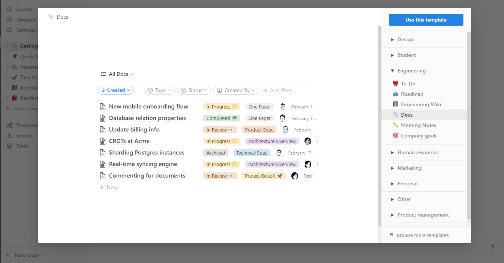
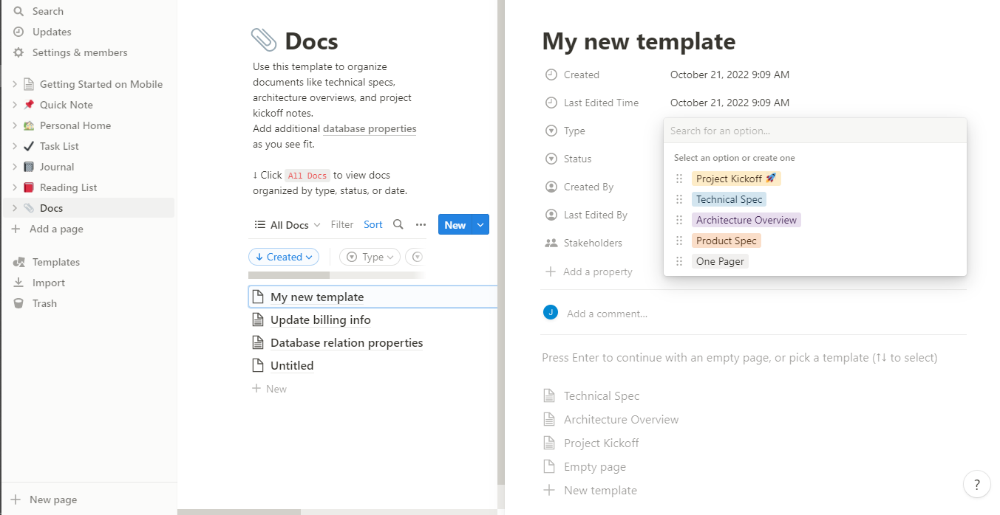

Documentation is a vital part of any product because it aids in making clear directives, specifics, staff conversations, and other information that can be unclear to not just workers but users too.  A permanent record of successes is provided by good documentation, which may be useful in future talks with clients or with the company's directors and legal counsel. The ability to rapidly and effectively provide support, such as figuring out what a particular piece of software is (or was) supposed to perform, is another benefit of thorough documentation. 

It wouldn’t be an oversight if I say [Notion](https://www.notion.so/) is that one app that has it all. I mean most developers and creatives will agree to the fact that notion is a really great tool. It is an all-in-one workspace for any company that always gets the work done. Notion does everything, from being a storage app for documents to a product map, and then API Documentation. You get the idea, it is a flexible tool with millions of ways it can be utilized. However, one of my favorite applications for Notion is open API documentation. Giving appropriate documentation on how to use a product, in my opinion, is a big bonus because it makes everything easier and less stressful for everyone especially developers.
 
One benefit Notion has over other tools of similar nature is the typographic hierarchy and readability with a super clean and minimal interface. Majority of Notion documents appear and read great, despite having a small selection of aesthetic options. By allowing you to stack data of any type, Notion also makes it possible for you to create your taxonomy for your documents.

## Quick guide on how to build documentation using Notion ae provided below.
Building a documentation with notion is a very easy process and shouldn't involve so much.
The first step is to create a [Notion](https://www.notion.so/personal) account that’s if you don’t have one.

With notion, you have the choice of either creating a template from scratch or using an already-existing template that is suitable for the type of information you want to publish.

### Here I am working with an existing template
Templates are essential in Notion since they streamline your approach and allow you to establish a unique platform for each team member. However, the first version of a template is rarely the final one. So, until you have a good template, get used to clicking on the button  to make a decision. To start you need to choose a suitable template that suits your content order

I'll use a doc because I'm writing a documentation, and docs have different styles to pick from, such as technical specs, architecture overviews, product specs, and so on. All of these may appear similar, but there is a variation in layout, and this is the primary focus.

Choosing a layout provides you with a decent documentation format to work with, and with it you're ready to move forward with your high-quality, helpful documentation. These layouts decide how your material will appear and how each text will align with one another. A technical specification document will start with a summary, then move on to background, goals, potential solutions, and follow-up tasks, whereas a project specification will start with an overview, then progress to success criteria, user stories, and scope. The headings change  at some time, but the main thing is their subject emphasis, which means a lot to us depending on the type of layout we want to deploy.

### Here I chose to go with a new template because I want it to be a bit different from the usual one.
Choosing to create a personal template that is unique to you isn't unexpected because sometimes we just want a different design, a different template, a different font and all of that and notion is fully aware of this and has gone ahead tobgive  users what they want and how they want it. To create a new page in Notion, simply click on the doc option under templates. This leads you to a page with "New" plainly printed on the right side of the screen on a light blue button. Now, click new.

The first process leads to a completely empty blog-like page that allows you to fill in the information regarding your documentation and how you want it to look.

Just like I said eailier the type of doc layout you choose to work with  though is up to should entirely be based on the content you intend to share. This matters because it determines the type of layout your documentation will have and should also be decided based on the type of ddocumentation you want to write.

When you are done filling out the form, you can go ahead to start documenting every bit of that process to guide your users accurately.

A well-documented information is  essential especially  now that the society is driven by sophisticated technology. When we can't quickly access the information we require, and there is no support at all, or the information that is provided is insufficient, we become incredibly frustrated. While access to information that helps us carry out our daily tasks successfully is crucial in today's tech culture, Notion is out here with easy ways to get this documentation done. Lookout for the next post on API documentation with Notion.

