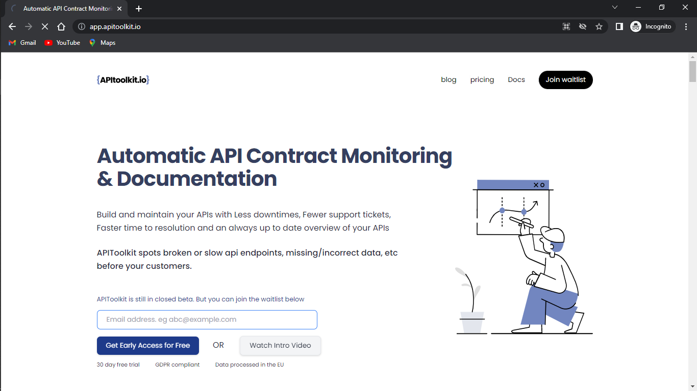
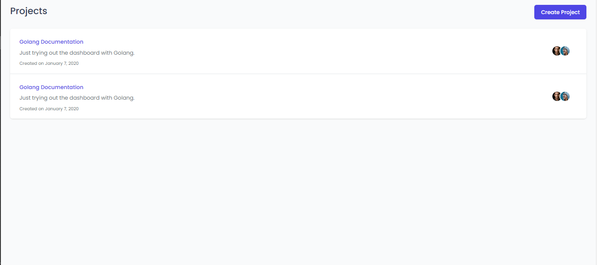
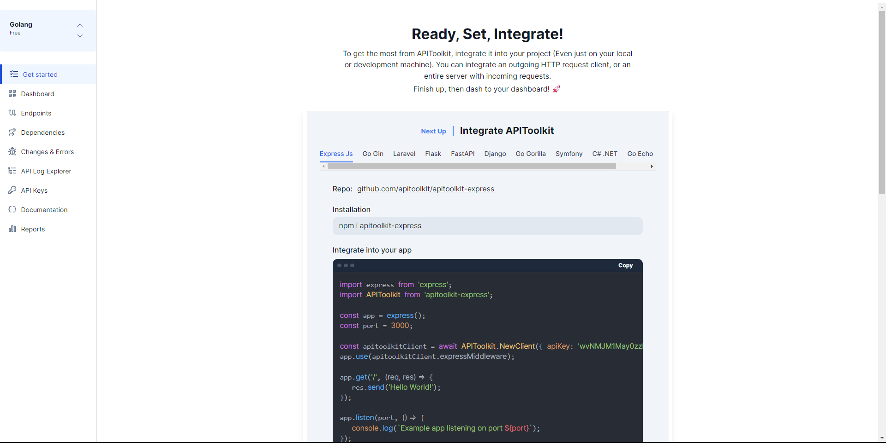

Here you will learn how to create a new project on APIToolkit, even if you’re a complete beginner who doesn’t have an APIToolkit account, this article will get you to the point where you create your project and have everything in place with your dashboard all ready for an integration. 

Here, let's go: 
To create a project, you start by logging into the APIToolkit dashbboard  
Sign up / Sign in [API dashboard](https://app.apitoolkit.io) 
 
Once you've signed up, select Create Project. 
 
Now you go ahead to provide a title and a description for your project here. 
 
Upon successful completion, your APIToolkit dashboard is ready. 
 