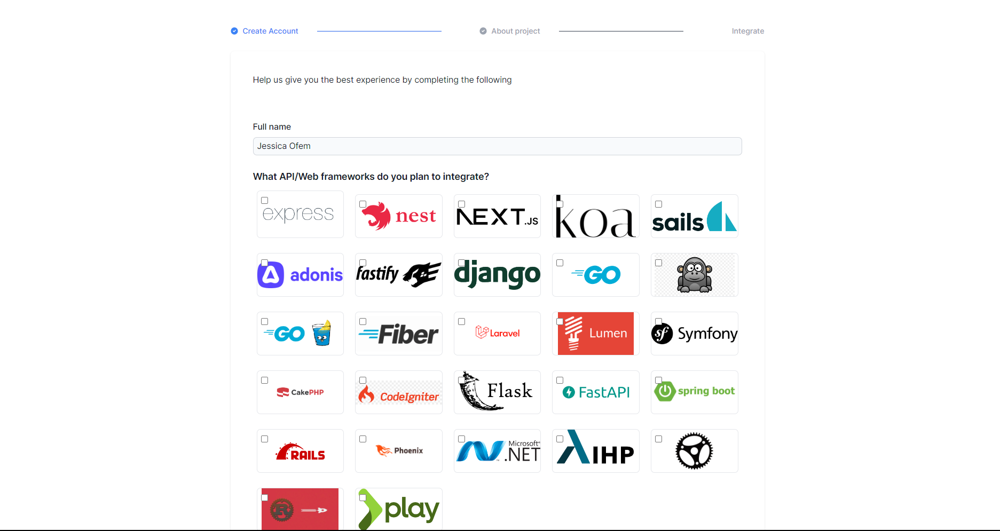
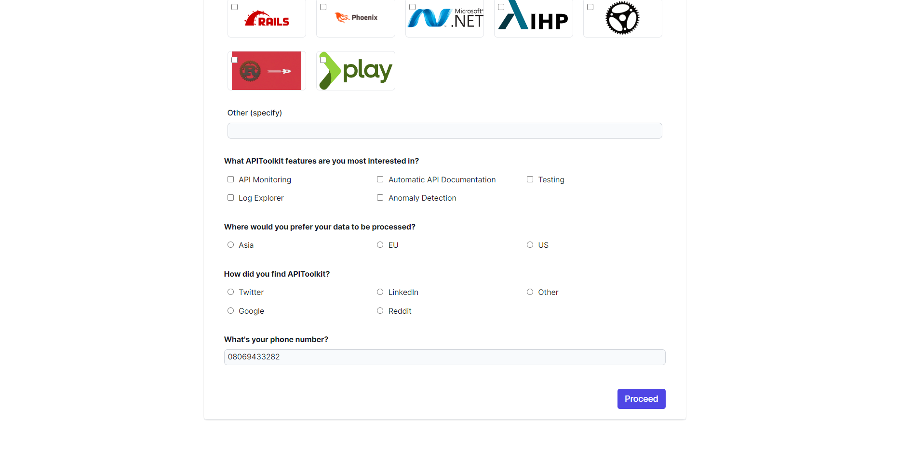

Embarking on your APIToolkit journey? Whether you're just starting out or are an existing user, this guide will walk you through the process of creating a new project and setting up your dashboard for seamless integration.

Here, let's go:

To create a project, you start by logging into the APIToolkit dashbboard

Fill in the project's title and description to give it a clear identity.

To optimize your experience with us:
   - Select your desired framework.

   - Specify the feature you're keen on.

   - Choose your preferred data location.

Upon completing these steps, your APIToolkit dashboard will be fully set up and operational.

Congratulations, and welcome aboard!
