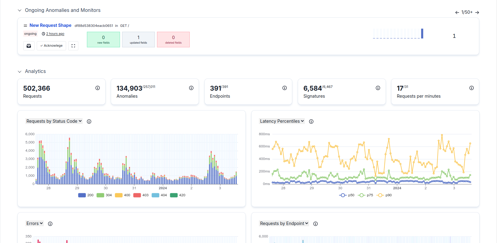
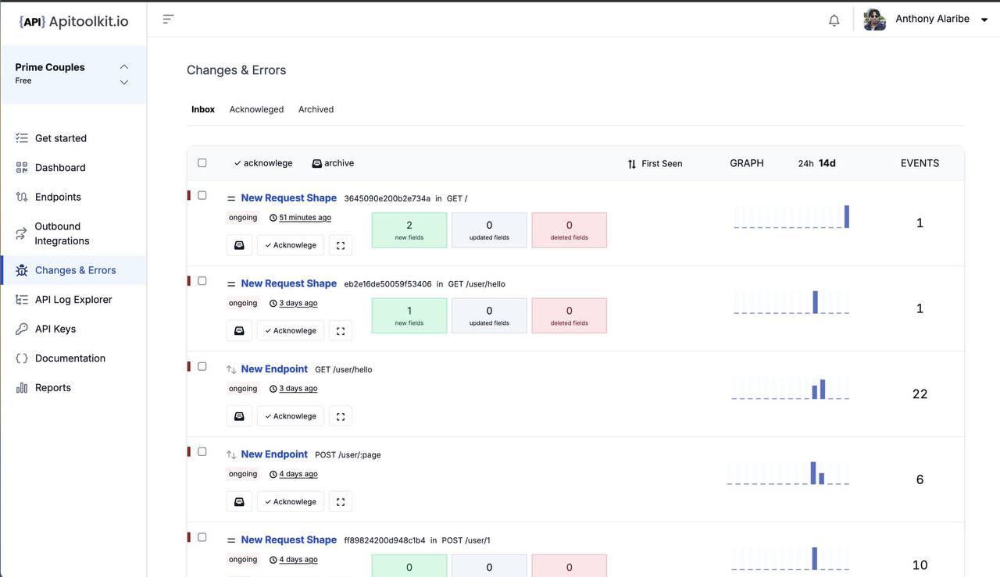
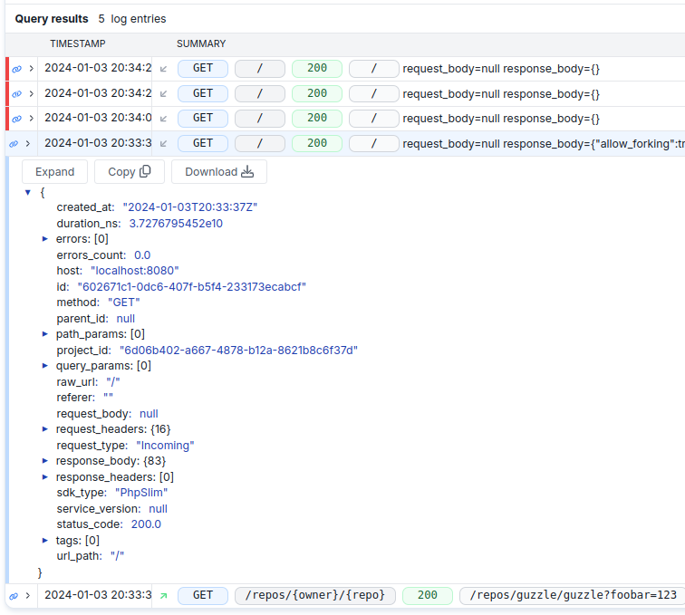

<section  class="mt-28 text-center home-feature-image-div text-center w-full max-w-full aspect-auto" >

###### <strong class="drop-shadow-md">Gain Insights, Optimize Your Product</strong>

### API Analytics {.mt-2}
Optimize what truly matters to your business, achieving peak performance and gaining valuable insights. From identifying trends to seamlessly solving problems.

    <a href="https://app.apitoolkit.io" class="drop-shadow hover:drop-shadow-lg transition-all rounded-md hover:bg-yellow-300 bg-amber-300 text-black border border-amber-400 font-semibold inline-block px-4 py-2 mt-2 sm:mt-0 hs-init hs-inview">
    Get Started for Free
    </a>
     OR 
    <a href="https://calendar.app.google/1a4HG5GZYv1sjjZG6" target="_blank" class="drop-shadow rounded-md border border-gray-200 bg-gray-100 hover:bg-gray-200 text-xs text-gray-900 inline-block px-4 py-2 sm:ml-1 mt-2 sm:mt-0 hs-init hs-inview">
    Get a demo &nbsp;
    </a>

<!-- <video class="w-full max-w-4xl" loop autoplay muted playsinline> -->
<!--     <source src='/assets/video/log_explorer.mp4' type='video/mp4'> -->
<!--     Your browser does not support the video tag. -->
<!-- </video> -->

<!---yt
<iframe width="100%" height="650" class="max-w-4xl mt-12 rounded-xl overflow-hidden drop-shadow-lg" src="https://www.youtube.com/embed/4F4l-hjpUfs?si=u3wPO62k38pc-L0q" title="YouTube video player" frameborder="0" allow="accelerometer; autoplay; clipboard-write; encrypted-media; gyroscope; picture-in-picture; web-share" allowfullscreen></iframe>
--->

</section>

<section  class="py-28 text-center text-center w-full max-w-full aspect-auto" >

     
    

### Get a peak understanding on how your APIs affect your workflow {.leading-tight} 
No more waiting for problems to snowball. Identify and fix issues as they happen, ensuring flawless performance and a seamless user experience. 
{.text-lg}

    <a href="https://app.apitoolkit.io" class="drop-shadow hover:drop-shadow-lg transition-all rounded-md hover:bg-yellow-300 bg-amber-300 text-black border border-amber-400 font-semibold inline-block px-4 py-2 mt-2 sm:mt-0 hs-init hs-inview">
    Get Started for Free
    </a>
     OR 
    <a href="https://calendar.app.google/1a4HG5GZYv1sjjZG6" target="_blank" class="drop-shadow rounded-md border border-gray-200 bg-gray-100 hover:bg-gray-200 text-xs text-gray-900 inline-block px-4 py-2 sm:ml-1 mt-2 sm:mt-0 hs-init hs-inview">
    Get a demo &nbsp;
    </a>

    

### Context-Rich Data on your API Anomalies {.leading-tight} 
Experiencing zero downtime of your APIs is possible. Having instant insights into errors, latency, and unexpected behavior, can identify and resolve issues in a in real-time.
{.text-lg}

    <a href="https://app.apitoolkit.io" class="drop-shadow hover:drop-shadow-lg transition-all rounded-md hover:bg-yellow-300 bg-amber-300 text-black border border-amber-400 font-semibold inline-block px-4 py-2 mt-2 sm:mt-0 hs-init hs-inview">
    Get Started for Free
    </a>
     OR 
    <a href="https://calendar.app.google/1a4HG5GZYv1sjjZG6" target="_blank" class="drop-shadow rounded-md border border-gray-200 bg-gray-100 hover:bg-gray-200 text-xs text-gray-900 inline-block px-4 py-2 sm:ml-1 mt-2 sm:mt-0 hs-init hs-inview">
    Get a demo &nbsp;
    </a>

 

     
    

### Get to know which API your customers use most {.leading-tight} 
Focusing on the APIs that drive the most customer engagement, you can ensure that your resources are directed towards maximizing user experience and satisfaction. 
{.text-lg}

    <a href="https://app.apitoolkit.io" class="drop-shadow hover:drop-shadow-lg transition-all rounded-md hover:bg-yellow-300 bg-amber-300 text-black border border-amber-400 font-semibold inline-block px-4 py-2 mt-2 sm:mt-0 hs-init hs-inview">
    Get Started for Free
    </a>
     OR 
    <a href="https://calendar.app.google/1a4HG5GZYv1sjjZG6" target="_blank" class="drop-shadow rounded-md border border-gray-200 bg-gray-100 hover:bg-gray-200 text-xs text-gray-900 inline-block px-4 py-2 sm:ml-1 mt-2 sm:mt-0 hs-init hs-inview">
    Get a demo &nbsp;
    </a>

### Performance Analytics for Product Quality {.leading-tight} 
Analyzing metrics such as response times, uptime, and error rates.
By monitoring these parameters, you can identify areas where your APIs can be improved and ensure they consistently deliver the expected level of quality and performance.
{.text-lg}

    <a href="https://app.apitoolkit.io" class="drop-shadow hover:drop-shadow-lg transition-all rounded-md hover:bg-yellow-300 bg-amber-300 text-black border border-amber-400 font-semibold inline-block px-4 py-2 mt-2 sm:mt-0 hs-init hs-inview">
    Get Started for Free
    </a>
     OR 
    <a href="https://calendar.app.google/1a4HG5GZYv1sjjZG6" target="_blank" class="drop-shadow rounded-md border border-gray-200 bg-gray-100 hover:bg-gray-200 text-xs text-gray-900 inline-block px-4 py-2 sm:ml-1 mt-2 sm:mt-0 hs-init hs-inview">
    Get a demo &nbsp;
    </a>

     
    

</section>
