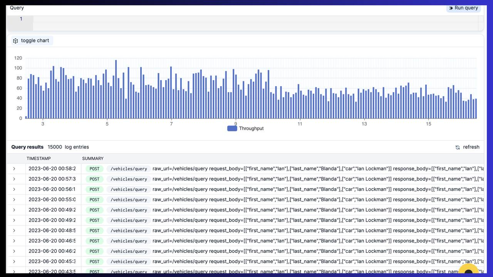
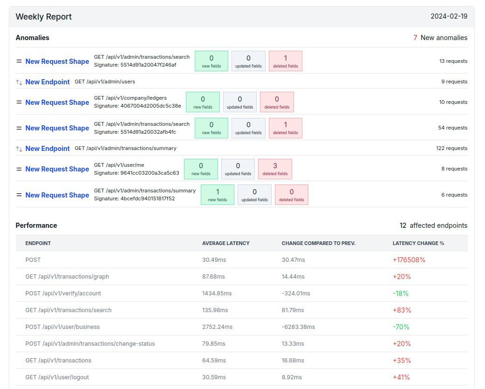

<section  class="mt-28 text-center home-feature-image-div text-center w-full max-w-full aspect-auto" >

###### <strong class="drop-shadow-md">Control It. Secure It. See It All</strong>

### API Management {.mt-2}

ApiToolkit isn't just another API management tool. It's the most feature-rich solution available, offering everything you need to manage your APIs effectively.

    <a href="https://app.apitoolkit.io" class="drop-shadow hover:drop-shadow-lg transition-all rounded-md hover:bg-yellow-300 bg-amber-300 text-black border border-amber-400 font-semibold inline-block px-4 py-2 mt-2 sm:mt-0 hs-init hs-inview">
    Get Started for Free
    </a>
     OR 
    <a href="https://calendar.app.google/1a4HG5GZYv1sjjZG6" target="_blank" class="drop-shadow rounded-md border border-gray-200 bg-gray-100 hover:bg-gray-200 text-xs text-gray-900 inline-block px-4 py-2 sm:ml-1 mt-2 sm:mt-0 hs-init hs-inview">
    Get a demo &nbsp;
    </a>

<!-- <video class="w-full max-w-4xl" loop autoplay muted playsinline> -->
<!--     <source src='/assets/video/log_explorer.mp4' type='video/mp4'> -->
<!--     Your browser does not support the video tag. -->
<!-- </video> -->

<!---yt
<iframe width="100%" height="650" class="max-w-4xl mt-12 rounded-xl overflow-hidden drop-shadow-lg" src="https://www.youtube.com/embed/4F4l-hjpUfs?si=u3wPO62k38pc-L0q" title="YouTube video player" frameborder="0" allow="accelerometer; autoplay; clipboard-write; encrypted-media; gyroscope; picture-in-picture; web-share" allowfullscreen></iframe>
--->

</section>

<section  class="py-28 text-center text-center w-full max-w-full aspect-auto" >

     
    

### API Monitoring {.leading-tight}

With comprehensive metrics tracking, you gain deep insights into how your API interacts with your system.  Monitor every call and leverage alerting and notification to ensure you catch errors before they reach your customers.
{.text-lg}

    <a href="https://app.apitoolkit.io" class="drop-shadow hover:drop-shadow-lg transition-all rounded-md hover:bg-yellow-300 bg-amber-300 text-black border border-amber-400 font-semibold inline-block px-4 py-2 mt-2 sm:mt-0 hs-init hs-inview">
    Get Started for Free
    </a>
     OR 
    <a href="https://calendar.app.google/1a4HG5GZYv1sjjZG6" target="_blank" class="drop-shadow rounded-md border border-gray-200 bg-gray-100 hover:bg-gray-200 text-xs text-gray-900 inline-block px-4 py-2 sm:ml-1 mt-2 sm:mt-0 hs-init hs-inview">
    Get a demo &nbsp;
    </a>

    

### Maintain API Quality and Reliability {.leading-tight}
By leveraging API documentation tools for clear instructions, API testing tools to identify and fix issues early, and API monitoring tools to catch problems before they impact users, you can deliver the dependable experience your customers deserve.
{.text-lg}

    <a href="https://app.apitoolkit.io" class="drop-shadow hover:drop-shadow-lg transition-all rounded-md hover:bg-yellow-300 bg-amber-300 text-black border border-amber-400 font-semibold inline-block px-4 py-2 mt-2 sm:mt-0 hs-init hs-inview">
    Get Started for Free
    </a>
     OR 
    <a href="https://calendar.app.google/1a4HG5GZYv1sjjZG6" target="_blank" class="drop-shadow rounded-md border border-gray-200 bg-gray-100 hover:bg-gray-200 text-xs text-gray-900 inline-block px-4 py-2 sm:ml-1 mt-2 sm:mt-0 hs-init hs-inview">
    Get a demo &nbsp;
    </a>

 

     
    

### Advanced Tests {.leading-tight}
Test in both staging and production environments. Be aware of issues before they escalate. Perform rigorous tests effortlessly.
{.text-lg}

    <a href="https://app.apitoolkit.io" class="drop-shadow hover:drop-shadow-lg transition-all rounded-md hover:bg-yellow-300 bg-amber-300 text-black border border-amber-400 font-semibold inline-block px-4 py-2 mt-2 sm:mt-0 hs-init hs-inview">
    Get Started for Free
    </a>
     OR 
    <a href="https://calendar.app.google/1a4HG5GZYv1sjjZG6" target="_blank" class="drop-shadow rounded-md border border-gray-200 bg-gray-100 hover:bg-gray-200 text-xs text-gray-900 inline-block px-4 py-2 sm:ml-1 mt-2 sm:mt-0 hs-init hs-inview">
    Get a demo &nbsp;
    </a>

     
    

### Analytics and Reporting {.leading-tight}
Monitor and pinpoint every single error. Understand the "Why," "How," and "When" these errors occur. Get a fully informative analytics dashboard. It applies to all use cases, including yours!
{.text-lg}

    <a href="https://app.apitoolkit.io" class="drop-shadow hover:drop-shadow-lg transition-all rounded-md hover:bg-yellow-300 bg-amber-300 text-black border border-amber-400 font-semibold inline-block px-4 py-2 mt-2 sm:mt-0 hs-init hs-inview">
    Get Started for Free
    </a>
     OR 
    <a href="https://calendar.app.google/1a4HG5GZYv1sjjZG6" target="_blank" class="drop-shadow rounded-md border border-gray-200 bg-gray-100 hover:bg-gray-200 text-xs text-gray-900 inline-block px-4 py-2 sm:ml-1 mt-2 sm:mt-0 hs-init hs-inview">
    Get a demo &nbsp;
    </a>

<!-- {} -->
{}
</section>
