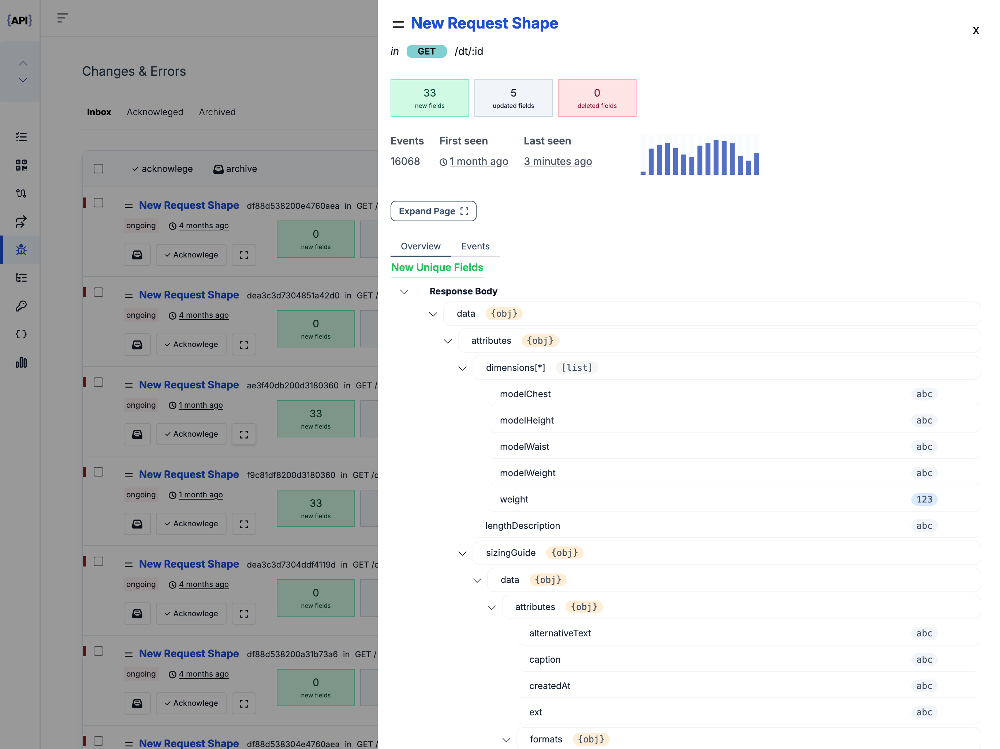

<section  class="mt-28 text-center home-feature-image-div text-center w-full max-w-full aspect-auto" >

###### <strong class="drop-shadow-md">Error Tracking & Breaking Change Detection </strong>

### Find and fix Errors and Breaking Changes in realtime. {.mt-2}

Error monitoring is not enough. Catch breaking changes in your APIs and third party integrations with enough context to reproduce the issues, and narrow down the root cause.

    <a href="https://app.apitoolkit.io" class="drop-shadow hover:drop-shadow-lg transition-all rounded-md hover:bg-yellow-300 bg-amber-300 text-black border border-amber-400 font-semibold inline-block px-4 py-2 mt-2 sm:mt-0 hs-init hs-inview">
    Get Started for Free
    </a>
     OR 
    <a href="https://calendar.app.google/1a4HG5GZYv1sjjZG6" target="_blank" class="drop-shadow rounded-md border border-gray-200 bg-gray-100 hover:bg-gray-200 text-xs text-gray-900 inline-block px-4 py-2 sm:ml-1 mt-2 sm:mt-0 hs-init hs-inview">
    Get a demo &nbsp;
    </a>

<!-- <video class="w-full max-w-4xl" loop autoplay muted playsinline> -->
<!--     <source src='/assets/video/log_explorer.mp4' type='video/mp4'> -->
<!--     Your browser does not support the video tag. -->
<!-- </video> -->
<iframe width="100%" height="650" class="max-w-4xl mt-12 rounded-xl overflow-hidden drop-shadow-lg" src="https://www.youtube.com/embed/4F4l-hjpUfs?si=u3wPO62k38pc-L0q" title="YouTube video player" frameborder="0" allow="accelerometer; autoplay; clipboard-write; encrypted-media; gyroscope; picture-in-picture; web-share" allowfullscreen></iframe>

</section>

<section  class="py-28  text-center w-full max-w-full aspect-auto" >

     
    

### Trace Errors back to the Root Cause {.leading-tight}

Don't just track errors and stack traces, but also record the incoming and outgoing requests which triggered the error. Good for customer support or reproducing the bug.
{.text-lg}

    <a href="https://app.apitoolkit.io" class="drop-shadow hover:drop-shadow-lg transition-all rounded-md hover:bg-yellow-300 bg-amber-300 text-black border border-amber-400 font-semibold inline-block px-4 py-2 mt-2 sm:mt-0 hs-init hs-inview">
    Get Started for Free
    </a>
     OR 
    <a href="https://calendar.app.google/1a4HG5GZYv1sjjZG6" target="_blank" class="drop-shadow rounded-md border border-gray-200 bg-gray-100 hover:bg-gray-200 text-xs text-gray-900 inline-block px-4 py-2 sm:ml-1 mt-2 sm:mt-0 hs-init hs-inview">
    Get a demo &nbsp;
    </a>

    

### Track breaking changes in your APIs & Third party Integrations. {.leading-tight}

Catch breaking changes in your APIs and in any third party APIs you depend on. No other platform can detect arbitrary breaking changes in your APIs or any APIs you call.
{.text-lg}

    <a href="https://app.apitoolkit.io" class="drop-shadow hover:drop-shadow-lg transition-all rounded-md hover:bg-yellow-300 bg-amber-300 text-black border border-amber-400 font-semibold inline-block px-4 py-2 mt-2 sm:mt-0 hs-init hs-inview">
    Get Started for Free
    </a>
     OR 
    <a href="https://calendar.app.google/1a4HG5GZYv1sjjZG6" target="_blank" class="drop-shadow rounded-md border border-gray-200 bg-gray-100 hover:bg-gray-200 text-xs text-gray-900 inline-block px-4 py-2 sm:ml-1 mt-2 sm:mt-0 hs-init hs-inview">
    Get a demo &nbsp;
    </a>

 

     
    

### Get instant Alert and Notifications on the Go {.leading-tight}

Integrate Alerts into your current workflow through slack, email, teams, pagerduty, opsgenie, or any prefered alerting or incident management integration.
{.text-lg}

    <a href="https://app.apitoolkit.io" class="drop-shadow hover:drop-shadow-lg transition-all rounded-md hover:bg-yellow-300 bg-amber-300 text-black border border-amber-400 font-semibold inline-block px-4 py-2 mt-2 sm:mt-0 hs-init hs-inview">
    Get Started for Free
    </a>
     OR 
    <a href="https://calendar.app.google/1a4HG5GZYv1sjjZG6" target="_blank" class="drop-shadow rounded-md border border-gray-200 bg-gray-100 hover:bg-gray-200 text-xs text-gray-900 inline-block px-4 py-2 sm:ml-1 mt-2 sm:mt-0 hs-init hs-inview">
    Get a demo &nbsp;
    </a>

  <section class="width-control mx-auto w-full">
    

      <h3 class="text-[#2E3238] self-center text-2xl md:text-[49px] font-bold leading-[1.14] mb-[0] tracking-tight">
        Integrate APIToolkit<h3>
          

            We support 14+ web frameworks (if we don't support your framework, email hello@apitoolkit.io and we'll create an SDK for you
            ASAP)
          

          

            
*]:shrink-0 md:grid md:grid-cols-3 lg:grid-cols-4 gap-4 items-center h-max mt-4">
              <button class="border shadow rounded-lg p-4 w-28 h-28 int_active int_btn" id="express_btn" title="expressjs"
                onclick="integrationTabs(event)">
                <svg viewBox="0 0 128 128"><path
                    d="M126.67 98.44c-4.56 1.16-7.38.05-9.91-3.75-5.68-8.51-11.95-16.63-18-24.9-.78-1.07-1.59-2.12-2.6-3.45C89 76 81.85 85.2 75.14 94.77c-2.4 3.42-4.92 4.91-9.4 3.7l26.92-36.13L67.6 29.71c4.31-.84 7.29-.41 9.93 3.45 5.83 8.52 12.26 16.63 18.67 25.21 6.45-8.55 12.8-16.67 18.8-25.11 2.41-3.42 5-4.72 9.33-3.46-3.28 4.35-6.49 8.63-9.72 12.88-4.36 5.73-8.64 11.53-13.16 17.14-1.61 2-1.35 3.3.09 5.19C109.9 76 118.16 87.1 126.67 98.44zM1.33 61.74c.72-3.61 1.2-7.29 2.2-10.83 6-21.43 30.6-30.34 47.5-17.06C60.93 41.64 63.39 52.62 62.9 65H7.1c-.84 22.21 15.15 35.62 35.53 28.78 7.15-2.4 11.36-8 13.47-15 1.07-3.51 2.84-4.06 6.14-3.06-1.69 8.76-5.52 16.08-13.52 20.66-12 6.86-29.13 4.64-38.14-4.89C5.26 85.89 3 78.92 2 71.39c-.15-1.2-.46-2.38-.7-3.57q.03-3.04.03-6.08zm5.87-1.49h50.43c-.33-16.06-10.33-27.47-24-27.57-15-.12-25.78 11.02-26.43 27.57z" />
</svg>
              </button>
              <button class="border shadow rounded-lg p-4 w-28 h-28 int_btn" id="phoenix_btn" title="phoenix"
                onclick="integrationTabs(event)">
                <svg viewBox="0 0 128 128"><path fill-rule="evenodd" clip-rule="evenodd" fill="#F05323"
                    d="M27.216 20.304c.864.38 1.807.322 2.71.432 6.884.834 12.467 4.156 17.314 8.928 3.96 3.899 7.384 8.27 11.011 12.462 2.97 3.434 6.152 6.628 10.012 9.075 4.074 2.579 8.502 4.015 13.335 4.138.173.004.342.012.513.023.015.001.026.042.081.143-1.798 1.248-3.752 2.167-5.886 2.67-4.824 1.136-9.183.176-13-3.032-1.066-.896-2.092-1.845-3.184-2.708-1.711-1.356-3.663-2.064-5.869-1.801-3.097.371-4.782 2.714-4.062 5.76 1.125 4.757 3.853 8.483 7.666 11.459 4.113 3.21 8.834 4.958 13.958 5.681 5.083.715 10.144.707 15.118-.789.325-.099.644-.135.805.229.151.348-.226.411-.396.55-1.172.946-2.334 1.904-3.544 2.803-4.375 3.243-9.29 5.114-14.714 5.512-3.93.286-7.36-1.083-10.4-3.522-2.396-1.919-4.262-4.332-6.23-6.65-1.639-1.929-3.263-3.869-4.914-5.786-1.022-1.187-2.116-2.305-3.411-3.207-2.041-1.417-4.276-1.899-6.722-1.409-3.333.668-5.152 3.429-4.255 6.728 1.946 7.153 6.49 11.612 13.845 13.067.208.041.466-.035.631.28-3.797.776-7.514.581-11.16-.615-7.354-2.415-13.289-6.619-16.902-13.66-2.258-4.398-3.212-9.132-3.445-14.036-.15-3.151-.032-6.32-.52-9.449-.578-3.696-1.465-7.296-3.616-10.452-2.424-3.558-5.762-5.375-10.097-5.287-.51.01-1.021.002-1.546.002-.005-.355.288-.423.468-.558 3.608-2.704 7.779-4.175 12.039-5.428 2.403-.707 4.868-1.121 7.359-1.379.181-.019.411.069.521-.174h6.487zm-12.175 5.279c.925.978 1.899 1.657 3.154 1.844 1.537.229 3.127-.612 3.65-1.905.365-.9.321-.962-.619-.888-.508.039-1.018.064-1.525.121-1.537.17-3.071.362-4.66.828z"></path><path fill-rule="evenodd" clip-rule="evenodd" fill="#F15524"
                    d="M127.923 80.218c-1.112.447-2.148 1.072-3.376 1.25-2.965.43-5.646-.118-7.922-2.167-.422-.379-.852-.756-1.231-1.174-1.862-2.049-4.166-3.189-6.921-3.433-.216-.019-.431-.08-.677-.126 2.675-2.362 7.299-2.821 10.673-1.1 1.39.71 2.554 1.699 3.595 2.831 1.628 1.772 3.55 3.056 5.859 3.745v.174zm-44.38 27.479c-.315-.331-.77-.286-1.157-.414-2.234-.74-4.114-1.999-5.72-3.708-3.089-3.29-4.574-4.292-8.591-5.874.113-.255.346-.226.562-.231 1.967-.056 3.916.083 5.83.561 3.561.892 6.303 2.921 8.14 6.096.728 1.258 1.572 2.354 2.813 3.12.173.108.327.227.344.451l-2.221-.001zm-5.652-11.363c-1.229-.315-2.377-.592-3.514-.907-3.729-1.03-7.487-.791-11.252-.28-1.941.262-3.878.563-5.827.764-5.938.613-11.449-.808-16.608-3.685-5.142-2.868-9.702-6.435-13.169-11.27-.264-.369-.512-.749-.763-1.128-.078-.117-.143-.243-.231-.394.418-.18.661.142.925.287 2.756 1.521 5.457 3.141 8.469 4.146 5.317 1.773 10.577 1.829 15.816-.313 2.525-1.033 5.072-1.187 7.568.142.233.124.543.178.657.514-1.101.293-2.192.555-3.265.878-.94.283-1.734.764-1.814 1.888-.068.938.452 1.619 1.64 2.135 2.418 1.048 4.98 1.312 7.579 1.352 2.979.046 5.881.456 8.632 1.684 1.572.702 2.958 1.681 4.29 2.746.426.34.741.759.867 1.441zm32.327-38.96c-.247-.521-.389-.826-.535-1.127-2.335-4.841-6.256-6.668-11.447-5.266-2.38.643-4.698 1.556-7.163 1.832-11.789 1.324-21.997-1.699-29.903-10.972-.219-.258-.716-.631-.495-.862.377-.395.67.207.949.403 6.046 4.277 12.729 6.282 20.146 5.701 3.334-.263 6.524-1.176 9.713-2.122 2.819-.836 5.675-1.422 8.646-.817 6.453 1.313 10.411 6.384 10.089 13.23zM80.66 82.615c.113-.049.185-.089.262-.112 2.92-.894 5.186-2.756 7.268-4.893 2.041-2.093 3.946-4.322 6.16-6.251 4.704-4.1 10.1-5.302 16.118-3.94 1.502.34 2.749 1.059 3.847 2.077-1.195-.092-2.253-.119-3.299-.262-2.123-.292-3.851.427-5.285 1.947a229.136 229.136 0 00-3.414 3.693c-4.105 4.544-9.348 6.776-15.308 7.557-1.806.235-3.612.416-5.438.365-.262-.005-.551.089-.911-.181zm26.951-18.425c-1.039.222-1.82-.132-2.6-.258-4.854-.785-9.321-.01-13.534 2.671-6.398 4.07-13.373 4.74-20.649 2.957-.877-.216-1.757-.525-2.659-1.239 1.022-.059 1.806.172 2.595.287 3.68.538 6.973-.469 10.012-2.483 2.469-1.636 5.023-3.117 7.831-4.086 5.458-1.877 10.891-2.157 16.239.425.918.441 1.8.946 2.765 1.726z"></path> <path fill-rule="evenodd" clip-rule="evenodd" fill="#F15524"
                    d="M84.314 41.491c-2.881 1.649-5.792 2.001-8.819 1.796-8.64-.583-15.498-4.728-21.449-10.698-.181-.181-.426-.385-.327-.648.114-.313.448-.148.676-.147 5.767.009 11.056 1.456 15.582 5.202.941.778 1.922 1.509 2.899 2.242 2.981 2.237 6.305 3.022 9.971 2.316.42-.079.837-.116 1.467-.063z"> </path></svg>
              </button>
              <button class="border shadow rounded-lg p-4 w-28 h-28 int_btn flex items-center justify-center"
                id="laravel_btn" title="Laravel" onclick="integrationTabs(event)">
                <svg width="50" height="52" viewBox="0 0 50 52" xmlns="http://www.w3.org/2000/svg"> <path
                    d="M49.626 11.564a.809.809 0 0 1 .028.209v10.972a.8.8 0 0 1-.402.694l-9.209 5.302V39.25c0 .286-.152.55-.4.694L20.42 51.01c-.044.025-.092.041-.14.058-.018.006-.035.017-.054.022a.805.805 0 0 1-.41 0c-.022-.006-.042-.018-.063-.026-.044-.016-.09-.03-.132-.054L.402 39.944A.801.801 0 0 1 0 39.25V6.334c0-.072.01-.142.028-.21.006-.023.02-.044.028-.067.015-.042.029-.085.051-.124.015-.026.037-.047.055-.071.023-.032.044-.065.071-.093.023-.023.053-.04.079-.06.029-.024.055-.05.088-.069h.001l9.61-5.533a.802.802 0 0 1 .8 0l9.61 5.533h.002c.032.02.059.045.088.068.026.02.055.038.078.06.028.029.048.062.072.094.017.024.04.045.054.071.023.04.036.082.052.124.008.023.022.044.028.068a.809.809 0 0 1 .028.209v20.559l8.008-4.611v-10.51c0-.07.01-.141.028-.208.007-.024.02-.045.028-.068.016-.042.03-.085.052-.124.015-.026.037-.047.054-.071.024-.032.044-.065.072-.093.023-.023.052-.04.078-.06.03-.024.056-.05.088-.069h.001l9.611-5.533a.801.801 0 0 1 .8 0l9.61 5.533c.034.02.06.045.09.068.025.02.054.038.077.06.028.029.048.062.072.094.018.024.04.045.054.071.023.039.036.082.052.124.009.023.022.044.028.068zm-1.574 10.718v-9.124l-3.363 1.936-4.646 2.675v9.124l8.01-4.611zm-9.61 16.505v-9.13l-4.57 2.61-13.05 7.448v9.216l17.62-10.144zM1.602 7.719v31.068L19.22 48.93v-9.214l-9.204-5.209-.003-.002-.004-.002c-.031-.018-.057-.044-.086-.066-.025-.02-.054-.036-.076-.058l-.002-.003c-.026-.025-.044-.056-.066-.084-.02-.027-.044-.05-.06-.078l-.001-.003c-.018-.03-.029-.066-.042-.1-.013-.03-.03-.058-.038-.09v-.001c-.01-.038-.012-.078-.016-.117-.004-.03-.012-.06-.012-.09v-.002-21.481L4.965 9.654 1.602 7.72zm8.81-5.994L2.405 6.334l8.005 4.609 8.006-4.61-8.006-4.608zm4.164 28.764l4.645-2.674V7.719l-3.363 1.936-4.646 2.675v20.096l3.364-1.937zM39.243 7.164l-8.006 4.609 8.006 4.609 8.005-4.61-8.005-4.608zm-.801 10.605l-4.646-2.675-3.363-1.936v9.124l4.645 2.674 3.364 1.937v-9.124zM20.02 38.33l11.743-6.704 5.87-3.35-8-4.606-9.211 5.303-8.395 4.833 7.993 4.524z"
                    fill="#FF2D20" fill-rule="evenodd" /></svg>
              </button>
              <button class="border shadow rounded-lg p-4 w-28 h-28 int_btn flex just-center items-center" id="net_btn"
                title="dot net" onclick="integrationTabs(event)">
                
              </button>
              <button class="border shadow rounded-lg p-4 w-28 h-28 int_btn flex just-center items-center" id="django_btn"
                onclick="integrationTabs(event)">
                
              </button>
              <button class="border shadow rounded-lg p-4 w-28 h-28 int_btn flex just-center items-center" id="fast_btn"
                onclick="integrationTabs(event)">
                
              </button>
              <button class="border shadow rounded-lg p-4 w-28 h-28 int_btn flex just-center items-center" id="flask_btn"
                onclick="integrationTabs(event)">
                
              </button>
              <button class="border shadow rounded-lg p-4 w-28 h-28 int_btn flex just-center items-center" id="gin_btn"
                onclick="integrationTabs(event)">
                
              </button>
              <button class="border shadow rounded-lg p-4 w-28 h-28 int_btn flex just-center items-center" id="adonis_btn"
                onclick="integrationTabs(event)">
                
              </button>
              <button class="border shadow rounded-lg p-4 w-28 h-28 int_btn flex just-center items-center" id="fastify_btn"
                onclick="integrationTabs(event)">
                
              </button>
              <button class="border shadow rounded-lg p-4 w-28 h-28 int_btn flex just-center items-center" id="nestjs_btn"
                onclick="integrationTabs(event)">
                
              </button>
              <button class="border shadow rounded-lg p-4 w-28 h-28 int_btn flex just-center items-center" id="mux_btn"
                onclick="integrationTabs(event)">
                
              </button>
              <button class="border shadow rounded-lg p-4 w-28 h-28 int_btn flex just-center items-center" id="symfony_btn"
                onclick="integrationTabs(event)">
                
              </button>
              <button class="border shadow rounded-lg p-4 w-28 h-28 int_btn flex just-center items-center" id="go_btn"
                onclick="integrationTabs(event)">
                
              </button>
              <a href="/docs/quickstarts" class="border text-center shadow text-base font-normal rounded-lg p-4 w-28 h-28 int_btn flex just-center items-center">
                View all SDKs
              </a>
            

            

              <!-- express -->
              

                <h4 class="text-[#2E3238]">Express js</h4>
                
Quickly integrate APIToolkit into your express js application
                

                

                  <h5 class="text-base text-[#2E3238] font-medium">Installation</h5>
                  

                    npm install apitoolkit-express
                  

                

                

                  <h5 class="text-base text-[#2E3238] font-medium mb-1">Integrate</h5>
                  <pre class="p-0 m-0 w-full">

import express from 'express';
import { APIToolkit } from 'apitoolkit-express';
const app = express();
const apitoolkitClient = APIToolkit.NewClient({ apiKey: '&lt;API-KEY&gt;' });
  
app.use(apitoolkitClient.expressMiddleware)
// All controllers should live here
app.get("/", (req, res) => {
});
// ...
// The error handler must be before any other error middleware
// and after all controllers
app.use(apitoolkitClient.errorHandler)
  
</pre>
                

              

              <!--- elixir -->
              

                <h4 class="text-[#2E3238]">Elixir Phoenix</h4>
                
Quickly integrate APIToolkit into your elixir application
                

                

                  <h5 class="text-base text-[#2E3238] font-medium">Installation (add to deps)</h5>
                  

                    {:apitoolkit_phoenix, "~> 0.1.1"}
                  

                

                

                  <h5 class="text-base text-[#2E3238] font-medium mb-1">Integrate</h5>
                  <pre class="p-0 m-0 w-full">

 // route.ex file                   
defmodule HelloWeb.Router do
  import ApitoolkitPhoenix

pipeline :api do
plug ApitoolkitPhoenix,
config: %{
api_key: "&lt;YOUR_API_KEY&gt;",
}
end
// Automatic error handling
@impl Plug.ErrorHandler
def handle_errors(conn, err) do
conn = report_error(conn, err)
json(conn, %{message: "Something went wrong"})
end
end 
</pre>

<!--laravel-->

  <h4 class="text-[#2E3238]">Laravel PHP</h4>
  
Quickly integrate APIToolkit into your laravel application
  

  

    <h5 class="text-base text-[#2E3238] font-medium">Installation (add to deps)</h5>
    

      composer require apitoolkit/apitoolkit-laravel
    

    <h5 class="text-base text-[#2E3238] font-normal">Set the <strong>APITOOLKIT_KEY</strong> environment variable to your API key in your .env file.</h5>
    

      APITOOLKIT_KEY=xxxxxx-xxxxx-xxxxxx-xxxxxx-xxxxxx
    

  

  

    <h5 class="text-base text-[#2E3238] font-medium mb-1">Integrate</h5>
    <pre class="p-0 m-0 w-full">
&lt;?php

namespace App\Http;

use Illuminate\Foundation\Http\Kernel as HttpKernel;

class Kernel extends HttpKernel
{
protected $middlewareGroups = [
'api' => [
\APIToolkit\Http\Middleware\APIToolkit::class,
],
];
}
</pre>

  

<!-- dot net-->

  <h4 class="text-[#2E3238]">.NET</h4>
  
Quickly integrate APIToolkit into your .NET application
  

  

    <h5 class="text-base text-[#2E3238] font-medium">Installation</h5>
    

      dotnet add package ApiToolkit.Net
    

  

  

    <h5 class="text-base text-[#2E3238] font-medium mb-1">Integrate</h5>
    <pre class="p-0 m-0 w-full">
var config = new Config
{
    Debug = true, # Set debug flags to false in production
    ApiKey = "{Your_APIKey}"
};
var client = await APIToolkit.NewClientAsync(config);
# Register the middleware to use the initialized client
app.Use(async (context, next) =>
{
    var apiToolkit = new APIToolkit(next, client);
    await apiToolkit.InvokeAsync(context);
});
</pre>

  

<!-- django -->

  <h4 class="text-[#2E3238]">Django</h4>
  
Quickly integrate APIToolkit into your Django application
  

  

    <h5 class="text-base text-[#2E3238] font-medium">Installation</h5>
    

      pip install apitoolkit-django
    

    <h5 class="text-base text-[#2E3238] font-normal">Add APIKEY to settings.py</h5>
    

      APITOOLKIT_KEY = "&lt;YOUR_API_KEY&gt;"
    

  

  

    <h5 class="text-base text-[#2E3238] font-medium mb-1">Integrate</h5>
    <pre class="p-0 m-0 w-full">

MIDDLEWARE = [
    ...,
    'apitoolkit_django.APIToolkit',
    ...,
]
</pre>

  

<!-- fast api -->

  <h4 class="text-[#2E3238]">FastAPI</h4>
  
Quickly integrate APIToolkit into your fastapi application
  

  

    <h5 class="text-base text-[#2E3238] font-medium">Installation</h5>
    

     pip install apitoolkit-fastapi
    

  

  

    <h5 class="text-base text-[#2E3238] font-medium mb-1">Integrate</h5>
    <pre class="p-0 m-0 w-full">

from fastapi import FastAPI
from apitoolkit_fastapi import APIToolkit

app = FastAPI()

apitoolkit = APIToolkit(api_key='<API_KEY goes here>')

app.middleware('http')(apitoolkit.middleware)
</pre>

  

<!-- flask -->

  <h4 class="text-[#2E3238]">Flask</h4>
  
Quickly integrate APIToolkit into your flask application
  

  

    <h5 class="text-base text-[#2E3238] font-medium">Installation</h5>
    

      pip install apitoolkit-flask
    

  

  

    <h5 class="text-base text-[#2E3238] font-medium mb-1">Integrate</h5>
    <pre class="p-0 m-0 w-full">

from flask import Flask
from apitoolkit_flask import APIToolkit

app = Flask(**name**)

apitoolkit = APIToolkit(api_key="&lt;API_KEY&gt;", debug=True)

@app.before_request
def before_request():
apitoolkit.beforeRequest()

@app.after_request
def after_request(response):
apitoolkit.afterRequest(response)
return response

</pre>

  

<!-- go gin -->

  <h4 class="text-[#2E3238]">Gin</h4>
  
Quickly integrate APIToolkit into your gin application
  

  

    <h5 class="text-base text-[#2E3238] font-medium">Installation</h5>
    

      go get github.com/apitoolkit/apitoolkit-go
    

  

  

    <h5 class="text-base text-[#2E3238] font-medium mb-1">Integrate</h5>
    <pre class="p-0 m-0 w-full">

package main

import (
"context"
apitoolkit "github.com/apitoolkit/apitoolkit-go"
"github.com/gin-gonic/gin"
)

func main() {

    // Initialize the client using your apitoolkit.io generated apikey
    apitoolkitClient, err := apitoolkit.NewClient(context.Background(), apitoolkit.Config{APIKey: "YOUR GENERATED API KEY"})
    if err != nil {
    	panic(err)
    }

    router := gin.New()

    // Register with the corresponding middleware of your choice. For Gin router, we use the GinMiddleware method.
    router.Use(apitoolkitClient.GinMiddleware)

}
</pre>

  

<!-- adonis -->

  <h4 class="text-[#2E3238]">Adonis JS</h4>
  
Quickly integrate APIToolkit into your adonis js application
  

  

    <h5 class="text-base text-[#2E3238] font-medium">Installation</h5>
    

      npm install apitoolkit-adonis
    

    <h5 class="text-base text-[#2E3238] font-normal">Configer the package</h5>
    

      node ace configure apitoolkit-adonis
    

    <h5 class="text-base text-[#2E3238] font-normal">Set APIKEY in <i>/conf/apitoolkit</i></h5>
        <pre class="p-0 m-0 w-full">

export const apitoolkitConfig = {
  apiKey: "<YOUR_API_KEY>",
};
</pre>

  

  

    <h5 class="text-base text-[#2E3238] font-medium mb-1">Integrate</h5>
    <pre class="p-0 m-0 w-full">

Server.middleware.register([
  () => import("@ioc:Adonis/Core/BodyParser"),
  () => import("@ioc:APIToolkit"),
]);
</pre>
  

<!-- fastify -->

  <h4 class="text-[#2E3238]">Fastify JS</h4>
  
Quickly integrate APIToolkit into your Fastify js application
  

  

    <h5 class="text-base text-[#2E3238] font-medium">Installation</h5>
    

      npm install apitoolkit-fastify
    

  

  

    <h5 class="text-base text-[#2E3238] font-medium mb-1">Integrate</h5>
    <pre class="p-0 m-0 w-full">

import APIToolkit from 'apitoolkit-fastify';
import Fastify from 'fastify';

const fastify = Fastify();

// Create and initialize an instance of the APIToolkit
const apittoolkitClient = APIToolkit.NewClient({
apiKey: 'YOUR_API_KEY',
fastify,
});
apitoolkitClient.init();

</pre>
  

<!-- nestjs -->

  <h4 class="text-[#2E3238]">Nest JS</h4>
  
Quickly integrate APIToolkit into your nest application
  

  

    <h5 class="text-base text-[#2E3238] font-medium">Installation</h5>
    

      npm install apitoolkit-express
    

  

  

    <h5 class="text-base text-[#2E3238] font-medium mb-1">Integrate</h5>
    <pre class="p-0 m-0 w-full">

import { NestFactory } from '@nestjs/core';
import { APIToolkit } from 'apitoolkit-express';
import { AppModule } from './app.module';
//
async function bootstrap() {
  const apiToolkitClient = APIToolkit.NewClient({
    apikey: '<API-KEY>',
  });
  const app = await NestFactory.create(AppModule);
  app.use(apiToolkitClient.expressMiddleware);
  await app.listen(3000);
}
//
bootstrap();

</pre>
  

<!-- mux -->

  <h4 class="text-[#2E3238]">Gorilla</h4>
  
Quickly integrate APIToolkit into your Gorilla Mux application
  

  

    <h5 class="text-base text-[#2E3238] font-medium">Installation</h5>
    

      go get -u github.com/gorilla/mux
    

  

  

    <h5 class="text-base text-[#2E3238] font-medium mb-1">Integrate</h5>
    <pre class="p-0 m-0 w-full">

package main

import (
"context"
"net/http"
"github.com/gorilla/mux"
apitoolkit "github.com/apitoolkit/apitoolkit-go"
)

func main() {
ctx := context.Background()

    // Initialize the client using your generated apikey
    apitoolkitClient, err := apitoolkit.NewClient(ctx, apitoolkit.Config{APIKey: "<APIKEY>"})
    if err != nil {
    	panic(err)
    }

    r := mux.NewRouter()
    // Register middleware
    r.Use(apitoolkitClient.GorillaMuxMiddleware)

}
</pre>

  

<!-- symfony -->

  <h4 class="text-[#2E3238]">Symfony</h4>
  
Quickly integrate APIToolkit into your Symfony application
  

  

    <h5 class="text-base text-[#2E3238] font-medium">Installation</h5>
    

      composer require apitoolkit/apitoolkit-symfony
    

    <h5 class="text-base text-[#2E3238] font-normal">Set the <strong>APITOOLKIT_KEY</strong> environment variable to your API key in your .env file.</h5>
    

      APITOOLKIT_KEY=xxxxxx-xxxxx-xxxxxx-xxxxxx-xxxxxx
    

  

  

    <h5 class="text-base text-[#2E3238] font-medium mb-1">Integrate (services.yaml)</h5>
    <pre class="p-0 m-0 w-full">

services:
  APIToolkit\EventSubscriber\APIToolkitService:
    arguments:
      $apiKey: '%env(APITOOLKIT_KEY)%'
    # Optional:  if you want to cache login result add this cache poll instance via setter injection
    calls:
      - setCachePool: ['@PutYourCachePoolServiceHere']
    tags:
      - { name: 'kernel.event_subscriber' }
      
</pre>
      
  

<!-- go native -->

  <h4 class="text-[#2E3238]">Go Native</h4>
  
Quickly integrate APIToolkit into your native Go application
  

  

    <h5 class="text-base text-[#2E3238] font-medium">Installation</h5>
    

      go get -u github.com/apitoolkit/apitoolkit-go
    

  

  

    <h5 class="text-base text-[#2E3238] font-medium mb-1">Integrate</h5>
    <pre class="p-0 m-0 w-full">

package main

import (
"net/http"
"context"
apitoolkit "github.com/apitoolkit/apitoolkit-go"
)

func main() {
// Initialize APIToolkit client with your generated API key
ctx := context.Background()
apitoolkitClient, err := apitoolkit.NewClient(ctx, apitoolkit.Config{APIKey: "YOUR_GENERATED_API_KEY"})
if err != nil {
panic(err)
}

    http.Handle("/", apitoolkitClient.Middleware(http.HandlerFunc(func(w http.ResponseWriter, r *http.Request) {
    	w.Write([]byte("Hello, World!"))
    })))

    http.ListenAndServe(":8080", nil)

}
</pre>

  

<!--end div for code examples container-->
            

          

  </section>
</section>

