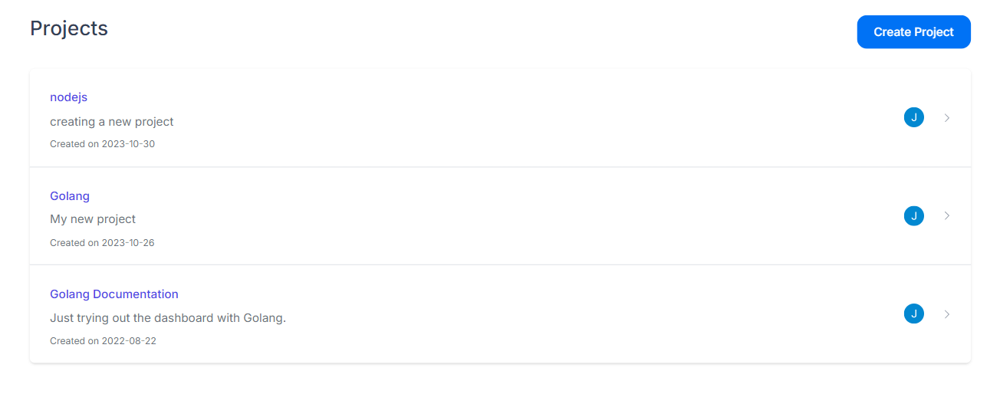

Our API documentation provides a comprehensive overview of all the functionalities and endpoints available in our API. To access this information, follow these simple steps:

## Step 1: Sign Up

Before accessing the documentation, you need to have an account with us.

1. Go to the [Sign Up](https://app.apitoolkit.io/)
2. Fill in the required details to create an account.
3. Verify your email address if required.

## Step 2: Choose a Project

Once logged in, you'll select a project for which you want to view the API documentation.

1. Navigate to the 'Projects' section in your dashboard.
2. Select the project you are interested in from the list of available projects.

## Step 3: Access the Documentation

After selecting a project, you can access its API documentation.
1. Look for the 'Documentation' tab on the left side of your dashboard.
2. Click on the 'Documentation' tab. This will open the Swagger documentation for your chosen project.

## Navigating the Swagger Documentation

The Swagger documentation provides a detailed rundown of all the activities and endpoints of your API. Here are some key features you can use:

- **Endpoints**: A list of all available API endpoints, including their HTTP methods.
- **Parameters**: Details of required and optional parameters for each endpoint.
- **Request and Response Examples**: Sample requests and responses to help you understand how to use the API.
- **Try it out**: An interactive feature that allows you to test API endpoints directly from the documentation.

### Need Help?

If you encounter any issues or have questions regarding the API documentation, please don't hesitate to contact our support team at [Support Email](hello@apitoolkit.io).
