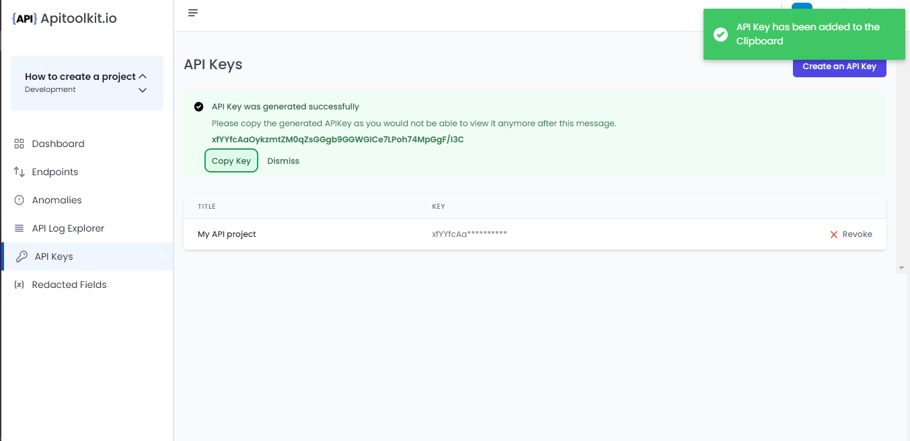

# Generating API Keys

API keys are unique identifiers that are used to authenticate user’s identity. The API key is a crucial component of integrating APIs into your programs. Your uniqueness and distinctiveness as a developer are determined by this factor.  

## How to Generate API keys in APIToolkit
- This is the first step to getting started signing up / signing in to the [API dashboard](https://app.apitoolkit.io). 

- You proceed to [create a project](creating-a-project.md) after you have gained access to the dashboard.
- Then you can move on to create your API key. You proceed by giving your API key a title that is easy to remember and resonates with your work for easy identification. It can be anything.

- And presto, your API key is ready. The key should be copied to your clipboard in order to utilize the API and prevent loss. 

- Voila! You can go ahead and integrate your API

