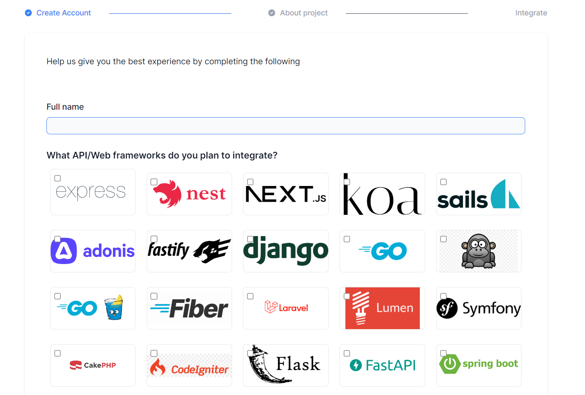
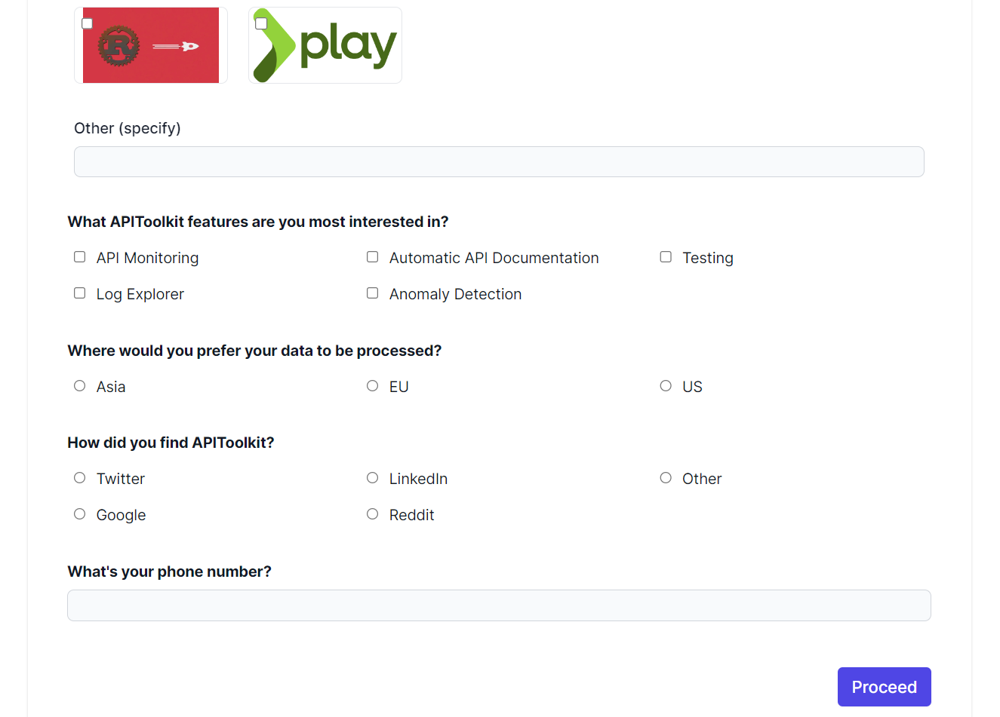

# Creating A Project

This guide will walk you through the process of creating a new project and setting up your dashboard for seamless integration.

To create a project, you start by logging into the APIToolkit dashbboard

### Fill in the needed fields

### Select your prefer tech stack

  

### Specify the feature you're keen on.

  

### Get your API KEY and connect it to APItoolkit

Upon completing these steps, we'll redirect you to the onboarding page with a default APIKEY automatically generated for you. Use the code example from the [quickstart](https://apitoolkit.io/docs/get-started/quickstarts/) and integrate it into your project before you can start using the APIToolkit dashboard.

After a successful connection you should see this 

