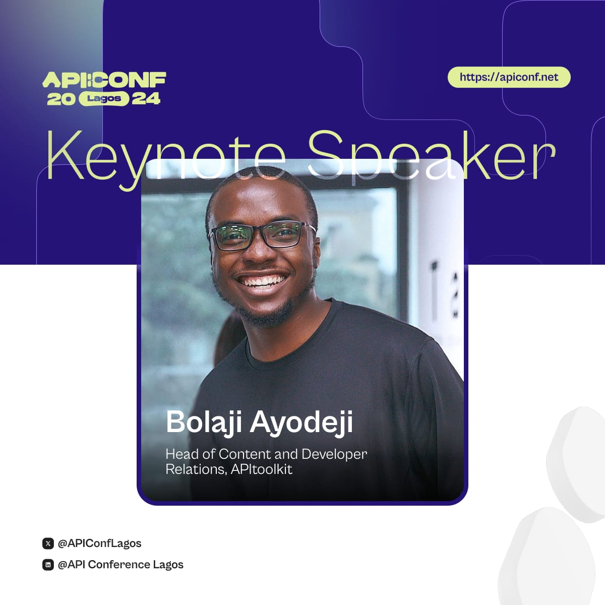

```=html
<div class="w-full width-control mx-auto py-24">
    <article class="mt-8 text-gray-500 text-lg prose max-w-prose">
```

### Conference Talk and Booth
# The Power of Observability in API-Driven Applications



It's a common tale amongst software engineers today about how the smallest technical error or decision can lead to significant business implications and a truckload of customer support requests. This usually calls for utilizing solid strategies to improve engineering systems and workflows. While strategies like stress testing, e2e testing, etc. are great for catching issues before they get into production, what if we could catch even more live from users' requests with detailed information on where and how the issue occurred, especially in cases where all internal checks fail or a new unexpected issue comes up, or even when a silent error sneaks into production?

In this talk, Bolaji will discuss the rapid evolution of observability in API-driven applications and how engineers can more easily than before, monitor and observe the APIs and external APIs they depend on, allowing them to swiftly identify, reproduce, and fix different kinds of errors or performance issues as they happen, thereby improving customer support resolution, preserving revenue, and maximizing shareholder value.

If you're in Lagos, 🇳🇬, make sure to attend the event to listen to this talk or find Bolaji who will be happy to talk to you about **how [APItoolkit](/) can help your company or side-project solve many of the API challenges you're facing** and **anything API monitoring and observability** ;).

<hr />

**Date**: 20th, July 2024.

**Time**: 08:00 AM - 05:00 PM (WAT).

**Booth Number**: TBA.

```=html
        <a href="https://apiconf.net/?ref=apitoolkit" target="_blank" rel="noreferrer noopener" class="w-full btn btn-secondary bg-blue-600 text-white hover:bg-white hover:text-black">
            Register
            <i class="fa-regular fa-arrow-right mr-4"></i>
        </a>
    </article>
</div>
```