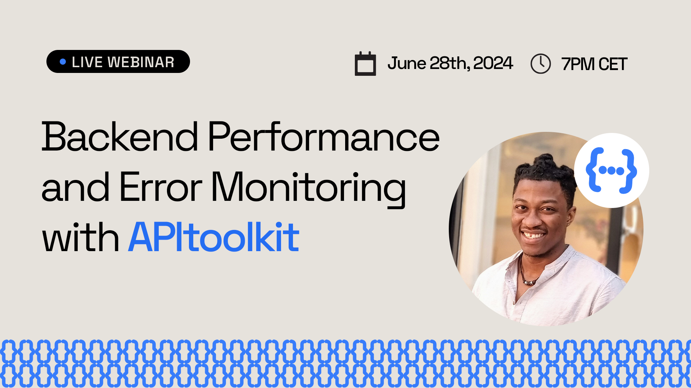

```=html
<div class="w-full width-control mx-auto py-24">
    <article class="mt-8 text-gray-500 text-lg prose max-w-prose">
```

### Sponsorship and Conference Talk
# TITLE TBA



The goal of API Conf is to promote API literacy amongst the different developer ecosystems that exist within Lagos, and in the future, Nigeria/Africa regardless of your expertise or skill level.

Details TBA...

**Date**: 20th, July 2024.

**Time**: TBA.

**Booth**: TBA.

<hr />

```=html
        <a href="https://apiconf.net/?utm_source=apitoolkit" target="_blank" rel="noreferrer noopener" class="w-full btn btn-secondary bg-blue-600 text-white hover:bg-white hover:text-black">
            Register
            <i class="fa-regular fa-arrow-right mr-4"></i>
        </a>
    </article>
</div>
```