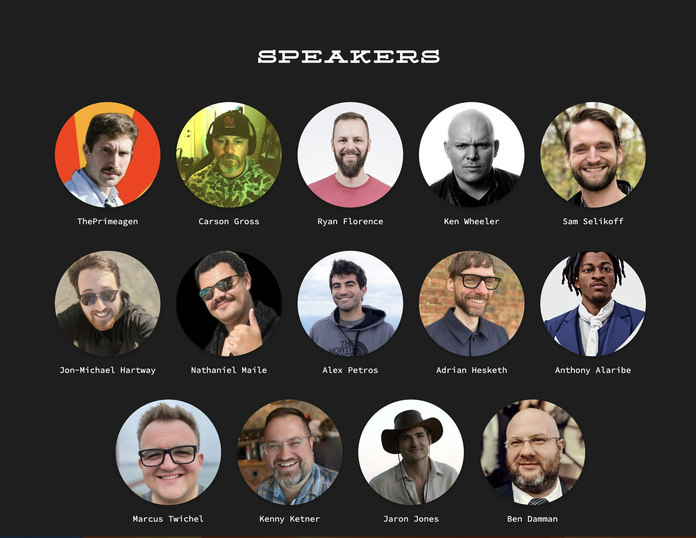

```=html
<div class="w-full width-control mx-auto py-24">
    <article class="mt-8 text-gray-500 text-lg prose max-w-prose">
```

### Conference Talk
# You Can’t Build Interactive Web Apps Except SPA and Other Myths




Are you in Montana this weekend? If so, come join our co-founder Anthony Alaribe and other amazing speakers at the annual [Big Sky Dev Con](https://bigskydevcon.com?utm_source=apitoolkit) (BSDC) on Saturday, June 8, from 09:00 AM. to 05:00 PM. at The Commons, Montana USA. Hosted by Montana Programmers, BSDC is an annual tech conference focused on sharing knowledge about software development, tech business, design, and user experience with the tech community.
​
Anthony will be speaking on the topic "**You Can’t Build Interactive Web Apps Except SPA and Other Myths**"

<hr />

```=html
        <a href="https://bigskydevcon.com?utm_source=apitoolkit" target="_blank" rel="noreferrer noopener" class="w-full btn btn-secondary bg-blue-600 text-white hover:bg-white hover:text-black">
            Register
            <i class="fa-regular fa-arrow-right mr-4"></i>
        </a>
    </article>
</div>
```