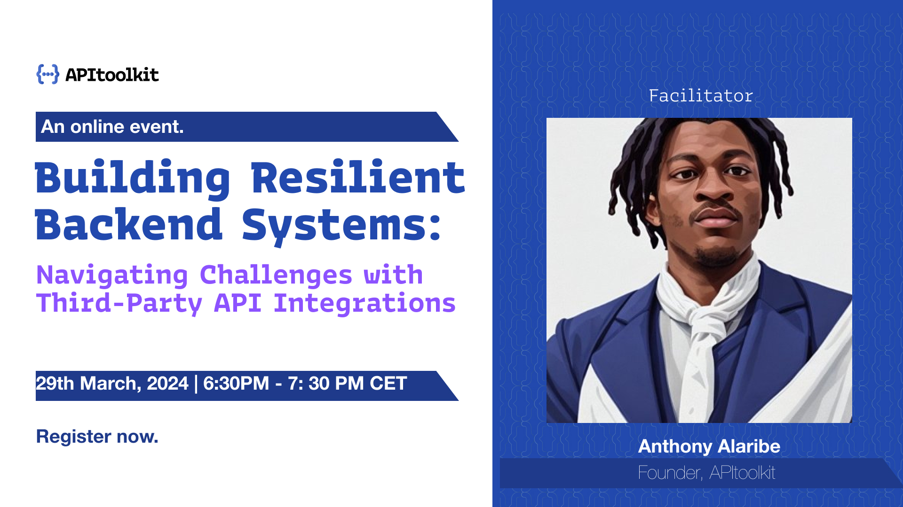

```=html
<div class="w-full width-control mx-auto py-24">
    <article class="mt-8 text-gray-500 text-lg prose max-w-prose">
```

### Webinar I
# Building Resilient Backend System: Navigating Challenges with Integration

{class="border-2 border-blue-600"}

As tech teams, especially backend teams, rely heavily on third-party integrations to function, they often encounter challenges associated with these integrations. Whether it's APIs experiencing downtime, introducing breaking changes, or delivering subpar performance, these issues and failures costs companies millions of dollars annually.


In this webinar, Anthony Alaribe, Founder of APItoolkit, will delve into the common issues introduced by third-party API integrations and share effective techniques and strategies for building resilient backend systems to be ahead of the curve. You will learn how to ensure your systems can quickly recover from setbacks or provide comprehensive insights into the root causes of any issues before they create costly and damaging effects.

<hr />

**Date**: 29th, March 2024.

**Time**: 06:00 PM CET.

**Duration**: 1 Hour.

<hr />

Don’t miss this opportunity to transform your backend operations and solve the challenges you face daily. Register Now to secure your spot and take the first step towards a more reliable and efficient backend infrastructure.

```=html
        <a href="#" class="w-full btn btn-secondary bg-blue-600 text-white hover:bg-white hover:text-black" disabled>
            Register
            <i class="fa-regular fa-arrow-right mr-4"></i>
        </a>
    </article>
</div>
```