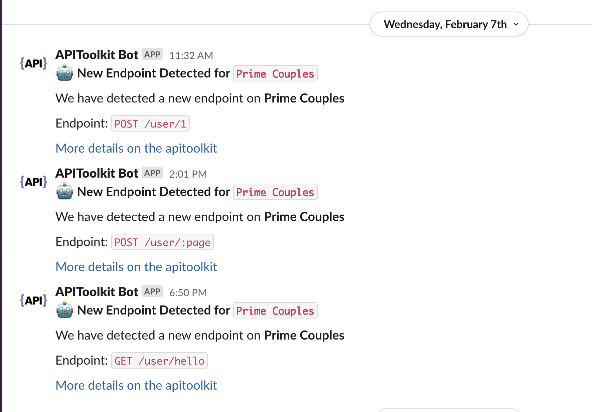

```=html
<section  class="mt-28 home-feature-image-div text-center w-full max-w-full aspect-auto" >
    <div class="max-w-4xl inline-block text-left  text-xl sm:text-2xl">
```

###### [*Error Tracking & Breaking Change Detection*{.drop-shadow-md}]{class="bg-amber-300 px-2 rounded-md dark:text-black"}

{class="mt-2 mb-3 dark:text-white "}
### Find and fix Errors and Breaking Changes in realtime

{class="py-5"}
Error monitoring is not enough. Catch breaking changes in your APIs and third party integrations with enough context to reproduce the issues, and narrow down the root cause.

{class="space-y-2 text-sm sm:pt-1 not-prose" id="waitlist-form-1"}
[Get Started for Free](https://app.apitoolkit.io){class="drop-shadow hover:drop-shadow-lg transition-all rounded-md hover:bg-yellow-300 bg-amber-300 text-black border border-amber-400 font-semibold inline-block px-4 py-2 mt-2 sm:mt-0 hs-init hs-inview"}
[OR]{.inline-block .px-5}
[Get a demo &nbsp;](https://calendar.app.google/1a4HG5GZYv1sjjZG6){target="\_blank" class="drop-shadow rounded-md border border-gray-200 bg-gray-100 hover:bg-gray-200 text-xs text-gray-900 inline-block px-4 py-2 sm:ml-1 mt-2 sm:mt-0 hs-init hs-inview"}

```=html
    <iframe width="100%" height="650" class="max-w-4xl mt-12 rounded-xl overflow-hidden drop-shadow-lg" src="https://www.youtube.com/embed/4F4l-hjpUfs?si=u3wPO62k38pc-L0q" title="YouTube video player" frameborder="0" allow="accelerometer; autoplay; clipboard-write; encrypted-media; gyroscope; picture-in-picture; web-share" allowfullscreen></iframe>
    </div>
</section>
<section  class="py-28  text-center w-full max-w-full aspect-auto" >
    <div class="max-w-6xl inline-block text-left  text-xl sm:text-2xl prose prose-lg prose-pre:p-0 space-y-16">
```

{class="grid grid-cols-1 px-6 md:px-2 md:grid-cols-5 gap-8 justify-center items-center"}
:::
{class="space-y-3 col-span-2"}
::::

{.leading-tight}
### See All Errors and API Changelog (Breaking and Safe Changes) at a glance

{.text-lg}
Seeing all changes and issues at glance to help you prioritize what issues need to be fixed, and what changes are benign and can be safely acknowleged.

{class="space-y-2 text-sm sm:pt-1 not-prose" id="waitlist-form-1"}
[Get Started for Free](https://app.apitoolkit.io){class="drop-shadow hover:drop-shadow-lg transition-all rounded-md hover:bg-yellow-300 bg-amber-300 text-black border border-amber-400 font-semibold inline-block px-4 py-2 mt-2 sm:mt-0 hs-init hs-inview"}
[OR]{.inline-block .px-5}
[Get a demo &nbsp;](https://calendar.app.google/1a4HG5GZYv1sjjZG6){target="\_blank" class="drop-shadow rounded-md border border-gray-200 bg-gray-100 hover:bg-gray-200 text-xs text-gray-900 inline-block px-4 py-2 sm:ml-1 mt-2 sm:mt-0 hs-init hs-inview"}
::::

{.col-span-3}
{class="w-full drop-shadow-lg border border-gray-200 rounded-md"}
:::

{class="grid grid-cols-1 md:grid-cols-5 gap-8 px-6 md:px-2 justify-center items-center"}
:::
{class="order-last md:order-first col-span-3"}
{class="w-full drop-shadow-lg border border-gray-200 rounded-md"}

{class="space-y-3 col-span-2 order-first md:order-last"}
::::
{.leading-tight}
### Trace Errors back to the Root Cause

{.text-lg}
Don't just track errors and stack traces, but also record the incoming and outgoing requests which triggered the error. Good for customer support or reproducing the bug.

{class="space-y-2 text-sm sm:pt-1 not-prose" id="waitlist-form-1"}
[Get Started for Free](https://app.apitoolkit.io){class="drop-shadow hover:drop-shadow-lg transition-all rounded-md hover:bg-yellow-300 bg-amber-300 text-black border border-amber-400 font-semibold inline-block px-4 py-2 mt-2 sm:mt-0 hs-init hs-inview"}
[OR]{.inline-block .px-5}
[Get a demo &nbsp;](https://calendar.app.google/1a4HG5GZYv1sjjZG6){target="\_blank" class="drop-shadow rounded-md border border-gray-200 bg-gray-100 hover:bg-gray-200 text-xs text-gray-900 inline-block px-4 py-2 sm:ml-1 mt-2 sm:mt-0 hs-init hs-inview"}
::::
:::

{class="grid grid-cols-1 px-6 md:px-2 md:grid-cols-5 gap-8 justify-center items-center"}
:::
{class="space-y-3 col-span-2"}
::::

{.leading-tight}
### Track breaking changes in your APIs & Third party Integrations

{.text-lg}
Catch breaking changes in your APIs and in any third party APIs you depend on. No other platform can detect arbitrary breaking changes in your APIs or any APIs you call.

{class="space-y-2 text-sm sm:pt-1 not-prose" id="waitlist-form-1"}
[Get Started for Free](https://app.apitoolkit.io){class="drop-shadow hover:drop-shadow-lg transition-all rounded-md hover:bg-yellow-300 bg-amber-300 text-black border border-amber-400 font-semibold inline-block px-4 py-2 mt-2 sm:mt-0 hs-init hs-inview"}
[OR]{.inline-block .px-5}
[Get a demo &nbsp;](https://calendar.app.google/1a4HG5GZYv1sjjZG6){target="\_blank" class="drop-shadow rounded-md border border-gray-200 bg-gray-100 hover:bg-gray-200 text-xs text-gray-900 inline-block px-4 py-2 sm:ml-1 mt-2 sm:mt-0 hs-init hs-inview"}
::::

{.col-span-3}
{class="w-full drop-shadow-lg border border-gray-200 rounded-md"}
:::

{class="grid px-6 grid-cols-1 md:px-2 md:grid-cols-5 gap-8 justify-center items-center"}
:::
{.col-span-3}
{class="w-full drop-shadow-lg border border-gray-200 rounded-md"}

{class="space-y-3 col-span-2 order-first md:order-last"}
::::
{.leading-tight}
### Get instant Alert and Notifications on the Go

{.text-lg}
Integrate Alerts into your current workflow through slack, email, teams, pagerduty, opsgenie, or any prefered alerting or incident management integration.

{class="space-y-2 text-sm sm:pt-1 not-prose" id="waitlist-form-1"}
[Get Started for Free](https://app.apitoolkit.io){class="drop-shadow hover:drop-shadow-lg transition-all rounded-md hover:bg-yellow-300 bg-amber-300 text-black border border-amber-400 font-semibold inline-block px-4 py-2 mt-2 sm:mt-0 hs-init hs-inview"}
[OR]{.inline-block .px-5}
[Get a demo &nbsp;](https://calendar.app.google/1a4HG5GZYv1sjjZG6){target="\_blank" class="drop-shadow rounded-md border border-gray-200 bg-gray-100 hover:bg-gray-200 text-xs text-gray-900 inline-block px-4 py-2 sm:ml-1 mt-2 sm:mt-0 hs-init hs-inview"}
::::
:::



{class="text-center"}
::::
### Integrate APItoolkit

```=html
<hr />
```


::::

```=html
</div>
</section>
```
